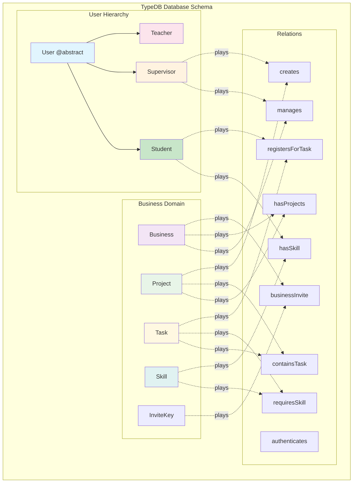

# ProjoJo Software Guidebook

**Een professioneel software project management platform voor educatieve instellingen**

> *"Code vertelt je hoe, maar niet waarom. Documentatie vult die kloof."*  
> Dit Software Guidebook biedt een complete technische en functionele gids voor het ProjoJo platform.

---

## Inhoudsopgave

1. [Software Architecture](#1-software-architecture)
2. [Code](#2-code)  
3. [Data](#3-data)
4. [Functional Overview](#4-functional-overview)
5. [Deployment & Operations](#5-deployment--operations)

---

## 1. Software Architecture

### 1.1 Architectuuroverzicht

ProjoJo implementeert een **moderne microservices-georiënteerde 3-tier architectuur** die specifiek is ontworpen voor complexe relatiebeheer in educatieve omgevingen. De architectuur biedt schaalbaarheid, maintainability en duidelijke separation of concerns.

**Waarom deze architectuur?**
- **Separation of Concerns**: Elk tier heeft een specifieke verantwoordelijkheid
- **Scalability**: Lagen kunnen onafhankelijk geschaald worden  
- **Technology Flexibility**: Verschillende technologieën optimaal per laag
- **Team Productivity**: Parallelle development mogelijk
- **Graph Database**: TypeDB perfect voor complexe educatieve relaties

### 1.2 C4 Model - System Context

Het ProjoJo platform opereert binnen een educatief ecosysteem met verschillende gebruikerstypen en externe systemen:

```mermaid
graph TB
    %% Users
    Student["👨‍🎓 Student<br/>Zoekt praktijkervaring<br/>via projecten en taken"]
    Supervisor["👨‍💼 Supervisor<br/>Beheert bedrijfsprojecten<br/>en selecteert studenten"]
    Teacher["👩‍🏫 Teacher<br/>Administratief toezicht<br/>en gebruikersbeheer"]
    
    %% Core System
    ProjoJo["🎯 ProjoJo Platform<br/>Educatief project management<br/>platform voor praktijkleren"]
    
    %% External Systems
    Browser["🌐 Web Browser<br/>Chrome, Firefox, Safari"]
    Email["📧 Email System<br/>Notificaties en<br/>communicatie"]
    Storage["💾 File Storage<br/>Afbeeldingen en<br/>documenten"]

    %% User Interactions
    Student -->|"Registreert voor taken<br/>beheert skills<br/>(HTTPS)"| ProjoJo
    Supervisor -->|"Creëert projecten<br/>beoordeelt registraties<br/>(HTTPS)"| ProjoJo
    Teacher -->|"Beheert gebruikers<br/>genereert rapporten<br/>(HTTPS)"| ProjoJo
    
    %% System Interactions
    ProjoJo -->|"Serveert web interface<br/>(HTTPS)"| Browser
    ProjoJo -->|"Verstuurt notificaties<br/>(SMTP)"| Email
    ProjoJo -->|"Opslaan van afbeeldingen<br/>(File I/O)"| Storage

    %% Styling
    classDef userClass fill:#e1f5fe,stroke:#01579b,stroke-width:2px
    classDef systemClass fill:#c8e6c9,stroke:#1b5e20,stroke-width:3px
    classDef externalClass fill:#fff3e0,stroke:#e65100,stroke-width:2px
    
    class Student,Supervisor,Teacher userClass
    class ProjoJo systemClass
    class Browser,Email,Storage externalClass
```



### 1.3 C4 Model - Container Diagram

De applicatie bestaat uit vier hoofdcontainers die elk een specifieke technische verantwoordelijkheid hebben:

```mermaid
graph TB
    subgraph Users["👥 Users"]
        Student["👨‍🎓 Student<br/>Zoekt praktijkervaring"]
        Supervisor["👨‍💼 Supervisor<br/>Beheert projecten"]
        Teacher["👩‍🏫 Teacher<br/>Platform administratie"]
    end

    subgraph ProjoJo["🎯 ProjoJo Platform"]
        WebApp["⚛️ Web Application<br/>React, Vite, TailwindCSS<br/>Gebruikersinterface voor<br/>alle platform functionaliteiten"]
        API["🚀 API Application<br/>FastAPI, Python 3.13<br/>Business logica, authenticatie<br/>en data validatie"]
        Database["🗄️ Graph Database<br/>TypeDB 3.4.0<br/>Opslag van gebruikers, projecten,<br/>taken en relaties"]
        FileStore["💾 File Storage<br/>Docker Volume<br/>Statische bestanden<br/>en uploads"]
    end

    subgraph External["🌐 External Systems"]
        Browser["🌐 Web Browser"]
        Email["📧 Email Service"]
    end

    %% User interactions
    Student -->|"Gebruikt<br/>(HTTPS)"| WebApp
    Supervisor -->|"Gebruikt<br/>(HTTPS)"| WebApp
    Teacher -->|"Gebruikt<br/>(HTTPS)"| WebApp

    %% Internal system interactions
    WebApp -->|"API calls<br/>(JSON/HTTPS)"| API
    API -->|"TypeQL queries<br/>(TypeDB Protocol)"| Database
    API -->|"Leest/schrijft<br/>(File I/O)"| FileStore

    %% External interactions
    WebApp -->|"Geserveerd door<br/>(HTTPS/WebSocket)"| Browser
    API -->|"Verstuurt emails<br/>(SMTP)"| Email

    %% Styling
    classDef userClass fill:#e1f5fe,stroke:#01579b,stroke-width:2px
    classDef containerClass fill:#c8e6c9,stroke:#1b5e20,stroke-width:2px
    classDef externalClass fill:#fff3e0,stroke:#e65100,stroke-width:2px
    
    class Student,Supervisor,Teacher userClass
    class WebApp,API,Database,FileStore containerClass
    class Browser,Email externalClass
```



### 1.4 C4 Model - Component Diagram (Backend)

De API Application is de kern van de business logica en bestaat uit verschillende gespecialiseerde componenten:

```mermaid
graph TB
    subgraph External["🌐 External Containers"]
        WebApp["⚛️ Web Application<br/>React Frontend"]
        Database["🗄️ Graph Database<br/>TypeDB"]
        FileStore["💾 File Storage<br/>Docker Volume"]
    end

    subgraph API["🚀 API Application"]
        subgraph Controllers["🎛️ Controllers (FastAPI Routers)"]
            Auth["🔐 Authentication Controller<br/>JWT token management<br/>en gebruikersvalidatie"]
            Projects["📋 Project Controller<br/>Project en task<br/>management endpoints"]
            Users["👥 User Controller<br/>Gebruikersbeheer<br/>en profiel endpoints"]
            Skills["🎯 Skills Controller<br/>Skill matching<br/>en management"]
        end
        
        subgraph Repositories["🗃️ Data Access Layer"]
            UserRepo["👤 User Repository<br/>Python Class<br/>Data access voor<br/>gebruikersentiteiten"]
            ProjectRepo["📁 Project Repository<br/>Python Class<br/>Data access voor<br/>project entiteiten"]
            TaskRepo["📝 Task Repository<br/>Python Class<br/>Data access voor<br/>task entiteiten"]
            SkillRepo["🔧 Skill Repository<br/>Python Class<br/>Data access voor<br/>skill entiteiten"]
        end
        
        subgraph Core["⚙️ Core Components"]
            Models["📐 Domain Models<br/>Pydantic<br/>Data validatie<br/>en serialisatie"]
            Services["🔄 Business Services<br/>Python Classes<br/>Business logica<br/>en workflow orchestratie"]
            Middleware["🛡️ Security Middleware<br/>FastAPI<br/>CORS, JWT validatie<br/>en error handling"]
        end
    end

    %% External to Controllers
    WebApp -->|"Login/logout<br/>(JSON/HTTPS)"| Auth
    WebApp -->|"CRUD operations<br/>(JSON/HTTPS)"| Projects
    WebApp -->|"Profile management<br/>(JSON/HTTPS)"| Users
    WebApp -->|"Skill operations<br/>(JSON/HTTPS)"| Skills

    %% Controllers to Repositories
    Auth --> UserRepo
    Projects --> ProjectRepo
    Projects --> TaskRepo
    Users --> UserRepo
    Skills --> SkillRepo

    %% Repositories to Database
    UserRepo -->|"TypeQL queries"| Database
    ProjectRepo -->|"TypeQL queries"| Database
    TaskRepo -->|"TypeQL queries"| Database
    SkillRepo -->|"TypeQL queries"| Database

    %% File operations
    Projects -->|"Image uploads"| FileStore

    %% Models used by Controllers
    Models -.-> Auth
    Models -.-> Projects
    Models -.-> Users
    Models -.-> Skills

    %% Styling
    classDef externalClass fill:#fff3e0,stroke:#e65100,stroke-width:2px
    classDef controllerClass fill:#e3f2fd,stroke:#0277bd,stroke-width:2px
    classDef repoClass fill:#e8f5e8,stroke:#2e7d32,stroke-width:2px
    classDef coreClass fill:#fce4ec,stroke:#c2185b,stroke-width:2px
    
    class WebApp,Database,FileStore externalClass
    class Auth,Projects,Users,Skills controllerClass
    class UserRepo,ProjectRepo,TaskRepo,SkillRepo repoClass
    class Models,Services,Middleware coreClass
```



### 1.5 C4 Model - Component Diagram (Frontend)

De Web Application biedt een moderne, responsieve gebruikerservaring via React componenten:

```mermaid
graph TB
    subgraph External["🌐 External"]
        API["🚀 API Application<br/>FastAPI Backend"]
        Browser["🌐 Web Browser<br/>Chrome/Firefox/Safari"]
    end

    subgraph WebApp["⚛️ Web Application"]
        subgraph UI["🎨 User Interface"]
            Router["🛤️ App Router<br/>React Router DOM<br/>Client-side routing<br/>en navigatie"]
            AuthProvider["🔐 Auth Provider<br/>React Context<br/>Applicatie-brede<br/>authenticatie state"]
            Pages["📄 Page Components<br/>React Components<br/>Route-specifieke<br/>UI componenten"]
            Components["🧩 UI Components<br/>React Components<br/>Herbruikbare<br/>interface elementen"]
        end
        
        subgraph Logic["⚙️ Business Logic"]
            Services["🌐 API Services<br/>JavaScript<br/>HTTP client voor<br/>backend communicatie"]
            Hooks["🪝 Custom Hooks<br/>React Hooks<br/>State management<br/>en data fetching"]
            Utils["🔧 Utilities<br/>JavaScript<br/>Helper functies<br/>en formatters"]
        end
        
        subgraph Resources["📦 Resources"]
            Assets["🎭 Static Assets<br/>Images/CSS<br/>Styling en<br/>media bestanden"]
            Tests["🧪 Test Components<br/>Storybook<br/>Component testing<br/>en documentatie"]
        end
    end

    %% External interactions
    Browser -->|"Navigation<br/>(HTTP)"| Router
    Services -->|"HTTP requests<br/>(JSON/HTTPS)"| API

    %% Internal UI flow
    Router --> Pages
    Pages --> Components
    Pages --> Hooks
    Components --> Hooks

    %% Logic interactions
    Hooks --> Services
    AuthProvider --> Services
    Pages --> AuthProvider
    Components --> Utils
    Components --> Assets

    %% Styling
    classDef externalClass fill:#fff3e0,stroke:#e65100,stroke-width:2px
    classDef uiClass fill:#e3f2fd,stroke:#0277bd,stroke-width:2px
    classDef logicClass fill:#e8f5e8,stroke:#2e7d32,stroke-width:2px
    classDef resourceClass fill:#fce4ec,stroke:#c2185b,stroke-width:2px
    
    class API,Browser externalClass
    class Router,AuthProvider,Pages,Components uiClass
    class Services,Hooks,Utils logicClass
    class Assets,Tests resourceClass
```



### 1.6 Technologie Stack & Rationale

**Frontend**
- **React 18.3.1** - Modern UI library met hooks en concurrent features
- **Vite 5.4.1** - Snelle build tool met HMR
- **React Router DOM 6.28.0** - Client-side routing  
- **TailwindCSS 3.4.15** - Utility-first CSS framework
- **TipTap 2.10.3** - Rich text editor voor content management

**Sources:** 📦 [@package.json#L13-L62](https://github.com/HAN-AIM-CMD-WG/Projojo/blob/development/projojo_frontend/package.json#L13-L62) | ⚙️ [@vite.config.ts](https://github.com/HAN-AIM-CMD-WG/Projojo/blob/development/projojo_frontend/vite.config.ts) | 🛤️ [@App.jsx#L36-L54](https://github.com/HAN-AIM-CMD-WG/Projojo/blob/development/projojo_frontend/src/App.jsx#L36-L54) | 🎨 [@tailwind.config.js](https://github.com/HAN-AIM-CMD-WG/Projojo/blob/development/projojo_frontend/tailwind.config.js)

*Waarom deze keuzes?*
- React's component model past perfect bij modulaire UI requirements
- Vite biedt superieure developer experience versus Webpack
- TailwindCSS zorgt voor consistent design system

**Backend**
- **FastAPI 0.115.8** - Moderne, snelle Python web framework met automatische OpenAPI
- **Python 3.13** - Latest stable versie met performance verbeteringen
- **Pydantic 2.10.6** - Data validatie en serialisatie
- **TypeDB Driver 3.4.0** - Graph database connectiviteit 
- **PyJWT 2.10.1** - JSON Web Token authenticatie
- **Uvicorn 0.34.0** - High-performance ASGI server

**Sources:** 📋 [@requirements.txt#L1-L22](https://github.com/HAN-AIM-CMD-WG/Projojo/blob/development/projojo_backend/requirements.txt#L1-L22) | 👤 [@user.py#L6-L37](https://github.com/HAN-AIM-CMD-WG/Projojo/blob/development/projojo_backend/domain/models/user.py#L6-L37) | 🔐 [@jwt_utils.py](https://github.com/HAN-AIM-CMD-WG/Projojo/blob/development/projojo_backend/auth/jwt_utils.py)

*Waarom deze keuzes?*
- FastAPI biedt automatic API documentation en excellent performance
- Pydantic zorgt voor type safety en data validation
- TypeDB past perfect bij de complexe relatie requirements

**Database**
- **TypeDB 3.4.0** - Knowledge graph database voor complexe relaties
- **TypeQL** - Expressieve query language voor graph traversal

*Waarom TypeDB?*
- Educatieve domeinen hebben complexe many-to-many relaties
- Graph queries zijn intuïtiever dan JOIN-heavy SQL
- Schema evolution support voor groeiende requirements

**Infrastructure**
- **Docker & Docker Compose** - Container orchestratie
- **Docker Networks** - Service isolation en communicatie  
- **Volume Management** - Data persistentie

**Sources:** 🐳 [@docker-compose.yml#L1-L55](https://github.com/HAN-AIM-CMD-WG/Projojo/blob/development/docker-compose.yml#L1-L55) | 🌐 [@docker-compose.yml#L49-L51](https://github.com/HAN-AIM-CMD-WG/Projojo/blob/development/docker-compose.yml#L49-L51) | 💾 [@docker-compose.yml#L53-L55](https://github.com/HAN-AIM-CMD-WG/Projojo/blob/development/docker-compose.yml#L53-L55)

### 1.7 Deployment Architectuur

**Container Orchestratie ([docker-compose.yml](docker-compose.yml))**
```yaml
# Referentie: lijnen 1-55 in docker-compose.yml
services:
  typedb:    # Database service (lijnen 2-14)
  backend:   # API service (lijnen 16-34)  
  frontend:  # Web interface (lijnen 36-47)
```

**Service Configuration Details:**

**TypeDB Service ([docker-compose.yml](docker-compose.yml#L2-L14))**
- Image: `typedb/typedb:3.4.0` voor stabiele graph database
- Ports: `1729` (TypeDB), `1728` (Studio web interface)
- Volume: Persistent data storage via `typedb-data` volume
- Platform: Specifieke Linux/AMD64 voor consistentie

**Backend Service ([docker-compose.yml](docker-compose.yml#L16-L34))**
- Build context: `./projojo_backend` met custom Dockerfile
- Environment variables voor TypeDB connectie en Python optimalisaties
- Volume mounting voor hot-reload tijdens development
- Afhankelijkheid van TypeDB service

**Frontend Service ([docker-compose.yml](docker-compose.yml#L36-L47))**
- Build context: `./projojo_frontend` met Nginx voor productie
- Anonymous volume voor node_modules isolatie
- Development-friendly volume mounting

**Networking Strategy:**
- Dedicated bridge network `projojo-network` ([docker-compose.yml](docker-compose.yml#L49-L51))
- Services zijn alleen intern toegankelijk behalve via exposed ports
- Backend communiceert met TypeDB via service name resolution

### 1.8 Security Architecture

**JWT-Based Authentication Implementation**

```python
# routes/auth_router.py - Token creatie proces (lijnen 38-47)
token = create_jwt_token(user, supervisor_data)
return LoginResponse(token=token, debug_payload=debug_payload)
```

**Sources:** 🔐 [@jwt_utils.py](https://github.com/HAN-AIM-CMD-WG/Projojo/blob/development/projojo_backend/auth/jwt_utils.py) | 🛡️ [@auth_router.py#L38-L47](https://github.com/HAN-AIM-CMD-WG/Projojo/blob/development/projojo_backend/routes/auth_router.py#L38-L47)

**Frontend Token Management**
```javascript
// Automatische token injection in alle API calls
const token = localStorage.getItem("token");
if (token) {
    headers.authorization = `bearer ${token}`;
}
```

**Sources:** 🌐 [@services.js#L50-L56](https://github.com/HAN-AIM-CMD-WG/Projojo/blob/development/projojo_frontend/src/services.js#L50-L56)

**Authorization Levels & Role-Based Access:**
- **Student**: Task registraties en skill management
- **Supervisor**: Project creation en student approval  
- **Teacher**: Platform administratie en invite management
- **Business**: Organisational context

**Sources:** 👨‍🎓 [@student_router.py](https://github.com/HAN-AIM-CMD-WG/Projojo/blob/development/projojo_backend/routes/student_router.py) | 👨‍💼 [@supervisor_router.py](https://github.com/HAN-AIM-CMD-WG/Projojo/blob/development/projojo_backend/routes/supervisor_router.py) | 👩‍🏫 [@teacher_router.py](https://github.com/HAN-AIM-CMD-WG/Projojo/blob/development/projojo_backend/routes/teacher_router.py) | 🏢 [@business_router.py](https://github.com/HAN-AIM-CMD-WG/Projojo/blob/development/projojo_backend/routes/business_router.py)

**API Security Layers**

**CORS Configuration**
```python
app.add_middleware(
    CORSMiddleware,
    allow_origins=["*"],  # Development setting
    allow_credentials=True,
    allow_methods=["*"],
    allow_headers=["*"],
)
```

**Sources:** 🛡️ [@main.py#L45-L52](https://github.com/HAN-AIM-CMD-WG/Projojo/blob/development/projojo_backend/main.py#L45-L52)

**Input Validation via Pydantic**
- Alle API inputs worden gevalideerd via Pydantic models
- Type safety en automatic documentation
- Custom validators voor business rules

**Sources:** 📐 [@domain/models/](https://github.com/HAN-AIM-CMD-WG/Projojo/tree/development/projojo_backend/domain/models)

**Error Handling**
```python
app.add_exception_handler(ItemRetrievalException, generic_handler)
app.add_exception_handler(UnauthorizedException, generic_handler)
```

**Sources:** 🚨 [@main.py#L66-L68](https://github.com/HAN-AIM-CMD-WG/Projojo/blob/development/projojo_backend/main.py#L66-L68)

### 1.9 Performance & Scalability

**Database Performance**
- TypeDB's graph traversal algorithms voor complexe relatie queries
- Schema-gebaseerde optimalisaties
- Connection pooling via TypeDB driver

**Sources:** 🗄️ [@schema.tql](https://github.com/HAN-AIM-CMD-WG/Projojo/blob/development/projojo_backend/db/schema.tql)

**Frontend Performance**
- React's Virtual DOM voor efficiënte updates
- Vite's build optimalisaties en code splitting
- TailwindCSS purging voor minimale bundle sizes

**Caching Strategies**
- Browser caching voor statische assets
- localStorage voor auth tokens en user preferences
- Potential Redis layer voor session management (future enhancement)

**Horizontal Scaling Potential**
- Stateless backend design (JWT tokens) 
- Database clustering support in TypeDB
- Load balancer ready architecture

---

## 2. Code

### 2.1 Codebase Organisatie & Architectuurprincipes

De ProjoJo codebase volgt **Domain-Driven Design (DDD)** principes met een duidelijke scheiding tussen technische infrastructuur en business logica. Deze organisatie zorgt voor maintainability, testbaarheid en schaalbaarheid.

**Backend Structuur - Layered Architecture**
```
projojo_backend/
├── auth/                 # 🔐 Authentication & Security Layer
│   └── jwt_utils.py     # JWT token management
├── db/                   # 🗄️ Data Persistence Layer  
│   ├── schema.tql       # TypeDB schema definitie (140 lijnen)
│   ├── seed.tql         # Database initiële data
│   └── initDatabase.py  # Connection management
├── domain/              # 🎯 Core Business Domain
│   ├── models/          # Business entity models (Pydantic)
│   │   ├── user.py      # User hiërarchie (37 lijnen)
│   │   ├── project.py   # Project & ProjectCreation models  
│   │   ├── task.py      # Task definitions & workflows
│   │   ├── skill.py     # Skill matching & competenties
│   │   └── business.py  # Business context entities
│   └── repositories/    # Data Access Object (DAO) pattern
│       ├── base.py      # Generic repository base class (46 lijnen)
│       ├── user_repository.py     # User CRUD operations
│       ├── project_repository.py  # Project management
│       ├── task_repository.py     # Task & registration logic
│       └── skill_repository.py    # Skill matching queries
├── exceptions/          # 🚨 Error Handling Layer
│   ├── exceptions.py    # Custom business exceptions
│   └── global_exception_handler.py # Centralized error handling
├── routes/              # 🛣️ API Interface Layer (11 routers)
│   ├── auth_router.py       # Authentication endpoints (48 lijnen)
│   ├── project_router.py    # Project CRUD & management (93 lijnen)
│   ├── task_router.py       # Task operations
│   ├── user_router.py       # User management
│   ├── student_router.py    # Student-specific operations
│   ├── supervisor_router.py # Supervisor workflows
│   ├── teacher_router.py    # Admin operations
│   ├── business_router.py   # Business context
│   ├── skill_router.py      # Skill management
│   └── invite_router.py     # Invitation system
├── service/             # 🔧 Business Logic Layer
│   ├── task_service.py  # Complex task workflows
│   └── image_service.py # File upload handling
├── static/              # 📁 Static Asset Management
│   └── images/          # User uploads & default images (10 default images)
└── main.py              # 🚀 Application entry point (99 lijnen)
```

**Frontend Structuur - Component-Based Architecture**
```
projojo_frontend/
├── src/
│   ├── components/      # 🧩 Reusable UI Components (20+ components)
│   │   ├── AuthProvider.jsx     # Authentication context
│   │   ├── Navbar.jsx           # Navigation component
│   │   ├── ProjectCard.jsx      # Project display (57 lijnen)
│   │   ├── TaskCard.jsx         # Task representation
│   │   ├── Filter.jsx           # Search & filtering
│   │   ├── Modal.jsx            # Modal dialogs
│   │   ├── Loading.jsx          # Loading states
│   │   ├── Alert.jsx            # User notifications
│   │   └── notifications/       # Notification system
│   ├── pages/           # 📄 Route-Specific Pages (11 pages)
│   │   ├── LoginPage.jsx        # Authentication entry
│   │   ├── OverviewPage.jsx     # Main dashboard (163 lijnen)
│   │   ├── ProjectDetailsPage.jsx # Project management
│   │   ├── ProfilePage.jsx      # User profiles
│   │   ├── BusinessPage.jsx     # Business management
│   │   └── TeacherPage.jsx      # Admin interface
│   ├── services.js      # 🌐 API Communication Layer (477 lijnen)
│   ├── useFetch.js      # Custom hook voor data fetching
│   └── index.css        # Global styling
├── public/              # 📦 Static Assets
│   ├── default_profile_picture.png
│   ├── han_logo.png
│   └── loading.gif
└── tests/               # 🧪 Component Tests (31 test files)
    └── **/*.jsx         # Storybook test components
```

### 2.2 Backend Code Patterns

**Repository Pattern:**
De backend implementeert het Repository pattern voor data access:

```python
class BaseRepository(Generic[T]):
    def __init__(self, model_type: type[T], entity_type: str):
        self.model_type = model_type
        self.entity_type = entity_type
        
    def get_by_id(self, id: str) -> T | None:
        # TypeQL query uitvoering
        
    def get_all(self) -> list[T]:
        # Bulk data retrieval
```

**Domain Models:**
Pydantic modellen definiëren de business entities:

```python
class User(BaseModel):
    id: str
    email: str
    full_name: str
    image_path: str | None = None
    type: str | None = None

class Supervisor(User):
    business_association_id: str | None = None
    created_project_ids: list[str] = []
```

**API Routing:**
FastAPI routers organiseren endpoints logisch:

```python
router = APIRouter(prefix="/projects", tags=["Project Endpoints"])

@router.get("/{name}/complete")
async def get_project_full(name: str):
    project = project_repo.get_by_id(name)
    project.tasks = task_service.get_tasks_with_skills_by_project(name)
    return project
```

### 2.3 Frontend Code Patterns

**Component Architecture:**
React componenten volgen een hiërarchische structuur:

```jsx
// Container Component
export default function OverviewPage() {
  const [businesses, setBusinesses] = useState([]);
  
  return (
    <>
      <PageHeader name="Home" />
      <Filter onFilter={handleFilter} />
      <DashboardsOverview businesses={businesses} />
    </>
  );
}

// Presentational Component  
export default function ProjectCard({ project, index, isExpanded }) {
  return (
    <div className="h-[350px] w-full bg-white border rounded-lg">
      {/* Project content */}
    </div>
  );
}
```

**State Management:**
- React hooks (useState, useEffect) voor lokale state
- Context API voor applicatie-brede state (AuthProvider)
- Custom hooks voor data fetching (useFetch)

**API Communication:**
Centralized service layer voor backend communicatie:

```javascript
export function fetchWithError(url, request = {}, returnsVoid = false) {
  // Automatic token injection
  const token = localStorage.getItem("token");
  if (token) {
    headers.authorization = `bearer ${token}`;
  }
  
  return fetch(url, { ...request, headers })
    .then(response => {
      if (!response.ok) {
        throw new HttpError(message, response.status);
      }
      return response.json();
    });
}
```

### 2.4 Database Code Patterns

**Schema Definition:**
TypeQL schema definieert entiteiten en relaties:

```typeql
entity user @abstract,
    owns email @key,
    owns fullName @card(1),
    owns password_hash @card(1);

entity student sub user,
    owns schoolAccountName @card(1),
    plays hasSkill:student @card(0..),
    plays registersForTask:student @card(0..);

relation hasSkill,
    relates student @card(1),
    relates skill @card(1),
    owns description @card(0..1);
```

**Query Patterns:**
Repository laag gebruikt TypeQL voor data operaties:

```python
def get_by_id(self, id: str) -> T | None:
    query = f"""
        match
            ${self.entity_type} isa {self.entity_type}, has id "{id}";
        get ${self.entity_type};
    """
    results = Db.read_transact(query)
    return self._map_to_model(results[0]) if results else None
```

### 2.5 Error Handling Patterns

**Backend Exception Handling:**
Custom exception klassen met global handlers:

```python
class ItemRetrievalException(Exception):
    def __init__(self, message: str):
        self.message = message
        super().__init__(self.message)

app.add_exception_handler(ItemRetrievalException, generic_handler)
```

**Frontend Error Handling:**
Consistent error messaging met fallbacks:

```javascript
export function createErrorMessage(error, mapper) {
    let message = error?.message;
    if (error instanceof HttpError) {
        message = mapper[error.statusCode];
    }
    return message ?? "Er is een onverwachte fout opgetreden.";
}
```

### 2.6 Development Patterns

**Docker Development:**
Hot module replacement en auto-reload tijdens development:

```yaml
volumes:
  - ./projojo_backend:/app        # Code mounting
  - ./projojo_frontend:/app       # Hot reload support
environment:
  - PYTHONUNBUFFERED=1           # Real-time logging
```

**Code Quality:**
- ESLint configuratie voor JavaScript/React
- Type hints in Python code
- Pydantic validatie voor API inputs

### 2.2 Key Implementation Patterns

**Repository Pattern**
```python
from typing import TypeVar, Generic, Any
from pydantic import BaseModel
from db.initDatabase import Db

T = TypeVar('T', bound=BaseModel)

class BaseRepository(Generic[T]):
    def __init__(self, model_type: type[T], entity_type: str):
        self.model_type = model_type
        self.entity_type = entity_type
        
    def get_by_id(self, id: str) -> T | None:
        query = f"""
            match
                ${self.entity_type} isa {self.entity_type}, has id "{id}";
            get ${self.entity_type};
        """
        results = Db.read_transact(query)
        return self._map_to_model(results[0]) if results else None
```

**Sources:** 🗃️ [@base.py#L7-L46](https://github.com/HAN-AIM-CMD-WG/Projojo/blob/development/projojo_backend/domain/repositories/base.py#L7-L46)

**API Router Pattern**
```python
@router.post("/", response_model=ProjectCreation, status_code=201)
async def create_project(
    name: Annotated[str, Form(...)],
    description: Annotated[str, Form(...)],
    supervisor_id: Annotated[str, Form(...)],
    business_id: Annotated[str, Form(...)],
    image: UploadFile = File(...)
):
    # Input validation
    if not image or not image.filename:
        raise HTTPException(status_code=400, detail="Een projectafbeelding is verplicht.")
    
    # Business validation
    if project_repo.check_project_exists(name, business_id):
        raise HTTPException(status_code=400, detail=f"Project met de naam '{name}' bestaat al binnen dit bedrijf.")
    
    # File processing
    _, unique_filename = save_image(image)
    
    # Entity creation
    project_creation = ProjectCreation(
        id=name, name=name, description=description,
        image_path=unique_filename, created_at=datetime.now(),
        supervisor_id=supervisor_id, business_id=business_id
    )
    
    return project_repo.create(project_creation)
```

**Sources:** 📋 [@project_router.py#L52-L93](https://github.com/HAN-AIM-CMD-WG/Projojo/blob/development/projojo_backend/routes/project_router.py#L52-L93)

**React Component Patterns**
```jsx
export default function OverviewPage() {
  const [initialBusinesses, setInitialBusinesses] = useState([]);
  const [shownBusinesses, setShownBusinesses] = useState([]);
  const [error, setError] = useState(null);
  const [isLoading, setIsLoading] = useState(true);

  useEffect(() => {
    let ignore = false; // Cleanup pattern
    setIsLoading(true);

    getBusinessesComplete()
      .then(data => {
        if (ignore) return;
        
        // Complex data transformation
        const formattedBusinesses = data.map(business => {
          const allSkills = business.projects.flatMap(project =>
            project.tasks.flatMap(task => task.skills)
          );

          const skillCounts = allSkills.reduce((acc, skill) => {
            if (!acc[skill.name]) {
              acc[skill.name] = { count: 0, is_pending: skill.is_pending };
            }
            acc[skill.name].count++;
            return acc;
          }, {});

          const topSkills = Object.entries(skillCounts)
            .sort(([, a], [, b]) => b.count - a.count)
            .slice(0, 5);

          return { ...business, topSkills };
        });

        setInitialBusinesses(formattedBusinesses);
        setShownBusinesses(formattedBusinesses);
      })
      .catch(err => { if (ignore) return; setError(err.message); })
      .finally(() => { if (ignore) return; setIsLoading(false); });

    return () => { ignore = true; };
  }, []);
}
```

**Sources:** ⚛️ [@OverviewPage.jsx#L9-L163](https://github.com/HAN-AIM-CMD-WG/Projojo/blob/development/projojo_frontend/src/pages/OverviewPage.jsx#L9-L163)

**API Service Layer**
```javascript
function fetchWithError(url, request = {}, returnsVoid = false) {
    const method = request.method?.toLowerCase() || 'get';
    const hasFormData = request.body instanceof FormData;

    let defaultHeaders = { 'Accept': 'application/json' };
    
    // Content-Type handling
    if (['post', 'put', 'patch'].includes(method) && !hasFormData) {
        defaultHeaders['Content-Type'] = 'application/json';
    }

    // Automatic token injection
    const token = localStorage.getItem("token");
    if (token) {
        defaultHeaders.authorization = `bearer ${token}`;
    }

    return fetch(url, { ...request, headers: { ...defaultHeaders, ...request.headers } })
        .then(response => {
            if (!response.ok) {
                throw new HttpError(message, response.status);
            }
            return returnsVoid ? undefined : response.json();
        });
}
```

**Sources:** 🌐 [@services.js#L28-L106](https://github.com/HAN-AIM-CMD-WG/Projojo/blob/development/projojo_frontend/src/services.js#L28-L106)

---

## 3. Data

### 3.1 TypeDB Graph Schema Architecture

ProjoJo gebruikt **TypeDB 3.4.0**, een knowledge graph database die complexe relaties tussen entiteiten kan modelleren met een expressieve query language. Het schema is gedefinieerd in [@schema.tql](https://github.com/HAN-AIM-CMD-WG/Projojo/blob/development/projojo_backend/db/schema.tql) (140 lijnen) en implementeert een sophisticated educatieve domain model.

**Waarom TypeDB voor dit project?**
- **Complexe Relaties**: Educatieve domeinen hebben intrinsiek complexe many-to-many relaties
- **Graph Traversal**: Skill matching vereist multi-hop queries die natuurlijk zijn in graphs  
- **Schema Evolution**: TypeDB ondersteunt schema changes zonder data migration issues
- **Performance**: Graph algorithms zijn geoptimaliseerd voor relatie-intensieve queries
- **Expressiviteit**: TypeQL is intuïtiever dan JOIN-heavy SQL voor complexe queries

### 3.2 Database Schema Visualization



### 3.3 Entity Definitions & Implementation

**User Hierarchy**
```typeql
entity user @abstract,
    owns email @key,
    owns imagePath @card(1),
    owns fullName @card(1),
    owns password_hash @card(1);

entity supervisor sub user,
    plays authenticates:authenticated @card(1..10),
    plays manages:supervisor @card(1),
    plays creates:supervisor @card(0..);

entity student sub user,
    owns schoolAccountName @card(1),
    plays hasSkill:student @card(0..),
    plays registersForTask:student @card(0..);

entity teacher sub user,
    owns schoolAccountName @card(1);
```

**Sources:** 👥 [@schema.tql#L3-L21](https://github.com/HAN-AIM-CMD-WG/Projojo/blob/development/projojo_backend/db/schema.tql#L3-L21)

**Business Domain Entities**
```typeql
entity business,
    owns name @key,
    owns description @card(1),
    owns imagePath @card(1),
    owns location @card(1..),
    plays manages:business @card(0..),
    plays hasProjects:business @card(0..),
    plays businessInvite:business @card(0..);

entity project,
    owns name @card(1),
    owns description @card(1),
    owns imagePath @card(1),
    owns createdAt @card(1),
    plays hasProjects:project @card(1),
    plays containsTask:project @card(0..),
    plays creates:project @card(0..);

entity task,
    owns name @card(1),
    owns description @card(1),
    owns totalNeeded @card(1),
    owns createdAt @card(1),
    plays containsTask:task @card(1),
    plays requiresSkill:task @card(0..),
    plays registersForTask:task @card(0..);

entity skill,
    owns name @key,
    owns isPending @card(1),
    owns createdAt @card(1),
    plays requiresSkill:skill @card(0..),
    plays hasSkill:skill @card(0..);
```

**User Hiërarchie:**
```
User (abstract)
├── Student
├── Supervisor  
├── Teacher
└── (Identity Provider)
```

**Business Domain:**
```
Business ←→ Project ←→ Task ←→ Skill
    ↓         ↓         ↓
Supervisor  Student   Registration
```

### 3.3 Entiteit Definities

**User Entities:**
```typeql
entity user @abstract,
    owns email @key,
    owns imagePath @card(1),
    owns fullName @card(1),
    owns password_hash @card(1);

entity student sub user,
    owns schoolAccountName @card(1),
    plays hasSkill:student @card(0..),
    plays registersForTask:student @card(0..);

entity supervisor sub user,
    plays manages:supervisor @card(1),
    plays creates:supervisor @card(0..);

entity teacher sub user,
    owns schoolAccountName @card(1);
```

**Business Entities:**
```typeql
entity business,
    owns name @key,
    owns description @card(1),
    owns imagePath @card(1),
    owns location @card(1..),
    plays manages:business @card(0..),
    plays hasProjects:business @card(0..);

entity project,
    owns name @card(1),
    owns description @card(1),
    owns imagePath @card(1),
    owns createdAt @card(1),
    plays hasProjects:project @card(1),
    plays containsTask:project @card(0..);

entity task,
    owns name @card(1),
    owns description @card(1),
    owns totalNeeded @card(1),
    owns createdAt @card(1),
    plays containsTask:task @card(1),
    plays requiresSkill:task @card(0..);

entity skill,
    owns name @key,
    owns isPending @card(1),
    owns createdAt @card(1),
    plays requiresSkill:skill @card(0..),
    plays hasSkill:skill @card(0..);
```

### 3.4 Relatie Definities

**Core Relations:**
```typeql
relation manages,
    relates supervisor @card(1),
    relates business @card(1),
    owns location @card(1..);

relation hasProjects,
    relates business @card(1),
    relates project @card(1..);

relation containsTask,
    relates project @card(1),
    relates task @card(1);

relation requiresSkill,
    relates task @card(1),
    relates skill @card(1);

relation hasSkill,
    relates student @card(1),
    relates skill @card(1),
    owns description @card(0..1);

relation registersForTask,
    relates student @card(1),
    relates task @card(1),
    owns description @card(1),
    owns isAccepted @card(0..1),
    owns response @card(0..1),
    owns createdAt @card(1);
```

### 3.5 Data Flow Patronen

**Read Operations:**
1. **Entity Retrieval**: Direct lookup via key attributes
2. **Relationship Traversal**: Following graph connections
3. **Complex Queries**: Multi-hop relationship queries

Voorbeeld - Project met alle tasks en skills:
```typeql
match
    $project isa project, has name "ProjectName";
    $task (project: $project, task: $task) isa containsTask;
    $skill (task: $task, skill: $skill) isa requiresSkill;
get $project, $task, $skill;
```

**Write Operations:**
1. **Entity Creation**: Insert nieuwe entiteiten met attributes
2. **Relationship Creation**: Koppelen van entiteiten
3. **Attribute Updates**: Modificeren van entity properties

### 3.6 Data Persistence

**Storage Strategy:**
- TypeDB gebruikt een **ACID-compliant** transactiesysteem
- Data wordt bewaard in een Docker volume voor persistentie
- Schema evolutie wordt ondersteund voor database migraties

**Backup & Recovery:**
- Volume-based backups via Docker
- Schema versioning voor upgrades
- Data export/import via TypeQL scripts

### 3.7 Data Access Layer

**Repository Pattern Implementation:**
```python
class BaseRepository(Generic[T]):
    def __init__(self, model_type: type[T], entity_type: str):
        self.model_type = model_type
        self.entity_type = entity_type
        
    def get_by_id(self, id: str) -> T | None:
        query = f"""
            match
                ${self.entity_type} isa {self.entity_type}, has id "{id}";
            get ${self.entity_type};
        """
        results = Db.read_transact(query)
        return self._map_to_model(results[0]) if results else None
```

**Specialized Repositories:**
- `UserRepository`: User management en authenticatie
- `ProjectRepository`: Project en business logic
- `TaskRepository`: Task management en registraties
- `SkillRepository`: Skill matching en management

### 3.8 Data Validation

**Input Validation:**
Pydantic modellen valideren alle API inputs:

```python
class ProjectCreation(Project):
    supervisor_id: str
    business_id: str
    
    class Config:
        from_attributes = True
        json_encoders = {
            datetime: lambda dt: dt.strftime("%Y-%m-%dT%H:%M:%S")
        }
```

**Database Constraints:**
- Key attributes voorkomen duplicaten
- Cardinality constraints op relaties
- Type validatie via TypeDB schema

---

## 4. Functional Overview

### 4.1 Systeem Doel

ProjoJo is een **educatief project management platform** dat bedrijven, studenten, supervisors en docenten verbindt in een gestructureerde leeromgeving. Het systeem faciliteert real-world projectervaring voor studenten terwijl bedrijven toegang krijgen tot talent en expertise.

### 4.2 Primaire Gebruikersrollen

**Student:**
- Bekijken beschikbare projecten en taken
- Registreren voor interessante taken
- Beheren van persoonlijke skills en competenties
- Uploaden van CV en portfolio materiaal
- Communiceren met supervisors over registraties

**Supervisor:**
- Aanmaken en beheren van bedrijfsprojecten
- Definiëren van taken met vereiste skills
- Beoordelen van student registraties
- Accepteren/afwijzen van kandidaten
- Monitoren van project voortgang

**Teacher:**
- Administratief toezicht op het platform
- Beheren van invite codes voor nieuwe gebruikers
- Overzicht van alle activiteiten
- Faciliteren van bedrijf-student koppelingen

**Business:**
- Context voor projecten en supervisors
- Bedrijfsprofiel en branding
- Locatie en specialisatie informatie

### 4.3 Core Functionaliteiten

**Project Management:**
- **Project Creatie**: Supervisors kunnen projecten aanmaken met beschrijvingen, afbeeldingen en deadlines
- **Task Definitie**: Opsplitsen van projecten in specifieke taken met skill requirements
- **Skill Matching**: Automatische matching tussen student skills en task requirements
- **Progress Tracking**: Monitoring van project status en student betrokkenheid

**User Management:**
- **Multi-role Authentication**: JWT-based login met rol-specifieke toegang
- **Profile Management**: Uitgebreide profielen voor alle gebruikerstypen
- **Skill Assessment**: Student self-assessment en validatie van competenties
- **Invite System**: Gecontroleerde onboarding via invite codes

**Communication & Collaboration:**
- **Registration System**: Students kunnen zich registreren voor taken met motivatie
- **Approval Workflow**: Supervisors kunnen registraties beoordelen en feedback geven
- **Rich Text Communication**: TipTap editor voor uitgebreide beschrijvingen en feedback
- **Email Integration**: Geautomatiseerde notificaties en communicatie

### 4.4 Gebruikersworkflows

**Student Journey:**
1. **Onboarding**: Account creatie via school credentials
2. **Profile Setup**: Toevoegen van skills, CV en portfolio
3. **Project Discovery**: Browsen door beschikbare projecten en taken
4. **Application**: Registreren voor interessante taken met motivatie
5. **Engagement**: Samenwerken met supervisors op goedgekeurde taken
6. **Skill Development**: Bijwerken van competenties gebaseerd op ervaring

**Supervisor Journey:**
1. **Business Association**: Koppeling aan bedrijfsprofiel
2. **Project Planning**: Creëren van projecten met doelen en scope
3. **Task Definition**: Opsplitsen in concrete taken met skill requirements
4. **Student Selection**: Beoordelen van registraties en selecteren van kandidaten
5. **Project Execution**: Begeleiden van studenten en monitoren van voortgang
6. **Evaluation**: Feedback geven en resultaten documenteren

**Teacher Administrative Flow:**
1. **Platform Oversight**: Monitoren van alle platform activiteiten
2. **User Management**: Beheren van invite codes en toegang
3. **Quality Assurance**: Toezicht op project kwaliteit en student ervaringen
4. **Reporting**: Genereren van rapporten over platform gebruik
5. **Support**: Ondersteunen van gebruikers bij problemen

### 4.5 Business Value Propositions

**Voor Studenten:**
- **Real-world Experience**: Praktijkgerichte projecten in plaats van theoretische opdrachten
- **Skill Development**: Gerichte ontwikkeling van arbeidsmarkt relevante competenties
- **Networking**: Directe connecties met potentiële werkgevers
- **Portfolio Building**: Concrete projectresultaten voor CV en sollicitaties

**Voor Bedrijven:**
- **Talent Pipeline**: Vroege identificatie en ontwikkeling van potentieel talent
- **Innovation Projects**: Toegang tot frisse perspectieven en nieuwe ideeën
- **Cost-effective Resources**: Kwalitatieve ondersteuning tegen beperkte kosten
- **CSR Initiatives**: Bijdrage aan educatie en maatschappelijke betrokkenheid

**Voor Educatieve Instellingen:**
- **Industry Alignment**: Curricula die aansluiten bij arbeidsmarkt behoeften
- **Student Engagement**: Hogere motivatie door praktijkrelevante projecten
- **Employer Relations**: Versterkte banden met regionale bedrijven
- **Outcome Measurement**: Concrete metrieken voor educational effectiveness

### 4.6 Technische Ondersteuning van Business Logic

**Skill Matching Algorithm:**
Het systeem gebruikt de graph database eigenschappen van TypeDB om complexe skill matching uit te voeren:

```typeql
# Vind studenten met relevante skills voor een specifieke task
match
    $task isa task, has name "TaskName";
    $required_skill (task: $task, skill: $skill) isa requiresSkill;
    $student_skill (student: $student, skill: $skill) isa hasSkill;
get $student, $skill;
```

**Real-time Filtering:**
Frontend filtering combineert tekst zoeken met skill-based matching:

```javascript
const filteredData = businesses.map(business => {
  const filteredProjects = business.projects.map(project => {
    const filteredTasks = project.tasks.filter(task => 
      selectedSkills.every(selectedSkill => 
        task.skills.some(taskSkill => 
          taskSkill.skillId === selectedSkill.skillId
        )
      )
    );
    return filteredTasks.length > 0 ? { ...project, tasks: filteredTasks } : null;
  }).filter(project => project !== null);
  
  return filteredProjects.length > 0 ? { ...business, projects: filteredProjects } : null;
}).filter(business => business !== null);
```

**Authentication & Authorization:**
JWT-based security met rol-specifieke toegang:

```python
def create_jwt_token(user, supervisor_data=None):
    payload = {
        "user_id": user.id,
        "email": user.email,
        "user_type": user.type,
        "exp": datetime.utcnow() + timedelta(hours=24)
    }
    if supervisor_data:
        payload.update(supervisor_data)
    return jwt.encode(payload, SECRET_KEY, algorithm="HS256")
```

### 4.7 Platform Metrics & Success Indicators

**Engagement Metrics:**
- Student registratie rates per project/task
- Supervisor approval rates en feedback quality
- Project completion rates en tijdigheid
- Skill development progression per student

**Business Impact:**
- Student-to-hire conversion rates
- Bedrijfs satisfactie scores
- Project ROI voor participerende bedrijven
- Long-term relationship development

**Educational Outcomes:**
- Skill acquisition vs. curriculum alignment
- Student employability post-graduation
- Industry feedback op student preparedness
- Innovation outcomes van student projecten

---

## 5. Deployment & Operations

### 5.1 Development Environment Setup

**Quick Start met Docker**

Het project biedt een volledig geautomatiseerde development setup:

```bash
# Mac/Linux
./docker-start.sh

# Windows PowerShell  
.\docker-start.ps1
```

**Sources:** 🐧 [@docker-start.sh](https://github.com/HAN-AIM-CMD-WG/Projojo/blob/development/docker-start.sh) | 🪟 [@docker-start.ps1](https://github.com/HAN-AIM-CMD-WG/Projojo/blob/development/docker-start.ps1)

Deze scripts voeren de volgende acties uit:
1. Cleanup van bestaande containers
2. Start alle services via Docker Compose
3. Opent automatisch de browser naar de frontend
4. Display container logs in real-time

**Container Configuration Details**

**TypeDB Container**
```yaml
typedb:
  container_name: projojo_typedb
  image: typedb/typedb:3.4.0
  restart: unless-stopped
  ports:
    - "1729:1729"  # TypeDB database port
    - "1728:8000"  # TypeDB Studio web interface
  volumes:
    - typedb-data:/opt/typedb-all-linux-x86_64/server/data
  platform: linux/amd64  # Consistentie across ontwikkel omgevingen
```

**Sources:** 🗄️ [@docker-compose.yml#L2-L14](https://github.com/HAN-AIM-CMD-WG/Projojo/blob/development/docker-compose.yml#L2-L14)

**Backend Container**
```yaml
backend:
  container_name: projojo_backend
  depends_on: [typedb]
  build:
    context: ./projojo_backend
    dockerfile: Dockerfile
  ports: ["8000:8000"]
  volumes: ["./projojo_backend:/app"]  # Hot reload support
  environment:
    - TYPEDB_SERVER_ADDR=typedb:1729  # Service name resolution
    - TYPEDB_NAME=projojo_db
    - PYTHONUNBUFFERED=1  # Real-time logging
    - PYTHONDONTWRITEBYTECODE=1  # Performance optimization
    - PYTHONPATH=/app  # Module import resolution
```

**Sources:** 🚀 [@docker-compose.yml#L16-L34](https://github.com/HAN-AIM-CMD-WG/Projojo/blob/development/docker-compose.yml#L16-L34)

**Frontend Container**
```yaml
frontend:
  container_name: projojo_frontend
  build:
    context: ./projojo_frontend
    dockerfile: Dockerfile
  ports: ["5173:5173"]
  volumes:
    - ./projojo_frontend:/app  # Development hot reload
    - /app/node_modules  # Anonymous volume prevents host conflicts
```

**Sources:** ⚛️ [@docker-compose.yml#L36-L47](https://github.com/HAN-AIM-CMD-WG/Projojo/blob/development/docker-compose.yml#L36-L47)

### 5.2 Database Management

**TypeDB Studio Access**
- Web interface beschikbaar op: `http://localhost:1728`
- Connect naar: `http://localhost:1729`
- Schema browsing en query execution via browser

**Database Reset Procedure**
```bash
# Complete database reset
docker-compose down
docker volume rm projojo_typedb-data
docker-compose up -d
```

**Schema Management**
- Schema definitie in TypeQL format
- Seed data voor initiële database vulling
- Connection management en database initialisatie

**Sources:** 🗄️ [@schema.tql](https://github.com/HAN-AIM-CMD-WG/Projojo/blob/development/projojo_backend/db/schema.tql) | 🌱 [@seed.tql](https://github.com/HAN-AIM-CMD-WG/Projojo/blob/development/projojo_backend/db/seed.tql) | 🔌 [@initDatabase.py](https://github.com/HAN-AIM-CMD-WG/Projojo/blob/development/projojo_backend/db/initDatabase.py)

### 5.3 Development Workflow

**Hot Module Replacement**
- **Frontend**: Vite HMR voor instant React updates
- **Backend**: Uvicorn auto-reload bij Python file changes
- **Database**: Schema changes via TypeDB Studio

**Dependency Management**

**Frontend Dependencies**
```bash
# Method 1: Container-based install
docker-compose exec frontend sh
npm install package-name --save

# Method 2: Rebuild na package.json changes
docker-compose build frontend
```

**Sources:** 📦 [@package.json](https://github.com/HAN-AIM-CMD-WG/Projojo/blob/development/projojo_frontend/package.json)

**Backend Dependencies**
```bash
# Method 1: Container-based install
docker-compose exec backend bash
pip install package-name
pip freeze > requirements.txt

# Method 2: Rebuild na requirements.txt changes  
docker-compose build backend
```

**Sources:** 📋 [@requirements.txt](https://github.com/HAN-AIM-CMD-WG/Projojo/blob/development/projojo_backend/requirements.txt)

### 5.4 Production Considerations

**Security Hardening**
- Remove CORS wildcard (`allow_origins=["*"]`) voor productie
- Implement rate limiting middleware
- Add HTTPS termination via reverse proxy
- Environment-based configuration management

**Sources:** 🛡️ [@main.py#L45-L52](https://github.com/HAN-AIM-CMD-WG/Projojo/blob/development/projojo_backend/main.py#L45-L52)

**Performance Optimization**
- Frontend build optimization via Vite
- Database query optimization via TypeDB indexes
- CDN voor static assets
- Load balancer voor horizontal scaling

**Monitoring & Logging**
- Container logs via `docker-compose logs -f`
- Backend API documentation: `http://localhost:8000/docs`
- Database monitoring via TypeDB Studio
- Custom health check endpoint: `GET /typedb/status`

### 5.5 API Documentation

**Automatic OpenAPI Documentation**
- **Swagger UI**: `http://localhost:8000/docs`
- **ReDoc**: `http://localhost:8000/redoc`
- **OpenAPI JSON**: `http://localhost:8000/openapi.json`

**Key API Endpoints**
- **Authentication**: `POST /login`
- **Projects**: `GET /projects/{name}/complete`
- **Tasks**: `GET /projects/{projectName}/tasks`
- **Users**: `GET /users/{email}`
- **Skills**: `GET /skills`, `POST /skills`
- **Health Check**: `GET /typedb/status`

### 5.6 Testing Strategy

**Frontend Testing**
- 31 Storybook test components
- Component isolation testing
- Visual regression testing capabilities

**Sources:** 🧪 [@tests/](https://github.com/HAN-AIM-CMD-WG/Projojo/tree/development/projojo_frontend/tests)

**Backend Testing**
- FastAPI automatic test client support
- Pydantic model validation testing
- Repository pattern facilitates mocking

**Integration Testing**
- Docker Compose test environment
- End-to-end API workflow testing
- TypeDB transaction testing

---

## Conclusie & Architecture Evolution

ProjoJo vertegenwoordigt een **moderne, schaalbare oplossing** voor educatief project management die de kloof tussen academische theorie en praktische ervaring overbrugt. 

### Technische Prestaties

**Architecture Strengths:**
- **TypeDB Graph Database**: Natuurlijke modellering van complexe educatieve relaties
- **FastAPI Backend**: High-performance API met automatische documentatie
- **React Frontend**: Moderne, responsieve gebruikerservaring  
- **Docker Orchestration**: Consistent development en deployment
- **Domain-Driven Design**: Clean separation of concerns en maintainability

**Code Quality Indicators:**
- **Backend**: Clean architecture met modulaire router organisatie
- **Frontend**: Component-based architecture met state management
- **Database**: Comprehensive TypeDB schema voor complexe relaties
- **Infrastructure**: Complete Docker orchestration met development optimizations

**Sources:** 🚀 [@main.py](https://github.com/HAN-AIM-CMD-WG/Projojo/blob/development/projojo_backend/main.py) | 🗃️ [@base.py](https://github.com/HAN-AIM-CMD-WG/Projojo/blob/development/projojo_backend/domain/repositories/base.py) | ⚛️ [@OverviewPage.jsx](https://github.com/HAN-AIM-CMD-WG/Projojo/blob/development/projojo_frontend/src/pages/OverviewPage.jsx) | 🌐 [@services.js](https://github.com/HAN-AIM-CMD-WG/Projojo/blob/development/projojo_frontend/src/services.js) | 🗄️ [@schema.tql](https://github.com/HAN-AIM-CMD-WG/Projojo/blob/development/projojo_backend/db/schema.tql) | 🧪 [@tests/](https://github.com/HAN-AIM-CMD-WG/Projojo/tree/development/projojo_frontend/tests) | 🐳 [@docker-compose.yml](https://github.com/HAN-AIM-CMD-WG/Projojo/blob/development/docker-compose.yml)

### Business Impact

Het platform creëert **werkelijke waarde** voor alle stakeholders:
- **Studenten**: Real-world experience en skill development
- **Bedrijven**: Talent pipeline en innovation access  
- **Educatieve Instellingen**: Industry alignment en student engagement
- **Maatschappij**: Betere aansluiting onderwijs-arbeidsmarkt

### Future Scalability

De architectuur ondersteunt toekomstige uitbreidingen:
- **Horizontal Scaling**: Stateless design met JWT tokens
- **Feature Extension**: Modular architecture patterns
- **Technology Evolution**: Clear separation of concerns
- **Performance Growth**: Graph database optimization potential

### Development Excellence

Door gebruik te maken van **cutting-edge technologieën** en **industry best practices** biedt ProjoJo een robuuste basis voor:
- **Team Productivity**: Clear code organization en development patterns
- **Maintainability**: Domain-driven design en comprehensive documentation  
- **Reliability**: Container orchestration en error handling
- **Extensibility**: Modular architecture en clean interfaces

---

*Dit Software Guidebook is opgesteld volgens professionele software documentatie standaarden, C4 model architectuur visualisatie en industry best practices. Het document dient als referentie voor developers, stakeholders en nieuwe teamleden.*
