# Deployment Infrastructure

This document describes how Projojo's deployment infrastructure works for both local development and preview/staging environments.

---

## Table of Contents

1. [Overview](#1-overview)
2. [Port Allocation Strategy](#2-port-allocation-strategy)
3. [Environment Configuration](#3-environment-configuration)
4. [Development Environment](#4-development-environment)
5. [Preview/Staging Environment](#5-previewstaging-environment)
6. [Docker Architecture](#6-docker-architecture)
7. [Service Configuration](#7-service-configuration)
8. [Networking](#8-networking)
9. [Troubleshooting](#9-troubleshooting)

---

## 1. Overview

### Architecture Diagram

#### Development Environment

```mermaid
graph TB
    subgraph Host["🖥️ Host Machine (localhost)"]
        Browser["🌐 Browser"]
    end
    
    subgraph Docker["🐳 Docker (projojo-network)"]
        Frontend["⚛️ Frontend<br/>:10101<br/>Vite HMR"]
        Backend["🚀 Backend<br/>:10102<br/>FastAPI"]
        TypeDB["🗄️ TypeDB<br/>:10103/:10104<br/>Graph DB + Studio"]
        MailHog["📧 MailHog<br/>:10105/:10106<br/>SMTP + Web UI"]
    end
    
    Browser -->|":10101"| Frontend
    Browser -->|":10102/docs"| Backend
    Browser -->|":10104"| TypeDB
    Browser -->|":10106"| MailHog
    Frontend -->|"API calls"| Backend
    Backend -->|"TypeQL"| TypeDB
    Backend -->|"SMTP"| MailHog
    
    style Frontend fill:#61dafb
    style Backend fill:#009688
    style TypeDB fill:#ff6b6b
    style MailHog fill:#ffa726
```



#### Preview/Staging Environment

```mermaid
graph TB
    subgraph Internet["🌍 Internet"]
        User["👤 User"]
    end
    
    subgraph Dokploy["☁️ Dokploy Server"]
        Traefik["🔀 Traefik Reverse Proxy<br/>HTTPS termination"]
        
        subgraph Containers["Docker Containers"]
            Frontend["⚛️ Frontend<br/>(built static)<br/>:10101"]
            Backend["🚀 Backend<br/>FastAPI<br/>:10102"]
            TypeDB["🗄️ TypeDB<br/>Graph DB"]
        end
    end
    
    User -->|"HTTPS"| Traefik
    Traefik -->|"projojo.dp..."| Frontend
    Traefik -->|"backend.projojo..."| Backend
    Frontend -.->|"via browser"| Backend
    Backend -->|"TypeQL"| TypeDB
    
    style Traefik fill:#326ce5
    style Frontend fill:#61dafb
    style Backend fill:#009688
    style TypeDB fill:#ff6b6b
```



### Quick Reference

| Environment | Docker Compose File | Env File | Purpose |
|-------------|-------------------|----------|---------|
| Development | `docker-compose.yml` | `.env` | Local development with hot reload |
| Preview | `docker-compose.preview.yml` | `.env.preview` | Staging on Dokploy |
| (Shared) | `docker-compose.base.yml` | — | Common service definitions |

---

## 2. Port Allocation Strategy

### Why 10101+?

All host-exposed ports use the **10101+ range** to avoid conflicts with:

- **macOS AirPlay**: Ports 5000 and 7000 (since Monterey)
- **Common dev tools**: 3000 (React), 5173 (Vite), 8000 (Django), 8080 (Java)
- **System services**: Ports below 1024 require root

### Port Allocation Table

| Host Port | Service | Container Internal Port | Description |
|-----------|---------|------------------------|-------------|
| 10101 | Frontend | 10101 | Vite dev server |
| 10102 | Backend | 10102 | FastAPI server |
| 10103 | TypeDB | 1729 | Graph database |
| 10104 | TypeDB HTTP API | 8000 | TypeDB HTTP interface (connect via [studio.typedb.com](https://studio.typedb.com)) |
| 10105 | MailHog SMTP | 1025 | Email capture |
| 10106 | MailHog Web | 8025 | Email viewer UI |

### Host vs Container Ports

```yaml
# docker-compose.yml example
ports:
  - "${FRONTEND_PORT}:${FRONTEND_PORT}"  # 10101:10101 - Same port both sides
  - "${TYPEDB_PORT}:1729"                # 10103:1729 - Different ports
```

- **Frontend**: Same port inside/outside so Vite's printed URL works directly
- **TypeDB**: Host port differs; internal services use container port (1729)

---

## 3. Environment Configuration

### Environment Files

| File | Committed? | Purpose |
|------|------------|---------|
| `.env.example` | ✅ Yes | Template with documentation |
| `.env` | ❌ No | Local development (copy from .example) |
| `.env.preview` | ✅ Yes | Preview environment (no secrets!) |

### File Usage

```
Development:  docker-compose.yml      → reads .env
Preview:      docker-compose.preview.yml → reads .env.preview
```

> **Note**: The backend's `settings.py` reads both `.env.preview` and `.env` files (with `.env` taking priority). This allows local overrides during development.

### Secrets Management

| Secret Type | Development | Preview |
|-------------|-------------|---------|
| Database passwords | `.env` file | Dokploy UI |
| OAuth credentials | `.env` file | Dokploy UI |
| JWT secrets | `.env` file | Dokploy UI |
| SMTP password | `.env` file | Dokploy UI |

**Never commit secrets to `.env.preview`** — set them in Dokploy's environment UI.

### Variable Naming

- `VITE_*` — Frontend variables (exposed to browser)
- `ENVIRONMENT` — Controls backend behavior (`development` or `preview`)
- Others — Backend only (never exposed to browser)

```bash
ENVIRONMENT=development           # Controls IS_DEVELOPMENT flag
VITE_BACKEND_HOST=                # Empty for dev (browser uses current hostname)
VITE_BACKEND_PORT=${BACKEND_PORT}
VITE_APP_NAME="Projojo..."        # App display name
VITE_APP_VERSION=0.7.0            # App version
```

### Creating Your .env

```bash
cp .env.example .env
# Edit .env with your secrets (OAuth keys, etc.)
```

---

## 4. Development Environment

### Prerequisites

- Docker Desktop
- Docker Compose v2+

### Quick Start

```bash
# Mac/Linux
./docker-start.sh

# Windows PowerShell
.\docker-start.ps1
```

This script:
1. Starts all services (use `-reset` flag to stop/remove containers first)
2. Waits for services to initialize
3. Opens browser to http://localhost:10101
4. Shows container logs for backend and frontend

### Compose File Structure

```
docker-compose.yml
    └── extends: docker-compose.base.yml
```

Development-specific overrides:
- Volume mounts for code (hot reload)
- Build target: `development`

### Volume Mounts

```yaml
# Backend volumes (docker-compose.yml)
volumes:
  - ./projojo_backend:/app              # Backend code
  - /app/__pycache__                    # Prevent Python cache conflicts
  - /app/.venv                          # Prevent venv conflicts

# Frontend volumes (docker-compose.yml)
volumes:
  - ./projojo_frontend:/app             # Frontend code
  - /app/node_modules                   # Prevent host node_modules conflicts
```

### Accessing Services

| Service | URL | Purpose |
|---------|-----|---------|
| Frontend | http://localhost:10101 | Main application |
| Backend API Docs | http://localhost:10102/docs | Swagger UI |
| TypeDB Studio | http://localhost:10104 | Database browser |
| MailHog | http://localhost:10106 | Captured emails |

### Development Tips

- **Code changes**: Auto-reload (no restart needed)
- **Package changes**: Rebuild container (`docker compose build frontend`)
- **Config changes**: Restart services (`docker compose restart`)

---

## 5. Preview/Staging Environment

### Differences from Development

| Aspect | Development | Preview |
|--------|-------------|---------|
| Build target | `development` | `preview` |
| Volume mounts | Yes (hot reload) | No (code in image) |
| MailHog | Yes (local email capture) | No (uses SMTP2GO) |
| HTTPS | No | Yes (via Traefik) |

### Dokploy/Traefik

Dokploy uses Traefik as reverse proxy:

```
projojo.dp.demopreview.nl         → Frontend container
backend.projojo.dp.demopreview.nl → Backend container
```

### Public URLs

```env
FRONTEND_URL=https://projojo.dp.demopreview.nl
VITE_BACKEND_HOST=backend.projojo.dp.demopreview.nl
VITE_BACKEND_PORT=443
```

### Build Targets

```yaml
# docker-compose.preview.yml
build:
  target: preview  # Uses preview stage in Dockerfile
```

### No Volume Mounts

Preview builds code into the image:
- Faster container starts
- Immutable deployments
- No host filesystem dependency

### Setting Secrets in Dokploy

In Dokploy's environment UI, set:
- `TYPEDB_NEW_PASSWORD`
- `EMAIL_SMTP_PASSWORD`
- `GOOGLE_CLIENT_SECRET` (and other OAuth secrets)
- `JWT_SECRET_KEY`
- `SESSIONS_SECRET_KEY`

---

## 6. Docker Architecture

### Multi-Stage Dockerfile

```mermaid
graph LR
    subgraph Dockerfile["📄 Dockerfile"]
        Base["📦 base<br/>Dependencies"]
        Dev["🔧 development<br/>Hot reload"]
        Preview["🚀 preview<br/>Built static"]
    end
    
    Base --> Dev
    Base --> Preview
    
    style Base fill:#e3f2fd
    style Dev fill:#c8e6c9
    style Preview fill:#fff3e0
```



```dockerfile
# Base stage - dependencies only
FROM node:22-alpine AS base
COPY package*.json ./
RUN npm ci

# Development - expects volume mount
FROM base AS development
CMD ["npm", "run", "dev"]

# Preview - builds into image
FROM base AS preview
COPY . .
RUN npm run build
CMD ["npm", "run", "preview"]
```

### Compose File Inheritance

```mermaid
graph TB
    Base["📄 docker-compose.base.yml<br/>Common definitions"]
    Dev["📄 docker-compose.yml<br/>Development"]
    Preview["📄 docker-compose.preview.yml<br/>Preview/Staging"]
    
    Base --> Dev
    Base --> Preview
    
    Dev -.->|"reads"| EnvDev[".env"]
    Preview -.->|"reads"| EnvPrev[".env.preview"]
    
    style Base fill:#e1f5fe
    style Dev fill:#c8e6c9
    style Preview fill:#fff3e0
```



`docker-compose.base.yml` contains:
- Service definitions
- Environment variable mappings
- Port configurations
- Volume definitions

Other compose files `extend` it:
```yaml
services:
  frontend:
    extends:
      file: docker-compose.base.yml
      service: frontend
```

### Build Context & Target

```yaml
build:
  context: ./projojo_frontend  # Dockerfile location
  target: development          # Which stage to use
```

### Platform Specification

TypeDB requires explicit platform for Apple Silicon:
```yaml
platform: linux/amd64
```

### Container Naming

All containers use `projojo_` prefix:
- `projojo_frontend`
- `projojo_backend`
- `projojo_typedb`
- `projojo_mailhog`

---

## 7. Service Configuration

### TypeDB

```yaml
typedb:
  image: typedb/typedb:3.4.0
  ports:
    - "${TYPEDB_PORT}:1729"         # Database (gRPC)
    - "${TYPEDB_STUDIO_PORT}:8000"  # HTTP API for TypeDB Studio
  volumes:
    - typedb-data:/opt/typedb-all-linux-x86_64/server/data
```

- **Persistence**: Docker volume `typedb-data`
- **Internal port**: Always 1729 (TypeDB gRPC default)
- **TypeDB Studio**: External web app at [studio.typedb.com](https://studio.typedb.com) — connects to `localhost:10104`

### Backend

```yaml
backend:
  depends_on: [typedb]
  environment:
    - PYTHONUNBUFFERED=1
    - PYTHONDONTWRITEBYTECODE=1
    - PYTHONPATH=/app
```

- Waits for TypeDB to start
- Connects via `typedb:1729` (container network)

### Frontend

```yaml
frontend:
  ports:
    - "${FRONTEND_PORT}:${FRONTEND_PORT}"
  environment:
    - VITE_BACKEND_HOST=${VITE_BACKEND_HOST}
    - VITE_BACKEND_PORT=${VITE_BACKEND_PORT}
```

Vite configuration reads `FRONTEND_PORT`:
```typescript
// vite.config.ts
const port = parseInt(process.env.FRONTEND_PORT || '5173', 10)
server: { port }
```

### MailHog (Development Only)

```yaml
mailhog:
  image: mailhog/mailhog:latest
  ports:
    - "${EMAIL_SMTP_PORT}:1025"     # SMTP
    - "${MAILHOG_WEB_PORT}:8025"    # Web UI
```

Backend sends mail to `mailhog:1025`, viewable at http://localhost:10106.

---

## 8. Networking

### Docker Bridge Network

```mermaid
graph LR
    subgraph Network["🔗 projojo-network (bridge)"]
        F["Frontend"]
        B["Backend"]
        T["TypeDB"]
        M["MailHog"]
    end
    
    F -->|"API calls"| B
    B -->|"typedb:1729"| T
    B -->|"mailhog:1025"| M
    
    Host["🖥️ Host"] -->|":10101"| F
    Host -->|":10102"| B
    Host -->|":10103"| T
    Host -->|":10106"| M
```



All services join `projojo-network`:

```yaml
networks:
  projojo-network:
    driver: bridge
```

### Service Discovery

Containers reference each other by service name:

```
Backend → TypeDB:    typedb:1729
Backend → MailHog:   mailhog:1025
```

> **Note**: The frontend runs in the user's browser, not in a Docker container. Browser JavaScript makes API calls to `localhost:10102` (development) or the configured `VITE_BACKEND_HOST` (preview).

### TYPEDB_SERVER_ADDR

Uses **container internal port**, not host port:

```env
TYPEDB_SERVER_ADDR=${TYPEDB_HOST_NAME}:1729  # Always 1729 internally
```

### External Access

From host machine, use host ports:
- http://localhost:10101 (frontend)
- http://localhost:10102 (backend)
- http://localhost:10103 (TypeDB direct, if needed)

---

## 9. Troubleshooting

### Common Issues

| Issue | Solution |
|-------|----------|
| Port already in use | Check `lsof -i :10101` and kill process |
| TypeDB won't start on Mac | Ensure `platform: linux/amd64` is set |
| Frontend shows old code | Clear browser cache or rebuild container |
| Backend can't reach TypeDB | Check TypeDB container is running |

### Checking Logs

```bash
# All services
docker compose logs -f

# Specific service
docker compose logs -f backend

# Last 100 lines
docker compose logs --tail 100 frontend
```

### Rebuilding Containers

```bash
# After Dockerfile changes
docker compose build

# Single service
docker compose build frontend

# Force rebuild (no cache)
docker compose build --no-cache backend
```

### Database Reset

```bash
# Stop services
docker compose down

# Remove TypeDB data
docker volume rm projojo_typedb-data

# Restart (will reinitialize)
docker compose up -d
```

### Port Conflicts

Check what's using a port:
```bash
# Mac/Linux
lsof -i :10101

# Windows
netstat -ano | findstr :10101
```

**macOS AirPlay conflict**: Disable AirPlay Receiver in:
`System Settings → General → AirDrop & Handoff → AirPlay Receiver`

### Health Checks

| Service | Health Endpoint |
|---------|----------------|
| Backend | `GET /typedb/status` (development only) |
| Frontend | Browser loads page |
| TypeDB | TypeDB Studio connects |

```bash
# Note: /typedb/status only works when ENVIRONMENT=development
curl http://localhost:10102/typedb/status
```
