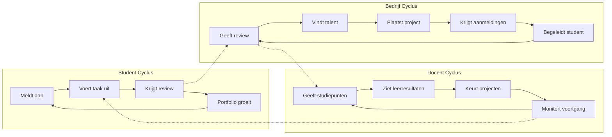

# Projojo Ecosysteem Strategie

> Een strategisch plan om Projojo te transformeren van een matching-platform naar een zelf-versterkend ecosysteem waar studenten portfolios opbouwen, bedrijven talent vinden, en docenten leertrajecten begeleiden.

---

## De Kernuitdaging

Een ecosysteem werkt alleen als het **zelf-versterkend** is. Dat betekent:

- Elke nieuwe student maakt het platform waardevoller voor bedrijven
- Elk nieuw project maakt het aantrekkelijker voor studenten
- Elke voltooide taak versterkt het vertrouwen in het systeem

---

## Kernprincipe: Onderwijs-First

Om te voorkomen dat studenten stoppen voor betaald werk of baanaanbiedingen, hanteert Projojo een **leer-eerst** model:

| Aspect | Aanpak | Waarom |
|--------|--------|--------|
| **Vergoeding** | Onbetaald of kleine onkostenvergoeding | Focus op leerervaring, niet op inkomen |
| **Projectduur** | Afgebakend (weken, niet maanden) | Past binnen curriculum, geen fulltime werk |
| **Docent-rol** | Poortwachter en begeleider | Ziet wat studenten doen, kan ingrijpen |
| **Baanaanbiedingen** | Welkom, maar pas na afstuderen | Bedrijf mag scouten, niet wegkapen |
| **Studiepunten** | Koppeling met curriculum | Werk = studie, niet werk OF studie |

**Het doel:** Werkervaring BINNEN de opleiding houden, zodat het de studie versterkt in plaats van vervangt.

---

## De Drie Pijlers van een Lopend Ecosysteem

### Pijler 1: Het Student Portfolio als Groeimachine

**Probleem nu:** Studenten voltooien een taak en... dat is het. Geen blijvende waarde.

**Oplossing: "Verified Work Portfolio"**

```
┌─────────────────────────────────────────────────────────┐
│  STUDENT PORTFOLIO                                      │
├─────────────────────────────────────────────────────────┤
│  ┌──────────────┐  ┌──────────────┐  ┌──────────────┐  │
│  │ Project A    │  │ Project B    │  │ Project C    │  │
│  │ ✓ Verified   │  │ ✓ Verified   │  │ In Progress  │  │
│  │ ★★★★☆        │  │ ★★★★★        │  │              │  │
│  │ Skills: 3    │  │ Skills: 5    │  │ Skills: 2    │  │
│  └──────────────┘  └──────────────┘  └──────────────┘  │
│                                                         │
│  Geverifieerde Skills: Python ████████░░ 80%           │
│                        React  ██████░░░░ 60%           │
│                        UX     ████░░░░░░ 40%           │
│                                                         │
│  Endorsements: 3 bedrijven, 2 docenten                 │
└─────────────────────────────────────────────────────────┘
```

**Waarom dit werkt:**

1. **Bewijs > CV** - Werkgevers zien wat studenten GEDAAN hebben, niet wat ze CLAIMEN
2. **Gamification** - Studenten willen hun portfolio uitbreiden
3. **Skill Validatie** - Bedrijven bevestigen skills na afronding
4. **Deelbaar** - Portfolio als LinkedIn-alternatief voor studenten

---

### Pijler 2: De Feedback Loop

Dit is het hart van het ecosysteem - na elke taak ontstaat waarde voor iedereen:



**Cruciale toevoegingen:**

1. **Review Systeem** (beide kanten)
   - Bedrijf reviewt student (skills, samenwerking, resultaat)
   - Student reviewt bedrijf (begeleiding, leerzaamheid, sfeer)

2. **Skill Endorsements**
   - Na afronding kan bedrijf specifieke skills "endorsen"
   - Dit bouwt een betrouwbare skill-grafiek op

3. **Studiepunten Integratie**
   - Docent kan voltooide taken koppelen aan studiepunten
   - Dit maakt het platform onderdeel van het curriculum

---

### Pijler 3: Netwerk-Effecten Bouwen

**Probleem:** Een platform zonder gebruikers trekt geen gebruikers aan.

**Oplossing: Gefaseerde groei met ingebouwde viraliteit**

| Fase | Focus | Viraliteit Mechanisme |
|------|-------|----------------------|
| 1 | Eén opleiding, lokale bedrijven | Docent nodigt studenten uit |
| 2 | Meerdere opleidingen | "Zoek een teamgenoot" - studenten nodigen elkaar uit |
| 3 | Regionale bedrijven | "Bekijk vergelijkbare bedrijven" - bedrijven nodigen concurrenten uit |
| 4 | Nationaal | Portfolio sharing naar LinkedIn/socials |

**Concrete Features voor Viraliteit:**

1. **Team Projecten** - Studenten kunnen samen aanmelden, nodigen vrienden uit
2. **Bedrijf Referrals** - "Wij werkten ook met X" - bedrijven in zelfde sector zien elkaar
3. **Alumni Terugkeer** - Afgestudeerden kunnen terugkomen als mentor of bedrijfscontact
4. **Portfolio Sharing** - Publieke portfolio pagina's die gedeeld kunnen worden

---

## Concrete Volgende Stappen (Prioriteit)

### Fase 1: Portfolio Foundation (Korte termijn)

- [ ] Voltooide taken tonen op studentprofiel
- [ ] Review/rating systeem na taak afronding
- [ ] Skill endorsement door bedrijven
- [ ] Publieke portfolio pagina

### Fase 2: Engagement Loops (Middellange termijn)

- [ ] Notificaties: "Nieuw project dat bij jouw skills past"
- [ ] Progress tracking: "Je hebt 3/5 skills voor Data Analist"
- [ ] Team aanmeldingen
- [ ] Docent dashboard met voortgang per student

### Fase 3: Ecosysteem Growth (Lange termijn)

- [ ] Studiepunten integratie met onderwijssystemen
- [ ] Bedrijven kunnen "talent pools" volgen
- [ ] Alumni mentorschap
- [ ] API voor externe integraties (LinkedIn, LMS)

---

## Risico's en Mitigatie

| Risico | Impact | Mitigatie |
|--------|--------|-----------|
| Kip-ei probleem (geen studenten = geen bedrijven) | Hoog | Start met captive audience (één opleiding) |
| Bedrijven misbruiken gratis arbeid | Hoog | Docent als curator/poortwachter, projecten max X weken |
| Studenten stoppen voor geld/baan | Medium | Onbetaald model, baanaanbod pas na diploma, docent ziet alles |
| Studenten haken af na eerste project | Medium | Portfolio gamification, skill badges |
| Reviews worden niet ingevuld | Medium | Reviews verplicht voor "Verified" badge |

---

---

## Uitbreiding: Burgers als Doelgroep

### Het "Living Lab" Model

Burgers kunnen waarde toevoegen als **testpersonen, eindgebruikers, of opdrachtgevers**:

| Rol | Beschrijving | Voorbeeld |
|-----|--------------|-----------|
| **Testpersoon** | Burger test product/service van student | UX-test van een app |
| **Eindgebruiker** | Burger is doelgroep van project | Senioren leren digitale vaardigheden |
| **Opdrachtgever** | Burger/buurt dient challenge in | "Maak onze wijk groener" |
| **Expert** | Burger deelt ervaringskennis | Patiënt adviseert zorg-studenten |

**Implementatie:**
- Burgers kunnen zich registreren als "community member"
- Geen portfolio, wel mogelijkheid om feedback te geven
- Burgerprojecten gemarkeerd als "Maatschappelijk"
- Gemeenten/wijkraden kunnen als "sponsor" optreden

---

## Uitbreiding: Regionale Kennissamenwerking

### Pre-Competitieve Samenwerking

Bedrijven concurreren niet als ze samenwerken aan **gedeelde uitdagingen**:

```
┌─────────────────────────────────────────────────────────┐
│  KENNISCLUSTER MODEL                                    │
├─────────────────────────────────────────────────────────┤
│                                                         │
│   Bedrijf A ──┐                                        │
│               │                                         │
│   Bedrijf B ──┼──► Sector Challenge ◄── Studenten      │
│               │    "Duurzame logistiek"              │
│   Bedrijf C ──┘     in de regio"                       │
│                                                         │
│   Resultaat: Gedeelde kennis, eigen implementatie      │
│                                                         │
└─────────────────────────────────────────────────────────┘
```

**Principes:**
1. **Gedeelde vraagstukken** - Bedrijven definiëren samen wat ze willen leren
2. **Open resultaten** - Onderzoeksresultaten zijn voor iedereen
3. **Eigen toepassing** - Hoe je het implementeert is concurrentievoordeel
4. **Geen directe concurrenten** - Complementaire bedrijven in cluster

**Voorbeelden:**
- Logistiek: "Hoe reduceren we uitstoot in last-mile delivery?"
- Zorg: "Hoe ondersteunen we mantelzorgers digitaal?"
- Techniek: "Hoe maken we productie circulair?"

---

## Uitbreiding: Opleidingsverificatie

### Integratie met Nationale Systemen

| Systeem | Doel | Status |
|---------|------|--------|
| **SURF/eduID** | Authenticatie studenten | Bestaand, te integreren |
| **Open Badges** | Skill-certificering | Standaard, zelf implementeren |
| **European Digital Credentials** | EU-erkende diploma's | Opkomend, toekomst |
| **DUO** | Officiële inschrijvingen | Via school, niet direct |

### Wat kunnen we verifiëren?

```
┌─────────────────────────────────────────────────────────┐
│  STUDENT VERIFICATIE NIVEAUS                            │
├─────────────────────────────────────────────────────────┤
│                                                         │
│  ✓ eduID Login         → Bewijs: is student            │
│  ✓ Opleiding           → Via school (handmatig/API)    │
│  ✓ Afgeronde semesters → Via school (SIS koppeling)    │
│  ✓ Competenties        → Open Badges (door school)     │
│  ✓ Projojo Ervaring    → Platform zelf (verified)      │
│                                                         │
└─────────────────────────────────────────────────────────┘
```

**Fasering:**
1. **Nu:** eduID login voor authenticatie
2. **Kort:** School kan handmatig opleiding/semester bevestigen
3. **Middel:** Open Badges voor competenties
4. **Lang:** SIS-integratie voor automatische verificatie

---

## Uitbreiding: Sectoren en Opdrachttypes

### Geschikte Sectoren

| Sector | Type Opdrachten | Specifieke Kenmerken |
|--------|-----------------|---------------------|
| **ICT/Software** | Stages, challenges, afstuderen | Hoog, veel remote mogelijk |
| **Techniek/Engineering** | Afstuderen, onderzoek | Vaak fysieke aanwezigheid |
| **Zorg/Welzijn** | Praktijkopdrachten, onderzoek | Privacy-gevoelig, begeleiding cruciaal |
| **Creatief/Design** | Portfolio-projecten, pitches | Visueel resultaat, IP-issues |
| **Business/Economie** | Consultancy, marktonderzoek | Resultaatgericht |
| **Onderwijs** | Lesmateriaal, onderzoek | Docentbegeleiding essentieel |
| **Recht** | Casestudies, juridisch advies | Supervisie vereist |

### Opdrachttypes

| Type | Duur | Studiepunten | Begeleiding |
|------|------|--------------|-------------|
| **Micro-taak** | Uren | Geen | Minimaal |
| **Challenge** | Weken | Optioneel | Project-based |
| **Stage** | Maanden | Ja | Intensief |
| **Afstuderen** | Semester | Ja | Zeer intensief |
| **Onderzoek** | Variabel | Ja | Academisch |

---

## Uitbreiding: AVG & Privacy

### Privacy by Design Principes

| Principe | Implementatie |
|----------|--------------|
| **Dataminimalisatie** | Alleen noodzakelijke gegevens verzamelen |
| **Doelbinding** | Data alleen voor matching/portfolio gebruiken |
| **Transparantie** | Duidelijk aangeven wat we bewaren en waarom |
| **Consent** | Expliciete toestemming voor elk gebruik |
| **Portabiliteit** | Student kan portfolio exporteren/meenemen |
| **Verwijdering** | Recht op vergetelheid implementeren |

### Concrete Maatregelen

```
┌─────────────────────────────────────────────────────────┐
│  DATA CATEGORIEËN                                       │
├─────────────────────────────────────────────────────────┤
│                                                         │
│  OPENBAAR (portfolio)     PRIVÉ (alleen voor matching)  │
│  ─────────────────────    ───────────────────────────  │
│  • Voltooide projecten    • E-mailadres                │
│  • Geverifieerde skills   • Telefoonnummer             │
│  • Reviews (geanonimiseerd)• Opleiding details        │
│  • Open Badges            • Locatie                    │
│                                                         │
│  VERWIJDERD NA X JAAR     NOOIT OPGESLAGEN             │
│  ─────────────────────    ───────────────────────────  │
│  • Niet-afgeronde taken   • BSN                        │
│  • Afgewezen aanmeldingen • Financiële gegevens        │
│  • Interne notities       • Gezondheidsgegevens        │
│                                                         │
└─────────────────────────────────────────────────────────┘
```

### Rollen en Verantwoordelijkheden (AVG)

| Rol | Partij | Verantwoordelijkheid |
|-----|--------|---------------------|
| **Verwerkingsverantwoordelijke** | School/Projojo (gezamenlijk) | Bepaalt doel en middelen |
| **Verwerker** | Projojo (platform) | Verwerkt data namens school |
| **Betrokkene** | Student/Burger | Rechten op inzage, correctie, verwijdering |

### Benodigde Documentatie
- [ ] Privacyverklaring
- [ ] Verwerkersovereenkomst (met scholen)
- [ ] DPIA (Data Protection Impact Assessment)
- [ ] Cookie policy
- [ ] Consent flows in UI

---

---

## Uitbreiding: SURF edubadges Integratie

### Wat zijn edubadges?

SURF edubadges is het Nederlandse systeem voor digitale badges in het onderwijs. Het is:
- Gebaseerd op de Open Badges standaard
- Beheerd door SURF (de ICT-coöperatie voor onderwijs)
- Al in gebruik bij veel hogescholen en universiteiten
- Gratis voor onderwijsinstellingen

### Waarom edubadges gebruiken?

| Voordeel | Beschrijving |
|----------|--------------|
| **Geen zelf bouwen** | Infrastructuur bestaat al |
| **Vertrouwd** | Scholen kennen en gebruiken het al |
| **Interoperabel** | Badges werken overal (LinkedIn, CV, etc.) |
| **Geverifieerd** | School is uitgever, niet Projojo |

### Integratie Scenario

```
┌─────────────────────────────────────────────────────────┐
│  EDUBADGES FLOW                                         │
├─────────────────────────────────────────────────────────┤
│                                                         │
│  1. Student voltooit taak in Projojo                   │
│              ↓                                          │
│  2. Bedrijf geeft review + skill endorsement           │
│              ↓                                          │
│  3. Docent keurt af (optioneel studiepunten)           │
│              ↓                                          │
│  4. School kent edubadge toe via SURF                  │
│              ↓                                          │
│  5. Badge verschijnt in student portfolio              │
│     (zowel Projojo als edubadges.nl)                   │
│                                                         │
└─────────────────────────────────────────────────────────┘
```

### Technische Integratie

| Optie | Complexiteit | Beschrijving |
|-------|--------------|--------------|
| **Handmatig** | Laag | Docent kent badge toe via edubadges.nl na Projojo-goedkeuring |
| **Deep link** | Medium | Projojo stuurt docent naar edubadges met pre-filled data |
| **API** | Hoog | Automatische badge-uitgifte via SURF API |

**Aanbeveling:** Start met handmatig, bouw naar deep link.

---

## Uitbreiding: Organisatiestructuur

### Waarom een Neutrale Rechtsvorm?

Voor pre-competitieve samenwerking tussen bedrijven is een neutrale partij essentieel:
- Bedrijven vertrouwen geen concurrent als beheerder
- IP en data moeten neutraal beheerd worden
- Langetermijn continuïteit vereist onafhankelijkheid

### Opties voor Rechtsvorm

| Vorm | Geschikt voor | Voordelen | Nadelen |
|------|---------------|-----------|---------|
| **Stichting** | Non-profit, ideëel doel | Geen winstoogmerk, vertrouwen | Geen leden, beperkte zeggenschap |
| **Coöperatie** | Gezamenlijk belang leden | Leden = eigenaren, democratisch | Complexer bestuur |
| **Vereniging** | Community-driven | Laagdrempelig, flexibel | Beperkte professionaliteit |
| **B.V.** | Commercieel | Duidelijke structuur | Winstoogmerk botst met missie |

### Aanbevolen Model: Coöperatie

```
┌─────────────────────────────────────────────────────────┐
│  PROJOJO COÖPERATIE U.A.                                │
├─────────────────────────────────────────────────────────┤
│                                                         │
│  LEDEN (stemrecht)                                      │
│  ├── Onderwijsinstellingen (bijv. 40%)                 │
│  ├── Bedrijven/Branches (bijv. 30%)                    │
│  ├── Overheid/Gemeenten (bijv. 20%)                    │
│  └── Studenten/Alumni (bijv. 10%)                      │
│                                                         │
│  BESTUUR                                                │
│  ├── Onafhankelijke voorzitter                         │
│  ├── Vertegenwoordiger onderwijs                       │
│  ├── Vertegenwoordiger bedrijfsleven                   │
│  └── Vertegenwoordiger overheid                        │
│                                                         │
│  UITVOERING                                             │
│  └── Projojo Platform (techniek + support)             │
│                                                         │
└─────────────────────────────────────────────────────────┘
```

### Financieringsmodel

| Bron | Type | Beschrijving |
|------|------|--------------|
| **Lidmaatschap scholen** | Vast | €X per jaar per opleiding |
| **Lidmaatschap bedrijven** | Vast | €X per jaar (gedifferentieerd naar grootte) |
| **Subsidies** | Variabel | NGI, Horizon Europe, RIF, regionale fondsen |
| **Diensten** | Variabel | Premium features, analytics, trainingen |

---

## Uitbreiding: Gemeente-Partnership

### Waarom Gemeenten?

Gemeenten zijn ideale partners voor burgerparticipatie:
- Budget voor participatie en sociale innovatie
- Toegang tot burgers en wijkraden
- Legitimiteit voor maatschappelijke projecten
- Lokale verankering

### Partnership Model

```
┌─────────────────────────────────────────────────────────┐
│  GEMEENTE PARTNERSHIP                                   │
├─────────────────────────────────────────────────────────┤
│                                                         │
│  GEMEENTE BIEDT:                PROJOJO BIEDT:         │
│  ─────────────────              ─────────────────       │
│  • Budget voor projecten        • Platform              │
│  • Toegang tot burgers          • Matching met studenten│
│  • Communicatiekanalen          • Projectbegeleiding    │
│  • Legitimiteit                 • Portfolio/resultaten  │
│  • Locaties                     • Evaluatie/rapportage  │
│                                                         │
│  VOORBEELDPROJECTEN:                                    │
│  ─────────────────────────────────────────────────      │
│  • Digitale inclusie senioren                          │
│  • Wijkapp ontwikkeling                                │
│  • Duurzaamheidsonderzoek                              │
│  • Toegankelijkheidsaudit                              │
│  • Jongerenparticipatie                                │
│                                                         │
└─────────────────────────────────────────────────────────┘
```

### Fasering Gemeente-Samenwerking

| Fase | Activiteit | Resultaat |
|------|------------|-----------|
| 1 | Pilot met 1 gemeente | Proof of concept, 3-5 projecten |
| 2 | Evaluatie en aanpassing | Best practices, templates |
| 3 | Uitrol naar regio | 5-10 gemeenten, structurele samenwerking |
| 4 | Landelijke schaal | VNG-partnership, standaard aanbod |

---

## Uitbreiding: Kennisclusters per Sector

### Model voor Pre-Competitieve Samenwerking

```
┌─────────────────────────────────────────────────────────┐
│  KENNISCLUSTER "DUURZAME LOGISTIEK ARNHEM-NIJMEGEN"    │
├─────────────────────────────────────────────────────────┤
│                                                         │
│  DEELNEMERS:                                            │
│  ├── 5 logistieke bedrijven (geen directe concurrenten)│
│  ├── HAN Logistiek                                     │
│  ├── Gemeente Arnhem + Nijmegen                        │
│  └── Brancheorganisatie TLN                            │
│                                                         │
│  GEDEELDE VRAAGSTUKKEN:                                │
│  ├── Hoe reduceren we CO2 in last-mile delivery?       │
│  ├── Hoe optimaliseren we laadinfrastructuur?          │
│  └── Hoe trainen we chauffeurs voor elektrisch rijden? │
│                                                         │
│  SPELREGELS:                                            │
│  ├── Onderzoeksresultaten zijn open voor alle leden    │
│  ├── Implementatie is eigen verantwoordelijkheid       │
│  ├── Geen directe concurrenten in zelfde cluster       │
│  ├── Studenten werken aan gezamenlijke vraagstukken    │
│  └── IP van studentwerk is van de coöperatie           │
│                                                         │
│  OUTPUT:                                                │
│  ├── Gedeelde kennis (rapporten, tools)                │
│  ├── Getrainde studenten (toekomstig personeel)        │
│  └── Netwerk en relaties                               │
│                                                         │
└─────────────────────────────────────────────────────────┘
```

### Voorbeeldclusters per Sector

| Cluster | Thema | Potentiële Deelnemers |
|---------|-------|----------------------|
| **Zorg Regio** | Digitale zorg voor thuiswonende ouderen | Ziekenhuizen, thuiszorg, gemeenten, HAN Verpleegkunde |
| **Tech Regio** | AI-toepassingen voor MKB | Software bedrijven, HAN ICT, Novio Tech Campus |
| **Energie Regio** | Energietransitie woningbouw | Installatiebedrijven, woningcorporaties, HAN Techniek |
| **Food Valley** | Duurzame voedselproductie | Voedselproducenten, WUR, HAN Food |

---

## Uitbreiding: Interdisciplinaire Samenwerking

### Waarom Interdisciplinair?

De meest waardevolle projecten vereisen expertise uit meerdere domeinen. Een app voor ouderenzorg heeft zowel ICT-studenten, zorgstudenten als designers nodig. Door studenten van verschillende opleidingen en niveaus samen te laten werken:

- **Studenten** leren samenwerken met andere disciplines (echte werkervaring)
- **Bedrijven** krijgen complete oplossingen, niet alleen deelproducten
- **Onderwijs** kan cross-curriculaire projecten aanbieden

### Model voor Cross-Disciplinaire Teams

```
┌─────────────────────────────────────────────────────────┐
│  INTERDISCIPLINAIR PROJECTTEAM                          │
├─────────────────────────────────────────────────────────┤
│                                                         │
│  PROJECT: "Digitale Huiskamer voor Senioren"           │
│                                                         │
│  TEAMSAMENSTELLING:                                     │
│  ├── 2x ICT (HBO) → App development                    │
│  ├── 1x Verpleegkunde (HBO) → Zorgbehoeften            │
│  ├── 1x Social Work (HBO) → Gedragsexpertise           │
│  ├── 1x CMD (HBO) → UX/UI Design                       │
│  └── 1x Informatica (WO) → Data architectuur           │
│                                                         │
│  BEGELEIDING:                                           │
│  ├── Projectcoördinator (vanuit bedrijf)               │
│  ├── Vakdocent per discipline                          │
│  └── Cross-disciplinaire coach (optioneel)             │
│                                                         │
│  STUDIEPUNTEN:                                          │
│  └── Elke student krijgt punten binnen eigen opleiding │
│                                                         │
└─────────────────────────────────────────────────────────┘
```

### Uitgewerkt Voorbeeld: "Digitale Huiskamer voor Senioren"

**Context:** Een zorginstelling wil eenzaamheid onder thuiswonende ouderen verminderen. De exacte oplossing staat niet vast - dat ontdekken studenten samen met de doelgroep.

#### Open Eind Leeromgeving: Principes

| Principe | Betekenis | In dit project |
|----------|-----------|----------------|
| **Emergente leeruitkomsten** | Studenten ontdekken wat ze moeten leren | Niemand weet vooraf welke technologie of aanpak het beste werkt |
| **Authentieke context** | Echte problemen, echte mensen | Ouderen en mantelzorgers zijn vanaf dag 1 betrokken |
| **Student-eigenaarschap** | Studenten bepalen mede de richting | Team kiest zelf welke oplossingsrichting ze verkennen |
| **Reflectie als leermiddel** | Leren door terugkijken | Elke sprint eindigt met reflectie op proces én inhoud |
| **Onzekerheid omarmen** | Niet alles is voorspelbaar | "We weten niet of dit werkt" is OK |

#### Agile Aanpak: Iteratief & Adaptief

```
┌─────────────────────────────────────────────────────────────────────────┐
│  AGILE PROJECT STRUCTUUR (16 weken)                                     │
├─────────────────────────────────────────────────────────────────────────┤
│                                                                         │
│  ┌─────────────────────────────────────────────────────────────────┐   │
│  │  DISCOVERY (Week 1-2) - "Wat is eigenlijk het probleem?"        │   │
│  │  ─────────────────────────────────────────────────────────────  │   │
│  │  • Kennismaking team + stakeholders (zorginstelling, ouderen)   │   │
│  │  • Design Thinking: empathize & define                          │   │
│  │  • Elke student formuleert persoonlijke leervragen              │   │
│  │  • Team stelt gezamenlijke "How Might We..." vraag op           │   │
│  │  • GEEN oplossing kiezen - alleen probleem begrijpen            │   │
│  │                                                                 │   │
│  │  Deliverable: Problem Statement + Persoonlijke Leerdoelen       │   │
│  └─────────────────────────────────────────────────────────────────┘   │
│                          ↓                                              │
│  ┌─────────────────────────────────────────────────────────────────┐   │
│  │  SPRINT 0 (Week 3-4) - "Welke richtingen zijn mogelijk?"        │   │
│  │  ─────────────────────────────────────────────────────────────  │   │
│  │  • Divergeren: 3+ verschillende oplossingsrichtingen verkennen  │   │
│  │  • Rapid prototyping (papier, Figma, no-code)                   │   │
│  │  • Elke discipline brengt eigen perspectief in                  │   │
│  │  • Testen met 3-5 ouderen: wat resoneert?                       │   │
│  │  • Team kiest richting op basis van feedback (niet vooraf!)     │   │
│  │                                                                 │   │
│  │  Deliverable: Gekozen richting + Eerste Product Backlog         │   │
│  └─────────────────────────────────────────────────────────────────┘   │
│                          ↓                                              │
│  ┌─────────────────────────────────────────────────────────────────┐   │
│  │  SPRINT 1-4 (Week 5-14) - Iteratieve ontwikkeling               │   │
│  │  ─────────────────────────────────────────────────────────────  │   │
│  │                                                                 │   │
│  │  Elke sprint (2-3 weken):                                       │   │
│  │  ┌─────────────────────────────────────────────────────────┐   │   │
│  │  │ PLANNING (2 uur)                                        │   │   │
│  │  │ • Wat is het belangrijkste om nu te leren/bouwen?       │   │   │
│  │  │ • Backlog refinement met hele team                      │   │   │
│  │  │ • User stories vanuit ALLE disciplines                  │   │   │
│  │  │ • Studenten kiezen eigen taken (pull, niet push)        │   │   │
│  │  └─────────────────────────────────────────────────────────┘   │   │
│  │              ↓                                                  │   │
│  │  ┌─────────────────────────────────────────────────────────┐   │   │
│  │  │ DAILY STANDUPS (15 min, 2-3x per week)                  │   │   │
│  │  │ • Wat heb ik geleerd? (niet alleen: wat heb ik gedaan)  │   │   │
│  │  │ • Waar loop ik vast?                                    │   │   │
│  │  │ • Wie kan mij helpen / wie kan ik helpen?               │   │   │
│  │  └─────────────────────────────────────────────────────────┘   │   │
│  │              ↓                                                  │   │
│  │  ┌─────────────────────────────────────────────────────────┐   │   │
│  │  │ SPRINT REVIEW (1 uur) - met stakeholders                │   │   │
│  │  │ • Demo van werkende increment aan ouderen/zorginstelling│   │   │
│  │  │ • Feedback direct verwerken in backlog                  │   │   │
│  │  │ • "Wat hebben we geleerd over het probleem?"            │   │   │
│  │  └─────────────────────────────────────────────────────────┘   │   │
│  │              ↓                                                  │   │
│  │  ┌─────────────────────────────────────────────────────────┐   │   │
│  │  │ RETROSPECTIVE (1 uur) - leren over leren                │   │   │
│  │  │ • Wat ging goed in de samenwerking?                     │   │   │
│  │  │ • Wat kunnen we verbeteren?                             │   │   │
│  │  │ • Persoonlijke leerdoelen: voortgang + bijstellen       │   │   │
│  │  │ • Interdisciplinaire reflectie: wat leer ik van anderen?│   │   │
│  │  └─────────────────────────────────────────────────────────┘   │   │
│  │                                                                 │   │
│  └─────────────────────────────────────────────────────────────────┘   │
│                          ↓                                              │
│  ┌─────────────────────────────────────────────────────────────────┐   │
│  │  AFSLUITING (Week 15-16) - Oogsten & Overdragen                 │   │
│  │  ─────────────────────────────────────────────────────────────  │   │
│  │  • Eindpresentatie voor alle stakeholders                       │   │
│  │  • Overdracht aan zorginstelling (docs, code, inzichten)        │   │
│  │  • Individuele reflectie: leerdoelen behaald?                   │   │
│  │  • Portfolio-items verzamelen en documenteren                   │   │
│  │  • Peer assessment: feedback van teamgenoten                    │   │
│  │                                                                 │   │
│  │  Deliverable: Werkend product + Leerportfolio + Overdracht      │   │
│  └─────────────────────────────────────────────────────────────────┘   │
│                                                                         │
└─────────────────────────────────────────────────────────────────────────┘
```

#### Rollen in het Agile Team

| Rol | Wie | Verantwoordelijkheid |
|-----|-----|---------------------|
| **Product Owner** | Contactpersoon zorginstelling | Prioriteert backlog, vertegenwoordigt eindgebruikers |
| **Scrum Master** | Roulerend (student) | Faciliteert ceremonies, bewaakt proces |
| **Team** | Alle studenten | Zelfsturend, cross-functioneel, gezamenlijk verantwoordelijk |
| **Coaches** | Docenten per discipline | Ondersteunen op inhoud, niet sturen |
| **Stakeholders** | Ouderen, mantelzorgers | Geven feedback elke sprint |

#### Open Eind: Wat staat NIET vast?

| Aspect | Traditioneel | Open Eind Aanpak |
|--------|--------------|------------------|
| **Eindproduct** | "Bouw een app" | "Los eenzaamheid op - hoe is aan jullie" |
| **Technologie** | "Gebruik React + Python" | "Kies wat past bij het probleem" |
| **Rolverdeling** | "ICT bouwt, CMD ontwerpt" | "Iedereen doet wat nodig is, leert van elkaar" |
| **Leeruitkomsten** | Vooraf gedefinieerd | Deels emergent - studenten formuleren eigen leervragen |
| **Succescriteria** | "Werkende app met X features" | "Waarde gecreëerd voor doelgroep + aantoonbaar geleerd" |

#### Wat staat WEL vast? (Kaders voor Veiligheid)

| Kader | Waarom |
|-------|--------|
| **Tijdsbox**: 16 weken | Voorkomt eindeloos doormodderen |
| **Sprint ritme**: 2-3 weken | Dwingt regelmatige reflectie af |
| **Minimale ceremonies** | Structuur voor samenwerking |
| **Ethische grenzen** | Privacy ouderen, geen schade |
| **Begeleiding beschikbaar** | Docenten als vangnet, niet als stuurders |

#### Persoonlijke Leerdoelen (Voorbeeld)

Elke student formuleert aan het begin eigen leervragen. Deze mogen gedurende het project evolueren:

| Student | Discipline | Initiële Leervraag | Na Sprint 2 (bijgesteld) |
|---------|------------|-------------------|-------------------------|
| **Anna** | ICT | "Hoe bouw ik een real-time chat?" | "Hoe maak ik technologie toegankelijk voor digibeten?" |
| **Bram** | Verpleegkunde | "Hoe signaleer je eenzaamheid?" | "Hoe combineer je tech-oplossingen met menselijk contact?" |
| **Carla** | Social Work | "Hoe activeer je passieve ouderen?" | "Hoe ontwerp je digitale interventies die gedragsverandering stimuleren?" |
| **David** | CMD | "Hoe ontwerp je voor ouderen?" | "Hoe test je met mensen die moeite hebben feedback te geven?" |
| **Eva** | Informatica | "Hoe bouw je privacy-by-design?" | "Hoe balanceer je dataverzameling voor inzicht met privacy?" |

#### User Stories: Interdisciplinair

User stories worden door het HELE team geschreven, niet alleen door ICT:

```
┌─────────────────────────────────────────────────────────────────────────┐
│  VOORBEELD USER STORIES - Sprint 2 Backlog                              │
├─────────────────────────────────────────────────────────────────────────┤
│                                                                         │
│  [ICT + CMD]                                                            │
│  Als oudere wil ik met één druk op de knop kunnen videobellen,          │
│  zodat ik geen ingewikkelde stappen hoef te onthouden.                  │
│  → Acceptatiecriteria: Getest met 3 ouderen, <10 sec tot verbinding     │
│                                                                         │
│  [Social Work + Verpleegkunde]                                          │
│  Als mantelzorger wil ik kunnen zien of mijn moeder actief is geweest,  │
│  zodat ik me minder zorgen maak zonder haar autonomie te schenden.      │
│  → Acceptatiecriteria: Balans privacy/zicht gevalideerd met ouderen     │
│                                                                         │
│  [Social Work + CMD]                                                    │
│  Als oudere wil ik uitgenodigd worden voor een "koffie-uurtje",         │
│  zodat ik een reden heb om de app te openen.                            │
│  → Acceptatiecriteria: 3 ouderen geven aan dit waardevol te vinden      │
│                                                                         │
│  [Informatica + Verpleegkunde]                                          │
│  Als zorgverlener wil ik signalen zien van afnemende activiteit,        │
│  zodat ik tijdig kan ingrijpen bij vereenzaming.                        │
│  → Acceptatiecriteria: Algoritme gevalideerd op historische data        │
│                                                                         │
│  [Hele team - LEARNING STORY]                                           │
│  Als team willen we begrijpen waarom ouderen afhaken na eerste gebruik, │
│  zodat we de onboarding kunnen verbeteren.                              │
│  → Acceptatiecriteria: 5 interviews afgenomen, inzichten gedocumenteerd │
│                                                                         │
└─────────────────────────────────────────────────────────────────────────┘
```

#### Definition of Done (Interdisciplinair)

Een increment is "Done" als:

| Criterium | Verantwoordelijke |
|-----------|-------------------|
| ✅ Werkend en gedemonstreerd aan stakeholders | ICT + CMD |
| ✅ Getest met minimaal 2 eindgebruikers | Hele team |
| ✅ Ethisch getoetst (privacy, geen schade) | Informatica + Verpleegkunde |
| ✅ Gedragsinzichten gedocumenteerd | Social Work |
| ✅ Zorgprotocol bijgewerkt indien nodig | Verpleegkunde |
| ✅ Leerinzichten gedeeld in retrospective | Hele team |

#### Emergente Leeruitkomsten (Portfolio)

Aan het eind van het project heeft elke student:

| Component | Beschrijving |
|-----------|--------------|
| **Werkbewijs** | Concrete bijdrage aan het product (code, ontwerp, protocol, etc.) |
| **Reflectieverslag** | Persoonlijke leerweg: wat wilde ik leren, wat heb ik geleerd, wat was onverwacht? |
| **Peer feedback** | Feedback van teamgenoten over samenwerking en bijdrage |
| **Stakeholder endorsement** | Bevestiging van waarde door zorginstelling/ouderen |
| **Interdisciplinaire inzichten** | "Wat heb ik geleerd van andere disciplines?" |

#### Hoe voorkom je silo's in Agile?

| Mechanisme | Beschrijving |
|------------|--------------|
| **Pair work across disciplines** | ICT'er en Social Worker doen samen user interview |
| **Gezamenlijke Definition of Done** | Iedereen moet akkoord voordat iets "Done" is |
| **Roulerende Scrum Master** | Elke sprint een andere student |
| **Cross-functionele user stories** | Stories hebben input nodig van meerdere disciplines |
| **Gedeelde retrospective** | Reflecteren op het team, niet op subgroepen |
| **"Teach back" momenten** | Elke discipline legt uit wat ze gedaan hebben |

### Niveaus van Samenwerking

| Niveau | Beschrijving | Voorbeeld |
|--------|--------------|-----------|
| **Binnen instelling** | Studenten van verschillende opleidingen binnen dezelfde hogeschool/universiteit | HAN ICT + HAN Verpleegkunde |
| **HBO-WO samenwerking** | Combinatie van praktijkgerichte en academische expertise | HAN Techniek + TU/e Research |
| **MBO-HBO samenwerking** | Uitvoerende en coördinerende rollen gecombineerd | ROC Techniek + HAN Engineering |
| **Cross-regionaal** | Studenten van verschillende instellingen in de regio | HAN + Radboud + ROC |

### Technische Implementatie

| Feature | Beschrijving |
|---------|--------------|
| **Opleiding-tags** | Elk studentprofiel toont opleiding en niveau |
| **Team Matching** | Projecten kunnen vereiste disciplines specificeren |
| **Multi-school Login** | eduID werkt voor alle Nederlandse onderwijsinstellingen |
| **Gedeelde Workspace** | Projectomgeving waar alle teamleden toegang hebben |
| **Per-discipline Beoordeling** | Elke docent beoordeelt eigen studenten |

### Uitdagingen en Oplossingen

| Uitdaging | Oplossing |
|-----------|----------|
| **Verschillende roosters** | Asynchrone samenwerking + geplande sync-momenten |
| **Verschillende beoordelingscriteria** | Per opleiding eigen rubrics, gedeelde projectdoelen |
| **Communicatie tussen instellingen** | Projojo als neutrale samenwerkingsomgeving |
| **IP en eigenaarschap** | Duidelijke afspraken vooraf, coöperatie als neutrale partij |

### Fasering Interdisciplinair

| Fase | Activiteit |
|------|------------|
| 1 | Cross-opleiding binnen één instelling (bijv. HAN) |
| 2 | HBO-HBO samenwerking in regio |
| 3 | HBO-WO samenwerking |
| 4 | Landelijk netwerk van samenwerkende instellingen |

---

## Uitbreiding: Student-Geïnitieerde Projecten

### Van Projectnemer naar Projectstarter

Naast het werken aan bedrijfsprojecten kunnen studenten in de toekomst ook **zelf projecten starten**. Dit stimuleert ondernemerschap en innovatie vanuit het onderwijs.

### Waarom Student-Projecten?

| Voordeel | Beschrijving |
|----------|--------------|
| **Ondernemerschap** | Studenten leren ideeën omzetten in actie |
| **Innovatie** | Frisse ideeën die bedrijven niet bedenken |
| **Eigenaarschap** | Hogere motivatie door eigen initiatief |
| **Talent Pool** | Investeerders en bedrijven vinden aanstormend talent |
| **Portfolio** | "Ik heb dit gebouwd" is sterker dan "ik heb hieraan meegewerkt" |

### Model voor Student-Projecten

```
┌─────────────────────────────────────────────────────────┐
│  STUDENT-GEÏNITIEERD PROJECT                            │
├─────────────────────────────────────────────────────────┤
│                                                         │
│  PROJECTVOORSTEL:                                       │
│  ├── Idee: "Sustainable Fashion Marketplace"           │
│  ├── Initiatiefnemer: Lisa (CMD, 3e jaar)              │
│  ├── Gezochte skills: Backend dev, Marketing, Finance  │
│  └── Status: Zoekt teamleden                           │
│                                                         │
│  ONDERSTEUNING:                                         │
│  ├── Docent-mentor (voor studiepunten)                 │
│  ├── Startup coach (via bijv. HAN Startup)             │
│  └── Incubator/accelerator (optioneel)                 │
│                                                         │
│  MOGELIJKE UITKOMSTEN:                                  │
│  ├── Leerervaring → Portfolio + studiepunten           │
│  ├── Startup → Doorstart na afstuderen                 │
│  ├── Overname → Bedrijf neemt concept over             │
│  └── Open Source → Publiek beschikbaar                 │
│                                                         │
└─────────────────────────────────────────────────────────┘
```

### Doelgroepen voor Student-Projecten

| Doelgroep | Wat ze zoeken | Wat ze bieden |
|-----------|---------------|---------------|
| **Medestudenten** | Interessant project om aan te werken | Skills, tijd, perspectief |
| **Docenten** | Innovatieve afstudeer/stageopdrachten | Begeleiding, studiepunten |
| **Alumni** | Kansen om terug te geven | Mentorschap, netwerk |
| **Investeerders** | Vroege toegang tot talent en ideeën | Funding, expertise, netwerk |
| **Bedrijven** | Innovatie van buitenaf | Pilots, co-creatie, eventuele overname |

### Projecttypes door Studenten

| Type | Beschrijving | Begeleiding |
|------|--------------|-------------|
| **Leerproject** | Bouwen om te leren, niet commercieel | Docent als mentor |
| **Startup-idee** | Potentieel commercieel, zoekt validatie | Startup coach + docent |
| **Social Impact** | Maatschappelijk doel, non-profit | NGO/gemeente als partner |
| **Open Source** | Bijdragen aan publieke codebase | Community + docent |
| **Research Spinoff** | Idee uit onderzoek verder ontwikkelen | Onderzoeker + bedrijf |

### Safeguards voor Student-Projecten

| Risico | Mitigatie |
|--------|----------|
| **Studenten besteden te veel tijd** | Maximum uren per week, koppeling aan studiepunten |
| **Exploitatie door investeerders** | Duidelijke IP-afspraken, docent als beschermer |
| **Projecten stranden** | Faalfase is OK, focus op leerervaring |
| **Kwaliteit varieert sterk** | Basisvalidatie door docent voordat project zichtbaar wordt |

### Technische Features voor Student-Projecten

| Feature | Beschrijving |
|---------|--------------|
| **"Start een Project"** | Student kan projectvoorstel indienen |
| **Teamvorming** | Andere studenten kunnen zich aanmelden |
| **Skill Matching** | Platform suggereert studenten met gezochte skills |
| **Pitch Page** | Publieke pagina om project te presenteren |
| **Investor View** | Investeerders kunnen projecten browsen (opt-in) |
| **Mentor Matching** | Koppeling met docenten of alumni mentors |

### Fasering Student-Projecten

| Fase | Activiteit |
|------|------------|
| 1 | Pilot met minor Ondernemerschap of vergelijkbaar |
| 2 | Integratie met HAN Startup / Incubator |
| 3 | Open voor alle studenten met docent-goedkeuring |
| 4 | Investeerder-toegang (opt-in, streng gescreend) |
| 5 | Cross-institutionele student-startups |

### Relatie met Bestaand Ecosysteem

```
┌─────────────────────────────────────────────────────────┐
│  ECOSYSTEEM MET STUDENT-PROJECTEN                       │
├─────────────────────────────────────────────────────────┤
│                                                         │
│  BEDRIJFSPROJECTEN          STUDENT-PROJECTEN          │
│  (vraag-gedreven)           (aanbod-gedreven)          │
│         │                          │                    │
│         ▼                          ▼                    │
│    ┌─────────────────────────────────────┐             │
│    │         STUDENT PORTFOLIO           │             │
│    │   (alle voltooide werk, verified)   │             │
│    └─────────────────────────────────────┘             │
│                      │                                  │
│                      ▼                                  │
│    ┌─────────────────────────────────────┐             │
│    │     ARBEIDSMARKT / INVESTEERDERS    │             │
│    │   (talent scouting, startup deals)  │             │
│    └─────────────────────────────────────┘             │
│                                                         │
└─────────────────────────────────────────────────────────┘
```

---

## Roadmap: Van MVP naar Ecosysteem

### Jaar 1: Foundation

| Q1-Q2 | Q3-Q4 |
|-------|-------|
| MVP met 1 opleiding | Portfolio feature live |
| 3-5 bedrijven pilot | Review systeem |
| Handmatige processen | 20+ actieve studenten |

### Jaar 2: Groei

| Q1-Q2 | Q3-Q4 |
|-------|-------|
| 3 opleidingen | Eerste gemeente-pilot |
| edubadges handmatig | 10 bedrijven |
| Eerste kenniscluster | 100+ studenten |
| **Pilot interdisciplinaire teams** | **Cross-opleiding matching** |

### Jaar 3: Schaal

| Q1-Q2 | Q3-Q4 |
|-------|-------|
| Coöperatie oprichten | 5 gemeenten |
| edubadges API | 3 kennisclusters |
| Regionale dekking | 500+ studenten |
| **Student-projecten pilot** | **HBO-WO samenwerking** |

### Jaar 4-5: Ecosysteem

| Activiteiten |
|--------------|
| Landelijke uitrol |
| VNG partnership |
| SURF integratie compleet |
| Burgerparticipatie structureel |
| Zelfvoorzienend financieringsmodel |
| **Interdisciplinaire teams als standaard** |
| **Student-startups met investor matching** |
| **Cross-institutionele samenwerking landelijk** |

---

## Advies

**Start klein, maar denk groot.**

De meest succesvolle educatieve ecosystemen (Coursera, LinkedIn Learning, GitHub) begonnen met één kernwaarde en bouwden daaromheen:

1. **GitHub** begon met code hosting → werd een developer portfolio
2. **LinkedIn** begon met netwerken → werd een recruitment platform
3. **Coursera** begon met video's → werd een certificeringsplatform

**Voor Projojo:**

Start met het **Verified Work Portfolio** als unique selling point. Dit is iets dat geen enkele andere partij (school, LinkedIn, Indeed) goed doet voor studenten.

De rest (studiepunten, team projecten, alumni, burgers, gemeenten, kennisclusters) volgt natuurlijk als het portfolio waarde bewijst.

---

## Volgende Concrete Stappen

1. **Technisch:** Portfolio feature bouwen (voltooide taken tonen)
2. **Organisatorisch:** Gesprek met SURF over edubadges integratie
3. **Partnerships:** Pilot-gemeente benaderen (bijv. Arnhem of Nijmegen)
4. **Juridisch:** AVG-documentatie opstellen (privacyverklaring, verwerkersovereenkomst)
5. **Strategisch:** Eerste kenniscluster identificeren (welke sector, welke bedrijven?)
6. **Interdisciplinair:** Gesprek met tweede opleiding binnen HAN voor cross-discipline pilot
7. **Student-projecten:** Verkenning met minor Ondernemerschap of HAN Startup voor pilot student-geïnitieerde projecten
