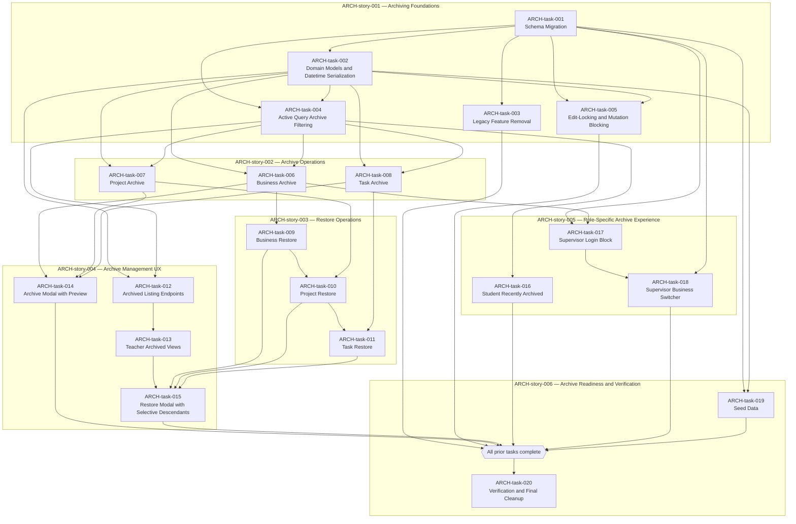

# Epic: Archiving System

---

## Umbrella Epic Story

**As a **teacher, student, supervisor, and archive-aware platform user, **I want **businesses, projects, and tasks to support controlled archiving and restoring with preview flows, permission enforcement, dependency-aware restore rules, and consistent UI feedback, **so that **archived data can be managed safely without breaking system behavior or confusing users.

This umbrella story is implemented through [ARCH-story-001](ARCH-story-001-archiving-foundations.md), [ARCH-story-002](ARCH-story-002-archive-operations.md), [ARCH-story-003](ARCH-story-003-restore-operations.md), [ARCH-story-004](ARCH-story-004-archive-management-ux.md), [ARCH-story-005](ARCH-story-005-role-specific-archive-experience.md), and [ARCH-story-006](ARCH-story-006-archive-readiness-and-verification.md).

---

## Overview

This directory contains tasks implementing the unified archiving and restoring system for Projojo as specified in the ARCHIVING_SPECIFICATION.md. The tasks are organized under explicit user stories and consolidated into a single backlog table for easier dependency and ownership tracking.

### Key Policy Changes from Current Codebase

The current `next-ui` branch uses an `isArchived` boolean approach (on business and project entities only). The specification replaces this entirely with:

- Timestamp-based archive state (`archivedAt`, `archivedBy`, `archivedReason`)
- Teacher-only archive and restore permissions
- Two-step preview-then-execute flow for all archive and restore operations
- Downward-only selective restore with preselection
- Multi-business supervisor model with conditional archiving
- Removal of draft business creation and hard-delete

---

## Explicit User Story Records

| User Story                                                             | Title                                    | Parent Story   | Child Tasks                   |
| ---------------------------------------------------------------------- | ---------------------------------------- | -------------- | ----------------------------- |
| ARCH-story-000                                                         | Unified Archiving and Restore Management | —              | ARCH-story-001–ARCH-story-006 |
| [ARCH-story-001](ARCH-story-001-archiving-foundations.md)              | Archiving Foundations                    | ARCH-story-000 | ARCH-task-001–ARCH-task-005   |
| [ARCH-story-002](ARCH-story-002-archive-operations.md)                 | Archive Operations                       | ARCH-story-000 | ARCH-task-006–ARCH-task-008   |
| [ARCH-story-003](ARCH-story-003-restore-operations.md)                 | Restore Operations                       | ARCH-story-000 | ARCH-task-009–ARCH-task-011   |
| [ARCH-story-004](ARCH-story-004-archive-management-ux.md)              | Archive Management UX                    | ARCH-story-000 | ARCH-task-012–ARCH-task-015   |
| [ARCH-story-005](ARCH-story-005-role-specific-archive-experience.md)   | Role-Specific Archive Experience         | ARCH-story-000 | ARCH-task-016–ARCH-task-018   |
| [ARCH-story-006](ARCH-story-006-archive-readiness-and-verification.md) | Archive Readiness and Verification       | ARCH-story-000 | ARCH-task-019–ARCH-task-020   |

---

## Master Backlog Table

| Task                                                           | Title                                                                   | Parent User Story                                                      | Priority    | Dependencies                                               |
| -------------------------------------------------------------- | ----------------------------------------------------------------------- | ---------------------------------------------------------------------- | ----------- | ---------------------------------------------------------- |
| [ARCH-task-001](ARCH-task-001-schema-migration.md)             | Schema Migration: Archive Attributes and Supervisor Cardinality         | [ARCH-story-001](ARCH-story-001-archiving-foundations.md)              | 🔴 Critical | None                                                       |
| [ARCH-task-002](ARCH-task-002-domain-models-datetime.md)       | Domain Models and Datetime Serialization                                | [ARCH-story-001](ARCH-story-001-archiving-foundations.md)              | 🔴 Critical | ARCH-task-001                                              |
| [ARCH-task-003](ARCH-task-003-legacy-feature-removal.md)       | Legacy Feature Removal: Draft Business, Hard-Delete, Portfolio Snapshot | [ARCH-story-001](ARCH-story-001-archiving-foundations.md)              | 🔴 Critical | ARCH-task-001                                              |
| [ARCH-task-004](ARCH-task-004-active-query-filtering.md)       | Active Query Archive Filtering and Count Accuracy                       | [ARCH-story-001](ARCH-story-001-archiving-foundations.md)              | 🔴 Critical | ARCH-task-001, ARCH-task-002                               |
| [ARCH-task-005](ARCH-task-005-edit-locking.md)                 | Edit-Locking and Mutation Blocking for Archived Entities                | [ARCH-story-001](ARCH-story-001-archiving-foundations.md)              | 🔴 Critical | ARCH-task-001, ARCH-task-002                               |
| [ARCH-task-006](ARCH-task-006-business-archive.md)             | Business Archive: Preview and Execute with Cascade                      | [ARCH-story-002](ARCH-story-002-archive-operations.md)                 | 🔴 Critical | ARCH-task-002, ARCH-task-004                               |
| [ARCH-task-007](ARCH-task-007-project-archive.md)              | Project Archive: Preview and Execute with Cascade                       | [ARCH-story-002](ARCH-story-002-archive-operations.md)                 | 🔴 Critical | ARCH-task-002, ARCH-task-004                               |
| [ARCH-task-008](ARCH-task-008-task-archive.md)                 | Task Archive: Preview and Execute with Cascade                          | [ARCH-story-002](ARCH-story-002-archive-operations.md)                 | 🟡 High     | ARCH-task-002, ARCH-task-004                               |
| [ARCH-task-009](ARCH-task-009-business-restore.md)             | Business Restore: Preview, Selective Descendants, and Execute           | [ARCH-story-003](ARCH-story-003-restore-operations.md)                 | 🔴 Critical | ARCH-task-006                                              |
| [ARCH-task-010](ARCH-task-010-project-restore.md)              | Project Restore: Preview, Blocked-Parent Check, and Execute             | [ARCH-story-003](ARCH-story-003-restore-operations.md)                 | 🔴 Critical | ARCH-task-007, ARCH-task-009                               |
| [ARCH-task-011](ARCH-task-011-task-restore.md)                 | Task Restore: Preview, Blocked-Parent Check, and Execute                | [ARCH-story-003](ARCH-story-003-restore-operations.md)                 | 🟡 High     | ARCH-task-008, ARCH-task-010                               |
| [ARCH-task-012](ARCH-task-012-archived-listing-endpoints.md)   | Archived Listing Endpoints with Parent Context                          | [ARCH-story-004](ARCH-story-004-archive-management-ux.md)              | 🟡 High     | ARCH-task-002, ARCH-task-004                               |
| [ARCH-task-013](ARCH-task-013-teacher-archived-views.md)       | Teacher Page: Archived Views for Businesses, Projects, and Tasks        | [ARCH-story-004](ARCH-story-004-archive-management-ux.md)              | 🔴 Critical | ARCH-task-012                                              |
| [ARCH-task-014](ARCH-task-014-archive-modal-preview.md)        | Archive Modal with Backend Preview                                      | [ARCH-story-004](ARCH-story-004-archive-management-ux.md)              | 🔴 Critical | ARCH-task-006, ARCH-task-007, ARCH-task-008                |
| [ARCH-task-015](ARCH-task-015-restore-modal-selective.md)      | Restore Modal with Selective Descendants                                | [ARCH-story-004](ARCH-story-004-archive-management-ux.md)              | 🔴 Critical | ARCH-task-009, ARCH-task-010, ARCH-task-011, ARCH-task-013 |
| [ARCH-task-016](ARCH-task-016-student-recently-archived.md)    | Student Dashboard: Recently Archived Registrations                      | [ARCH-story-005](ARCH-story-005-role-specific-archive-experience.md)   | 🟡 High     | ARCH-task-004                                              |
| [ARCH-task-017](ARCH-task-017-supervisor-login-block.md)       | Supervisor Login Block for Fully Archived Accounts                      | [ARCH-story-005](ARCH-story-005-role-specific-archive-experience.md)   | 🟡 High     | ARCH-task-001, ARCH-task-006                               |
| [ARCH-task-018](ARCH-task-018-supervisor-business-switcher.md) | Multi-Business Supervisor Switcher                                      | [ARCH-story-005](ARCH-story-005-role-specific-archive-experience.md)   | 🟡 High     | ARCH-task-001, ARCH-task-017                               |
| [ARCH-task-019](ARCH-task-019-seed-data.md)                    | Seed Data for Archive Scenarios                                         | [ARCH-story-006](ARCH-story-006-archive-readiness-and-verification.md) | 🟡 High     | ARCH-task-001, ARCH-task-002                               |
| [ARCH-task-020](ARCH-task-020-verification-cleanup.md)         | Verification and Final Cleanup                                          | [ARCH-story-006](ARCH-story-006-archive-readiness-and-verification.md) | 🟡 High     | All previous tasks                                         |

The `Parent User Story` column shows the direct story owner for each task.

---

## Dependency Graph

---

## Specification Traceability

| Spec Section                     | Covered By                                                                                              |
| -------------------------------- | ------------------------------------------------------------------------------------------------------- |
| §2.1–2.5 Data Model              | ARCH-task-001, ARCH-task-002                                                                            |
| §3.1 Permission Model            | ARCH-task-006, ARCH-task-007, ARCH-task-008, ARCH-task-009, ARCH-task-010, ARCH-task-011, ARCH-task-014 |
| §3.2 Archive Operations          | ARCH-task-006, ARCH-task-007, ARCH-task-008                                                             |
| §3.3 Restore Operations          | ARCH-task-009, ARCH-task-010, ARCH-task-011                                                             |
| §3.4 Error Semantics             | ARCH-task-006–ARCH-task-011, ARCH-task-014, ARCH-task-015                                               |
| §3.5 Visibility and Filtering    | ARCH-task-004                                                                                           |
| §3.6 Edit-Locking                | ARCH-task-005                                                                                           |
| §3.7 Idempotency                 | ARCH-task-006, ARCH-task-007, ARCH-task-008                                                             |
| §3.8 Name Uniqueness             | ARCH-task-009, ARCH-task-010, ARCH-task-011                                                             |
| §4.1–4.3 Cascade Specs           | ARCH-task-006, ARCH-task-007, ARCH-task-008                                                             |
| §4.4 Restore Preview Rules       | ARCH-task-009, ARCH-task-010, ARCH-task-011                                                             |
| §4.5 Supervisor Multi-Business   | ARCH-task-006, ARCH-task-017, ARCH-task-018                                                             |
| §4.6 Cascade Atomicity           | ARCH-task-006, ARCH-task-007, ARCH-task-008, ARCH-task-009, ARCH-task-010, ARCH-task-011                |
| §5.1–5.3 API Contract            | ARCH-task-006, ARCH-task-007, ARCH-task-008, ARCH-task-009, ARCH-task-010, ARCH-task-011                |
| §5.4 Archived Listings           | ARCH-task-012                                                                                           |
| §5.5 API Modeling                | ARCH-task-002, all backend tasks                                                                        |
| §6.1 Teacher Archived Views      | ARCH-task-013                                                                                           |
| §6.2 Archive Modal UX            | ARCH-task-014                                                                                           |
| §6.3 Restore Modal UX            | ARCH-task-015                                                                                           |
| §6.4 Student Recently Archived   | ARCH-task-016                                                                                           |
| §6.5 Archive State Detection     | ARCH-task-002, ARCH-task-013, ARCH-task-014, ARCH-task-015                                              |
| §6.6 Supervisor Login Block      | ARCH-task-017                                                                                           |
| §6.7 Supervisor Switcher         | ARCH-task-018                                                                                           |
| §7.1 Registration Count Accuracy | ARCH-task-004                                                                                           |
| §7.2 Skill-Match Calculations    | ARCH-task-004                                                                                           |
| §7.3 Public Discovery            | ARCH-task-004                                                                                           |
| §7.4 Legacy Feature Removal      | ARCH-task-003                                                                                           |
| §7.5 Notifications Deferred      | ARCH-task-014, ARCH-task-015 (copy honesty)                                                             |
| §8.1 Migration Strategy          | ARCH-task-001                                                                                           |
| §8.2 Seed Data                   | ARCH-task-019                                                                                           |
| §8.4 Verification Strategy       | ARCH-task-020                                                                                           |
