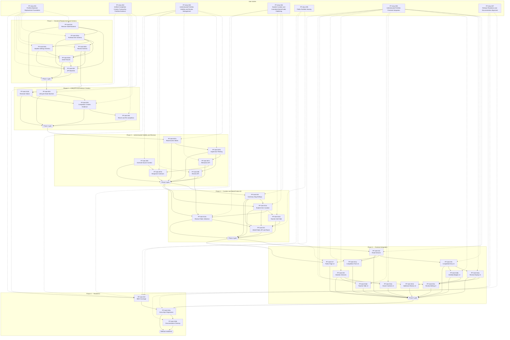

# Epic: Portfolio System

## Umbrella Epic Story

**As a** student, teacher, supervisor, reviewer, public visitor, and release reviewer, **I want** portfolio evidence to be created from verified completed work, reviewed credibly, curated intentionally, shown through authenticated and world-public visibility rules, and protected by cross-epic regression checks, **so that** Projojo can support trustworthy student portfolio presentation across the full Portfolio feature set.

This umbrella story is implemented through [PF-story-001](PF-story-001-portfolio-backend-replacement-foundation.md) to [PF-story-007](PF-story-007-release-readiness-cross-epic-regression-and-documentation-alignment.md). The cross-cutting automated coverage task [PF-task-019](PF-task-019-portfolio-bdd-api-and-browser-coverage.md) supports every story as a phase-gated test enabler rather than a standalone product slice.

## Master Backlog Table

| ID                                                                                          | Title                                                                    | User Story                                                                                          | Phase                                      | Priority       | Type                                    | Dependencies                                                                                               |
| ------------------------------------------------------------------------------------------- | ------------------------------------------------------------------------ | --------------------------------------------------------------------------------------------------- | ------------------------------------------ | -------------- | --------------------------------------- | ---------------------------------------------------------------------------------------------------------- |
| [PF-task-001](PF-task-001-remove-stale-portfolio-backend.md)                                | Remove Stale Snapshot and Mixed Portfolio Backend                        | [PF-story-001](PF-story-001-portfolio-backend-replacement-foundation.md)                            | 1 — Backend / Schema                       | 🔴 Critical    | Technical Task                          | SF-task-001, SF-task-003                                                                                   |
| [PF-task-002a](PF-task-002a-canonical-portfolio-item-schema.md)                             | Canonical Portfolio Item Schema                                          | [PF-story-001](PF-story-001-portfolio-backend-replacement-foundation.md)                            | 1 — Backend / Schema                       | 🔴 Critical    | Technical Task (Schema)                 | PF-task-001, SF-task-004                                                                                   |
| [PF-task-002b](PF-task-002b-portfolio-review-schema-and-author-relations.md)                | Portfolio Review Schema and Author Relations                             | [PF-story-001](PF-story-001-portfolio-backend-replacement-foundation.md)                            | 1 — Backend / Schema                       | 🔴 Critical    | Technical Task (Schema)                 | PF-task-002a, SF-task-004                                                                                  |
| [PF-task-002c](PF-task-002c-student-portfolio-settings-schema.md)                           | Student Portfolio Settings Schema                                        | [PF-story-001](PF-story-001-portfolio-backend-replacement-foundation.md)                            | 1 — Backend / Schema                       | 🔴 Critical    | Technical Task (Schema)                 | PF-task-002a, SF-task-004                                                                                  |
| [PF-task-002d](PF-task-002d-portfolio-seed-fixtures-and-reset-contract.md)                  | Portfolio Seed Fixtures and Reset Contract                               | [PF-story-001](PF-story-001-portfolio-backend-replacement-foundation.md)                            | 1 — Backend / Schema                       | 🔴 Critical    | Technical Task (Seed / Test Data)       | PF-task-002a, PF-task-002b, PF-task-002c, SF-task-004                                                      |
| [PF-task-003](PF-task-003-authenticated-portfolio-api-baseline.md)                          | Authenticated Portfolio API Baseline and Public Slug Guard               | [PF-story-001](PF-story-001-portfolio-backend-replacement-foundation.md)                            | 1 — Backend / Schema                       | 🔴 Critical    | Functional Task (API)                   | PF-task-001, PF-task-002a, PF-task-002b, PF-task-002c, PF-task-002d, SF-task-001                           |
| [PF-task-004](PF-task-004-registration-lifecycle-api-and-state-machine.md)                  | Registration Lifecycle API Authorization and State Machine               | [PF-story-002](PF-story-002-verified-completion-creates-trustworthy-portfolio-evidence.md)          | 2 — Lifecycle / Evidence                   | 🔴 Critical    | Functional Task (API / State Machine)   | PF-task-003, SF-task-002                                                                                   |
| [PF-task-005](PF-task-005-completion-creates-portfolio-item-and-review.md)                  | Completion Creates Canonical Portfolio Item and Initial Review           | [PF-story-002](PF-story-002-verified-completion-creates-trustworthy-portfolio-evidence.md)          | 2 — Lifecycle / Evidence                   | 🔴 Critical    | Functional Task (API / Persistence)     | PF-task-002a, PF-task-002b, PF-task-004, PF-task-012b                                                      |
| [PF-task-006](PF-task-006-revert-and-recompletion-behavior.md)                              | Revert Completion, Revert Start, and Re-completion Behavior              | [PF-story-002](PF-story-002-verified-completion-creates-trustworthy-portfolio-evidence.md)          | 2 — Lifecycle / Evidence                   | 🔴 Critical    | Functional Task (API / Consistency)     | PF-task-004, PF-task-005                                                                                   |
| [PF-task-007a](PF-task-007a-authenticated-portfolio-read-access-matrix.md)                  | Authenticated Portfolio Read Access Matrix                               | [PF-story-003](PF-story-003-authenticated-portfolio-visibility-and-review-management.md)            | 3 — Authenticated Visibility / Reviews     | 🔴 Critical    | Functional Task (API / Security)        | PF-task-003, PF-task-005, PF-task-006, SF-task-001                                                         |
| [PF-task-007b](PF-task-007b-supervisor-authenticated-public-item-filtering.md)              | Supervisor Authenticated-Public Item Filtering                           | [PF-story-003](PF-story-003-authenticated-portfolio-visibility-and-review-management.md)            | 3 — Authenticated Visibility / Reviews     | 🔴 Critical    | Functional Task (API / Security)        | PF-task-007a, PF-task-005, PF-task-006                                                                     |
| [PF-task-007c](PF-task-007c-student-authenticated-public-retraction-api.md)                 | Student Authenticated-Public Retraction API                              | [PF-story-003](PF-story-003-authenticated-portfolio-visibility-and-review-management.md)            | 3 — Authenticated Visibility / Reviews     | 🔴 Critical    | Functional Task (API / Curation)        | PF-task-007a, PF-task-007b                                                                                 |
| [PF-task-007d](PF-task-007d-authenticated-portfolio-response-contract-examples.md)          | Authenticated Portfolio Response Contract Examples                       | [PF-story-003](PF-story-003-authenticated-portfolio-visibility-and-review-management.md)            | 3 — Authenticated Visibility / Reviews     | 🔴 Critical    | Technical Task (API Contract)           | PF-task-007a, PF-task-007b, PF-task-007c, PF-task-009                                                      |
| [PF-task-008](PF-task-008-review-creation-and-editing.md)                                   | Additional Review Creation and Review Editing                            | [PF-story-003](PF-story-003-authenticated-portfolio-visibility-and-review-management.md)            | 3 — Authenticated Visibility / Reviews     | 🔴 Critical    | Functional Task (API)                   | PF-task-005, PF-task-007b, PF-task-012b                                                                    |
| [PF-task-009](PF-task-009-archived-source-context.md)                                       | Archived-Source Portfolio Context and Disabled Navigation                | [PF-story-003](PF-story-003-authenticated-portfolio-visibility-and-review-management.md)            | 3 — Authenticated Visibility / Reviews     | 🟠 Medium-High | Functional Task (API Integration)       | PF-task-007b, PF-task-007d, SF-task-003                                                                    |
| [PF-task-010](PF-task-010-student-summary-slug-and-public-settings.md)                      | Student Portfolio Summary, Slug, and World-Public Page Settings          | [PF-story-004](PF-story-004-student-curation-and-controlled-world-public-publishing.md)             | 4 — Curation / Public API                  | 🔴 Critical    | Functional Task (API)                   | PF-task-002c, PF-task-003, PF-task-007a                                                                    |
| [PF-task-011a](PF-task-011a-student-item-ordering-hide-show-and-world-visible-selection.md) | Student Item Ordering, Hide/Show, and World-Visible Selection            | [PF-story-004](PF-story-004-student-curation-and-controlled-world-public-publishing.md)             | 4 — Curation / Public API                  | 🔴 Critical    | Functional Task (API)                   | PF-task-007b, PF-task-007c, PF-task-010                                                                    |
| [PF-task-011b](PF-task-011b-teacher-portfolio-item-soft-hide-and-precedence.md)             | Teacher Portfolio Item Soft-Hide and Precedence                          | [PF-story-004](PF-story-004-student-curation-and-controlled-world-public-publishing.md)             | 4 — Curation / Public API                  | 🔴 Critical    | Functional Task (API / Moderation)      | PF-task-002a, PF-task-007b, PF-task-011a                                                                   |
| [PF-task-012a](PF-task-012a-student-review-world-public-selection-api.md)                   | Student Review World-Public Selection API                                | [PF-story-004](PF-story-004-student-curation-and-controlled-world-public-publishing.md)             | 4 — Curation / Public API                  | 🔴 Critical    | Functional Task (API / Privacy)         | PF-task-008, PF-task-011a, PF-task-012b                                                                    |
| [PF-task-012b](PF-task-012b-reviewer-public-use-notice-enforcement.md)                      | Reviewer Public-Use Notice Enforcement                                   | [PF-story-002](PF-story-002-verified-completion-creates-trustworthy-portfolio-evidence.md)          | 2–4 — Review and Public Publication Safety | 🔴 Critical    | Functional Task (API / Privacy)         | PF-task-002b                                                                                               |
| [PF-task-013](PF-task-013-world-public-portfolio-api-and-route.md)                          | World-Public Portfolio API and Minimal Frontend Route Shell              | [PF-story-005](PF-story-005-public-portfolio-viewing.md)                                            | 4 — Curation / Public API                  | 🔴 Critical    | Functional Task (API / Routing)         | PF-task-010, PF-task-011a, PF-task-011b, PF-task-012a                                                      |
| [PF-task-014](PF-task-014-portfolio-service-layer-and-data-wiring.md)                       | Frontend Portfolio Read Service Layer for New APIs                       | [PF-story-006](PF-story-006-authenticated-portfolio-frontend-integration.md)                        | 5 — Frontend Integration                   | 🔴 Critical    | Technical Task (Frontend API Wiring)    | PF-task-003, PF-task-013                                                                                   |
| [PF-task-015](PF-task-015-authenticated-portfolio-ui-completed-only.md)                     | Authenticated Portfolio UI Shows Completed Work Only                     | [PF-story-006](PF-story-006-authenticated-portfolio-frontend-integration.md)                        | 5 — Frontend Integration                   | 🔴 Critical    | Functional Task (Frontend)              | PF-task-014, PF-task-007a, PF-task-007b, PF-task-009                                                       |
| [PF-task-016a](PF-task-016a-portfolio-item-review-and-rating-display-ui.md)                 | Portfolio Item Review and Rating Display UI                              | [PF-story-006](PF-story-006-authenticated-portfolio-frontend-integration.md)                        | 5 — Frontend Integration                   | 🔴 Critical    | Functional Task (Frontend)              | PF-task-008, PF-task-014, PF-task-015                                                                      |
| [PF-task-016b](PF-task-016b-portfolio-item-visibility-badges-and-explanations-ui.md)        | Portfolio Item Visibility Badges and Explanations UI                     | [PF-story-006](PF-story-006-authenticated-portfolio-frontend-integration.md)                        | 5 — Frontend Integration                   | 🔴 Critical    | Functional Task (Frontend)              | PF-task-007d, PF-task-009, PF-task-015                                                                     |
| [PF-task-016c](PF-task-016c-portfolio-item-owner-curation-controls-ui.md)                   | Portfolio Item Owner Curation Controls UI                                | [PF-story-006](PF-story-006-authenticated-portfolio-frontend-integration.md)                        | 5 — Frontend Integration                   | 🔴 Critical    | Functional Task (Frontend)              | PF-task-011a, PF-task-012a, PF-task-015, PF-task-020                                                       |
| [PF-task-016d](PF-task-016d-teacher-portfolio-item-hide-control-ui.md)                      | Teacher Portfolio Item Hide Control UI                                   | [PF-story-006](PF-story-006-authenticated-portfolio-frontend-integration.md)                        | 5 — Frontend Integration                   | 🔴 Critical    | Functional Task (Frontend / Moderation) | PF-task-011b, PF-task-015, PF-task-020                                                                     |
| [PF-task-017](PF-task-017-public-portfolio-page-ui.md)                                      | Public Portfolio Page UI                                                 | [PF-story-005](PF-story-005-public-portfolio-viewing.md)                                            | 5 — Frontend Integration                   | 🔴 Critical    | Functional Task (Frontend)              | PF-task-013, PF-task-014                                                                                   |
| [PF-task-018a](PF-task-018a-portfolio-cross-epic-regression-gate.md)                        | Portfolio Cross-Epic Regression Gate                                     | [PF-story-007](PF-story-007-release-readiness-cross-epic-regression-and-documentation-alignment.md) | 6 — Readiness                              | 🔴 Critical    | Non-functional Task (Regression)        | PF-task-015, PF-task-016a, PF-task-016b, PF-task-016c, PF-task-016d, PF-task-017, SF-task-003, SF-task-004 |
| [PF-task-018b](PF-task-018b-portfolio-documentation-cleanup.md)                             | Portfolio Documentation Cleanup for Snapshot and Hard-Delete Assumptions | [PF-story-007](PF-story-007-release-readiness-cross-epic-regression-and-documentation-alignment.md) | 6 — Readiness                              | 🔴 Critical    | Non-functional Task (Documentation)     | PF-task-018a                                                                                               |
| [PF-task-019](PF-task-019-portfolio-bdd-api-and-browser-coverage.md)                        | Portfolio BDD API and Browser Coverage                                   | PF-story-001–PF-story-007                                                                           | All Portfolio Phases                       | 🔴 Critical    | Technical Task (BDD / E2E Testing)      | SF-task-005, staged dependencies on each implementation task                                               |
| [PF-task-020](PF-task-020-portfolio-settings-and-curation-services.md)                      | Frontend Portfolio Settings and Curation Services                        | [PF-story-006](PF-story-006-authenticated-portfolio-frontend-integration.md)                        | 5 — Frontend Integration                   | 🔴 Critical    | Technical Task (Frontend API Wiring)    | PF-task-007c, PF-task-010, PF-task-011a, PF-task-011b, PF-task-012a, PF-task-014                           |
| [PF-task-021a](PF-task-021a-lifecycle-completion-review-form-ui.md)                         | Lifecycle Completion Review Form UI                                      | [PF-story-006](PF-story-006-authenticated-portfolio-frontend-integration.md)                        | 5 — Frontend Integration                   | 🔴 Critical    | Functional Task (Frontend / API Wiring) | PF-task-004, PF-task-005, PF-task-012b, PF-task-014                                                        |
| [PF-task-021b](PF-task-021b-additional-review-creation-ui.md)                               | Additional Review Creation UI                                            | [PF-story-006](PF-story-006-authenticated-portfolio-frontend-integration.md)                        | 5 — Frontend Integration                   | 🔴 Critical    | Functional Task (Frontend / API Wiring) | PF-task-008, PF-task-012b, PF-task-016a                                                                    |
| [PF-task-021c](PF-task-021c-review-editing-ui.md)                                           | Review Editing UI                                                        | [PF-story-006](PF-story-006-authenticated-portfolio-frontend-integration.md)                        | 5 — Frontend Integration                   | 🔴 Critical    | Functional Task (Frontend / API Wiring) | PF-task-008, PF-task-016a, PF-task-016b                                                                    |

---

## Explicit User Story Records

| User Story                                                                                          | Title                                                                 | Parent Story | Child Tasks                                                                                             |
| --------------------------------------------------------------------------------------------------- | --------------------------------------------------------------------- | ------------ | ------------------------------------------------------------------------------------------------------- |
| PF-story-000                                                                                        | Portfolio System Experience                                           | —            | PF-story-001–PF-story-007                                                                               |
| [PF-story-001](PF-story-001-portfolio-backend-replacement-foundation.md)                            | Portfolio Backend Replacement Foundation                              | PF-story-000 | PF-task-001, PF-task-002a–PF-task-002d, PF-task-003, PF-task-019                                        |
| [PF-story-002](PF-story-002-verified-completion-creates-trustworthy-portfolio-evidence.md)          | Verified Completion Creates Trustworthy Portfolio Evidence            | PF-story-000 | PF-task-004–PF-task-006, PF-task-012b, PF-task-019                                                      |
| [PF-story-003](PF-story-003-authenticated-portfolio-visibility-and-review-management.md)            | Authenticated Portfolio Visibility and Review Management              | PF-story-000 | PF-task-007a–PF-task-007d, PF-task-008–PF-task-009, PF-task-019                                         |
| [PF-story-004](PF-story-004-student-curation-and-controlled-world-public-publishing.md)             | Student Curation and Controlled World-Public Publishing               | PF-story-000 | PF-task-010, PF-task-011a–PF-task-011b, PF-task-012a, PF-task-019                                       |
| [PF-story-005](PF-story-005-public-portfolio-viewing.md)                                            | Public Portfolio Viewing                                              | PF-story-000 | PF-task-013, PF-task-017, PF-task-019                                                                   |
| [PF-story-006](PF-story-006-authenticated-portfolio-frontend-integration.md)                        | Authenticated Portfolio Frontend Integration                          | PF-story-000 | PF-task-014–PF-task-015, PF-task-016a–PF-task-016d, PF-task-020, PF-task-021a–PF-task-021c, PF-task-019 |
| [PF-story-007](PF-story-007-release-readiness-cross-epic-regression-and-documentation-alignment.md) | Release Readiness, Cross-Epic Regression, and Documentation Alignment | PF-story-000 | PF-task-018a–PF-task-018b, PF-task-019                                                                  |

The `User Story` column in the master backlog table above shows which story owns each task. [PF-task-019](PF-task-019-portfolio-bdd-api-and-browser-coverage.md) is intentionally cross-cutting because it supplies phase-gated automated coverage for all seven stories.

---

## Dependency Graph

---

## Phase Summary

| Phase                                         | Tasks  | Critical | Medium-High |
| --------------------------------------------- | ------ | -------- | ----------- |
| 1 — Backend Replacement and Schema            | 6      | 6        | —           |
| 2 — Lifecycle and Evidence Creation           | 4      | 4        | —           |
| 3 — Authenticated Visibility and Reviews      | 6      | 5        | 1           |
| 4 — Curation and World-Public API             | 5      | 5        | —           |
| 5 — Frontend Integration                      | 11     | 11       | —           |
| 6 — Readiness                                 | 2      | 2        | —           |
| All Portfolio Phases — Automated Gate Support | 1      | 1        | —           |
| **Total**                                     | **35** | **34**   | **1**       |

---

## Traceability Matrix

| Portfolio Capability                                                                                  | Covered by                                                                                                                              |
| ----------------------------------------------------------------------------------------------------- | --------------------------------------------------------------------------------------------------------------------------------------- |
| Remove stale snapshot-driven and active-work portfolio behavior                                       | PF-task-001                                                                                                                             |
| Establish canonical completed-work portfolio schema and seed fixtures                                 | PF-task-002a, PF-task-002b, PF-task-002c, PF-task-002d                                                                                  |
| Provide safe authenticated portfolio API baseline and private slug guard                              | PF-task-003                                                                                                                             |
| Enforce registration lifecycle and create portfolio evidence at completion                            | PF-task-004, PF-task-005, PF-task-006                                                                                                   |
| Enforce reviewer public-use notice for submitted review text                                          | PF-task-012b, PF-task-021a, PF-task-021b                                                                                                |
| Implement authenticated read access and supervisor visibility rules                                   | PF-task-007a, PF-task-007b, PF-task-007c, PF-task-007d                                                                                  |
| Support additional review creation and review editing                                                 | PF-task-008, PF-task-021b, PF-task-021c                                                                                                 |
| Preserve portfolio evidence when source records are archived                                          | PF-task-009, PF-task-018a                                                                                                               |
| Support student summary, slug, item curation, teacher hide, and review public selection               | PF-task-010, PF-task-011a, PF-task-011b, PF-task-012a, PF-task-020, PF-task-016c, PF-task-016d                                          |
| Support world-public portfolio API, route, and public page UI                                         | PF-task-013, PF-task-017                                                                                                                |
| Integrate authenticated frontend services, completed-only UI, badges, reviews, and reviewer workflows | PF-task-014, PF-task-015, PF-task-016a, PF-task-016b, PF-task-016c, PF-task-016d, PF-task-020, PF-task-021a, PF-task-021b, PF-task-021c |
| Provide phase-gated BDD/API/browser coverage                                                          | PF-task-019                                                                                                                             |
| Verify cross-epic readiness and remove stale documentation assumptions                                | PF-task-018a, PF-task-018b                                                                                                              |

---

## Out of Scope (Deferred)

These items from the current portfolio backlog and specification are explicitly excluded from this backlog:

| Item                                                  | Reason                                                                                                                            | Source                        |
| ----------------------------------------------------- | --------------------------------------------------------------------------------------------------------------------------------- | ----------------------------- |
| Endorsements and verified skills                      | Not included in current portfolio story/task set                                                                                  | Portfolio specification scope |
| Export or PDF portability                             | No current portfolio task covers it                                                                                               | Portfolio specification scope |
| Evidence attachments                                  | No current portfolio task covers it                                                                                               | Portfolio specification scope |
| Tags                                                  | No current portfolio task covers it                                                                                               | Portfolio specification scope |
| Notification system implementation                    | Deferred; only documentation of notification copy debt appears in [PF-task-018b](PF-task-018b-portfolio-documentation-cleanup.md) | PF-task-018b                  |
| Admin-only hidden or retired item review UI           | Current tasks exclude normal-view hidden/retired records and defer admin context                                                  | PF-task-006, PF-task-011b     |
| Performance targets beyond correctness-oriented tests | Current automated coverage is correctness, security, lifecycle, visibility, and public-sharing focused                            | PF-task-019                   |

---

## Epic Acceptance Criteria

1. **Given** stale snapshot and mixed active/completed portfolio behavior exists, **when** the backend replacement foundation is complete, **then** portfolio APIs use canonical completed-work portfolio records instead of active task registrations or hard-delete snapshots.
2. **Given** an accepted registration moves through the lifecycle, **when** authorized completion succeeds, **then** a canonical portfolio item and required review data are created according to role rules.
3. **Given** an authenticated viewer requests a student's portfolio, **when** the viewer is a student owner, teacher, related supervisor, unrelated supervisor, or unauthenticated caller, **then** access and item visibility follow the documented role and relationship matrix.
4. **Given** a student curates portfolio settings, items, and reviews, **when** they update summary, slug, visibility, ordering, hide/show, or public-selection state, **then** the backend persists the intended curation without leaking private data.
5. **Given** a visitor opens a public portfolio slug, **when** the portfolio is private, unknown, summary-only, or published with selected items/reviews, **then** the public API and UI return only the data allowed for that state.
6. **Given** reviewers submit or edit review text and ratings, **when** the relevant API or UI flow is used, **then** validation, notice acceptance, author permissions, and rating-gate recalculation are enforced.
7. **Given** Portfolio, Archiving, and Theme/SDG changes are integrated, **when** the release-readiness gate runs, **then** source archiving, hard-delete absence, Theme/SDG compatibility, documentation cleanup, and full E2E coverage pass together.

---

*All 35 portfolio tasks are individually filed in this folder with full acceptance criteria, implementation notes, ambiguity defaults, and test expectations. The seven portfolio user stories provide the product-level organization for the task set, with [PF-task-019](PF-task-019-portfolio-bdd-api-and-browser-coverage.md) tracking phase-gated automated coverage across the epic.*