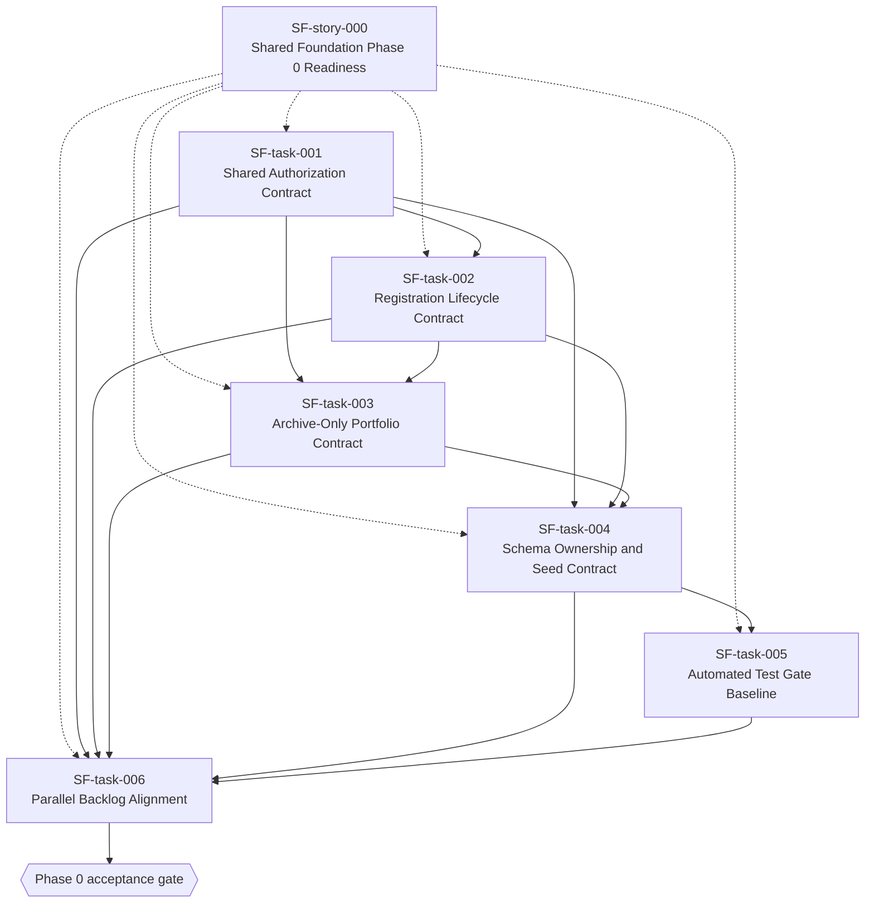

# Epic: Shared Foundation Phase 0

## Umbrella Epic Story

**As a** product owner coordinating Portfolio, Archiving, and Theme/SDG implementation, **I want** shared authorization, lifecycle, archive, schema, seed, test-gate, and backlog-alignment contracts agreed before feature work begins, **so that** three parallel development streams can implement Phase 0 safely without contradictory rules or unstable test data.

This umbrella story is implemented through [SF-task-001](SF-task-001-shared-authorization-contract.md) to [SF-task-006](SF-task-006-parallel-backlog-alignment.md). The scope traces to [Portfolio spec Phase 0](../../plans/PORTFOLIO_SYSTEM_SPECIFICATION_AND_IMPLEMENTATION_PLAN.md:570) and [ADR-007](../../plans/PORTFOLIO_SYSTEM_SPECIFICATION_AND_IMPLEMENTATION_PLAN.md:428).

## Master Backlog Table

| ID | Title | User Story | Phase | Priority | Type | Dependencies |
| --- | --- | --- | --- | --- | --- | --- |
| [SF-task-001](SF-task-001-shared-authorization-contract.md) | Shared Authorization Contract for Portfolio, Archiving, and Theme/SDG | [SF-story-000](SF-EPIC.md) | 0 — Shared Foundation Contract | 🔴 Critical | Non-functional Task (Security / Contract) | — |
| [SF-task-002](SF-task-002-registration-lifecycle-contract.md) | Registration Lifecycle and Revert Contract | [SF-story-000](SF-EPIC.md) | 0 — Shared Foundation Contract | 🔴 Critical | Technical Task (Contract) | SF-task-001 |
| [SF-task-003](SF-task-003-archive-only-portfolio-contract.md) | Archive-Only and Portfolio Evidence Contract | [SF-story-000](SF-EPIC.md) | 0 — Shared Foundation Contract | 🔴 Critical | Technical Task (Cross-epic Contract) | SF-task-001, SF-task-002 |
| [SF-task-004](SF-task-004-schema-ownership-and-seed-contract.md) | Schema Ownership and Deterministic Seed Contract | [SF-story-000](SF-EPIC.md) | 0 — Shared Foundation Contract | 🔴 Critical | Technical Task (Data Contract) | SF-task-001, SF-task-002, SF-task-003 |
| [SF-task-005](SF-task-005-cross-epic-automated-test-gate.md) | Cross-Epic Automated Test Gate Baseline | [SF-story-000](SF-EPIC.md) | 0 — Shared Foundation Contract | 🔴 Critical | Technical Task (Testing) | SF-task-004 |
| [SF-task-006](SF-task-006-parallel-backlog-alignment.md) | Parallel Backlog Alignment for Archiving and Theme/SDG | [SF-story-000](SF-EPIC.md) | 0 — Shared Foundation Contract | 🔴 Critical | Documentation / Coordination Task | SF-task-001, SF-task-002, SF-task-003, SF-task-004, SF-task-005 |

---

## Explicit User Story Records

| User Story | Title | Parent Story | Child Tasks |
| --- | --- | --- | --- |
| SF-story-000 | Shared Foundation Phase 0 Readiness | — | SF-task-001–SF-task-006 |

The `User Story` column in the master backlog table above shows that each Shared Foundation task belongs to the single Phase 0 umbrella story.

---

## Dependency Graph

---

## Phase Summary

| Phase | Tasks | Critical | Security / Auth | Lifecycle | Archive | Data / Seed | Testing | Coordination |
| --- | ---: | ---: | ---: | ---: | ---: | ---: | ---: | ---: |
| 0 — Shared Foundation Contract | 6 | 6 | 1 | 1 | 1 | 1 | 1 | 1 |

---

## Traceability Matrix

| Phase 0 Requirement | Covered by |
| --- | --- |
| Define shared authorization contract for student, supervisor, teacher, and unauthenticated users | [SF-task-001](SF-task-001-shared-authorization-contract.md) |
| Define task registration lifecycle contract and revert semantics | [SF-task-002](SF-task-002-registration-lifecycle-contract.md) |
| Define review, rating, and public-review notice contract boundaries | [SF-task-001](SF-task-001-shared-authorization-contract.md), [SF-task-002](SF-task-002-registration-lifecycle-contract.md) |
| Define archive-only contract and remove hard-delete from target stories | [SF-task-003](SF-task-003-archive-only-portfolio-contract.md), [SF-task-006](SF-task-006-parallel-backlog-alignment.md) |
| Define schema ownership boundaries between Portfolio, Archiving, and Theme/SDG | [SF-task-004](SF-task-004-schema-ownership-and-seed-contract.md) |
| Define deterministic seed data contract for the E2E seed | [SF-task-004](SF-task-004-schema-ownership-and-seed-contract.md), [SF-task-005](SF-task-005-cross-epic-automated-test-gate.md) |
| Update Archiving backlog tasks to remove hard-delete-only portfolio snapshotting | [SF-task-003](SF-task-003-archive-only-portfolio-contract.md), [SF-task-006](SF-task-006-parallel-backlog-alignment.md) |
| Update Theme/SDG backlog tasks to avoid uncoordinated shared auth or schema changes | [SF-task-006](SF-task-006-parallel-backlog-alignment.md) |
| Add cross-epic regression test requirements to relevant story definitions | [SF-task-005](SF-task-005-cross-epic-automated-test-gate.md), [SF-task-006](SF-task-006-parallel-backlog-alignment.md) |
| Verify the Phase 0 automated gate can load the E2E runner and reset the seed path | [SF-task-005](SF-task-005-cross-epic-automated-test-gate.md) |

---

## Out of Scope for Phase 0

| Item | Reason |
| --- | --- |
| Implementing new Portfolio APIs, schema, or UI | Belongs to Portfolio Phase 1 and later in [Portfolio spec Phase 1](../../plans/PORTFOLIO_SYSTEM_SPECIFICATION_AND_IMPLEMENTATION_PLAN.md:604). |
| Implementing Archiving behavior | Phase 0 only aligns contracts and backlog dependencies. |
| Implementing Theme/SDG behavior | Phase 0 only prevents uncoordinated changes to shared auth, schema, and seed data. |
| Full portfolio feature test suite | Phase 0 establishes the baseline and naming conventions; later phases add executable portfolio scenarios. |

---

*All 6 tasks are individually filed in this folder with acceptance criteria, implementation notes, ambiguity defaults, and test expectations.*
