# Epic: Theme/SDG System

## Umbrella Epic Story

**As a** teacher, student, supervisor, and business-facing platform user, **I want** themes and SDG information to be reliable, manageable, linkable to projects, visible across the platform, and reusable for student interests, **so that** the platform supports consistent thematic discovery, governance, and communication across the full Theme-SDG feature set.

This umbrella story is implemented through [TS-story-001](docs/user-stories/theme-sdg/TS-story-001-theme-platform-integrity.md) to [TS-story-005](docs/user-stories/theme-sdg/TS-story-005-student-theme-interests.md), with [TS-task-027](docs/user-stories/theme-sdg/TS-task-027-documentation-corrections.md) tracked separately as a standalone documentation follow-up.

## Master Backlog Table

| ID                                                             | Title                                             | User Story                                                           | Phase       | Priority       | Type             | Dependencies                                       |
| -------------------------------------------------------------- | ------------------------------------------------- | -------------------------------------------------------------------- | ----------- | -------------- | ---------------- | -------------------------------------------------- |
| [TS-task-001](TS-task-001-theme-name-uniqueness.md)            | Enforce Theme Name Uniqueness                     | [TS-story-001](TS-story-001-theme-platform-integrity.md)             | 1 — Backend | 🔴 High        | Technical        | —                                                  |
| [TS-task-002](TS-task-002-project-deletion-cascade.md)         | Fix Project Deletion Cascade for hasTheme         | [TS-story-001](TS-story-001-theme-platform-integrity.md)             | 1 — Backend | 🔴 High        | Technical (Bug)  | —                                                  |
| [TS-task-003](TS-task-003-link-ownership-enforcement.md)       | Enforce Ownership on Project-Theme Linking        | [TS-story-001](TS-story-001-theme-platform-integrity.md)             | 1 — Backend | 🔴 High        | Security         | —                                                  |
| [TS-task-004](TS-task-004-theme-input-validation.md)           | Add Input Validation on Theme CRUD                | [TS-story-001](TS-story-001-theme-platform-integrity.md)             | 1 — Backend | 🟠 Medium-High | Data Quality     | TS-task-001                                        |
| [TS-task-005](TS-task-005-atomic-theme-linking.md)             | Make Project-Theme Linking Atomic                 | [TS-story-001](TS-story-001-theme-platform-integrity.md)             | 1 — Backend | 🟠 Medium-High | Technical        | —                                                  |
| [TS-task-006](TS-task-006-jwt-middleware-narrowing.md)         | Narrow JWT Middleware Exclusion for Themes        | [TS-story-001](TS-story-001-theme-platform-integrity.md)             | 1 — Backend | 🟡 Medium      | Security         | —                                                  |
| [TS-task-007](TS-task-007-exception-logging.md)                | Replace Silent Exception Swallowing with Logging  | [TS-story-001](TS-story-001-theme-platform-integrity.md)             | 1 — Backend | 🟡 Medium      | Observability    | —                                                  |
| [TS-task-008](TS-task-008-link-existence-validation.md)        | Validate Theme/Project Existence in Link Endpoint | [TS-story-001](TS-story-001-theme-platform-integrity.md)             | 1 — Backend | 🟡 Medium      | Data Quality     | TS-task-005                                        |
| [TS-task-009](TS-task-009-backend-themes-in-business-query.md) | Add Themes to getBusinessesComplete()             | [TS-story-003](TS-story-003-project-theme-linking-and-visibility.md) | 2 — UI      | 🔴 High        | Technical        | —                                                  |
| [TS-task-010](TS-task-010-theme-management-list.md)            | Theme Management List on TeacherPage              | [TS-story-002](TS-story-002-teacher-theme-management.md)             | 2 — UI      | 🔴 Critical    | Functional       | —                                                  |
| [TS-task-011](TS-task-011-theme-create-modal.md)               | Theme Create Modal for Teachers                   | [TS-story-002](TS-story-002-teacher-theme-management.md)             | 2 — UI      | 🔴 Critical    | Functional       | TS-task-010, TS-task-001, TS-task-004              |
| [TS-task-012](TS-task-012-theme-edit-modal.md)                 | Theme Edit Modal for Teachers                     | [TS-story-002](TS-story-002-teacher-theme-management.md)             | 2 — UI      | 🔴 Critical    | Functional       | TS-task-010, TS-task-011, TS-task-004              |
| [TS-task-013](TS-task-013-theme-delete-confirmation.md)        | Theme Delete with Confirmation Dialog             | [TS-story-002](TS-story-002-teacher-theme-management.md)             | 2 — UI      | 🔴 Critical    | Functional       | TS-task-010, TS-task-002                           |
| [TS-task-014](TS-task-014-theme-picker-component.md)           | Reusable ThemePicker Component                    | [TS-story-003](TS-story-003-project-theme-linking-and-visibility.md) | 2 — UI      | 🔴 Critical    | Functional       | —                                                  |
| [TS-task-015](TS-task-015-theme-on-project-create.md)          | Theme Selection on Project Creation               | [TS-story-003](TS-story-003-project-theme-linking-and-visibility.md) | 2 — UI      | 🔴 Critical    | Functional       | TS-task-014, TS-task-003, TS-task-005, TS-task-008 |
| [TS-task-016](TS-task-016-theme-on-project-edit.md)            | Theme Selection on Project Edit                   | [TS-story-003](TS-story-003-project-theme-linking-and-visibility.md) | 2 — UI      | 🔴 Critical    | Functional       | TS-task-014, TS-task-003, TS-task-005              |
| [TS-task-017](TS-task-017-theme-inline-edit-details.md)        | Inline Theme Editing on ProjectDetailsPage        | [TS-story-003](TS-story-003-project-theme-linking-and-visibility.md) | 2 — UI      | 🟠 Medium-High | Functional       | TS-task-014, TS-task-019                           |
| [TS-task-018](TS-task-018-projectcard-theme-badges.md)         | Theme Badges on Authenticated ProjectCard         | [TS-story-003](TS-story-003-project-theme-linking-and-visibility.md) | 2 — UI      | 🟠 Medium-High | Functional       | TS-task-009                                        |
| [TS-task-019](TS-task-019-project-details-theme-display.md)    | Theme Display on ProjectDetailsPage               | [TS-story-003](TS-story-003-project-theme-linking-and-visibility.md) | 2 — UI      | 🟠 Medium-High | Functional       | —                                                  |
| [TS-task-020](TS-task-020-overviewpage-theme-fix.md)           | Fix OverviewPage Public-Only Theme Limitation     | [TS-story-003](TS-story-003-project-theme-linking-and-visibility.md) | 2 — UI      | 🟠 Medium-High | Functional (Bug) | TS-task-009                                        |
| [TS-task-021](TS-task-021-supervisor-dashboard-themes.md)      | Theme Display on Supervisor Dashboard             | [TS-story-003](TS-story-003-project-theme-linking-and-visibility.md) | 2 — UI      | 🟡 Medium      | Functional       | TS-task-009                                        |
| [TS-task-022](TS-task-022-sdg-badge-component.md)              | SDG Badge Component with UN Colors                | [TS-story-004](TS-story-004-sdg-visualization.md)                    | 3 — Enhance | 🟡 Medium      | Functional       | —                                                  |
| [TS-task-023](TS-task-023-sdg-display-integration.md)          | SDG Badge Integration Across Theme Views          | [TS-story-004](TS-story-004-sdg-visualization.md)                    | 3 — Enhance | 🟡 Medium      | Functional       | TS-task-022, TS-task-010, TS-task-014, TS-task-019 |
| [TS-task-024](TS-task-024-student-interest-backend.md)         | Student Interest Schema and Backend               | [TS-story-005](TS-story-005-student-theme-interests.md)              | 3 — Enhance | 🟡 Medium      | Technical        | TS-task-001, TS-task-005                           |
| [TS-task-025](TS-task-025-student-interest-selection.md)       | Student Interest Selection UI on Profile          | [TS-story-005](TS-story-005-student-theme-interests.md)              | 3 — Enhance | 🟡 Medium      | Functional       | TS-task-024, TS-task-014                           |
| [TS-task-026](TS-task-026-student-interest-dashboard.md)       | Student Interest Summary on Dashboard             | [TS-story-005](TS-story-005-student-theme-interests.md)              | 3 — Enhance | 🟢 Low-Medium  | Functional       | TS-task-024, TS-task-025                           |
| [TS-task-027](TS-task-027-documentation-corrections.md)        | Correct Documentation for Theme Feature Status    | Standalone                                                           | 3 — Enhance | 🟡 Medium      | Documentation    | All Phase 2                                        |

---

## Explicit User Story Records

| User Story                                                           | Title                                | Parent Story | Child Tasks                          |
| -------------------------------------------------------------------- | ------------------------------------ | ------------ | ------------------------------------ |
| TS-story-000                                                         | Theme and SDG Platform Experience    | —            | TS-story-001–TS-story-005            |
| [TS-story-001](TS-story-001-theme-platform-integrity.md)             | Theme Platform Integrity             | TS-story-000 | TS-task-001–TS-task-008              |
| [TS-story-002](TS-story-002-teacher-theme-management.md)             | Teacher Theme Management             | TS-story-000 | TS-task-010–TS-task-013              |
| [TS-story-003](TS-story-003-project-theme-linking-and-visibility.md) | Project Theme Linking and Visibility | TS-story-000 | TS-task-009, TS-task-014–TS-task-021 |
| [TS-story-004](TS-story-004-sdg-visualization.md)                    | SDG Visualization                    | TS-story-000 | TS-task-022–TS-task-023              |
| [TS-story-005](TS-story-005-student-theme-interests.md)              | Student Theme Interests              | TS-story-000 | TS-task-024–TS-task-026              |

The `User Story` column in the master backlog table above shows exactly which story owns each task.

**Standalone task outside the user-story hierarchy:** [TS-task-027](TS-task-027-documentation-corrections.md) remains intentionally standalone as a documentation cleanup item.

---

## Dependency Graph

```mermaid
flowchart TD
    %% User story grouping
    subgraph Stories[User stories]
        S001["TS-story-001<br/>Theme Platform Integrity"]
        S002["TS-story-002<br/>Teacher Theme Management"]
        S003["TS-story-003<br/>Project Theme Linking and Visibility"]
        S004["TS-story-004<br/>SDG Visualization"]
        S005["TS-story-005<br/>Student Theme Interests"]
    end

    %% Phase 1
    subgraph P1[Phase 1 — Backend and Data Integrity]
        direction TB
        T001["TS-task-001<br/>Theme Name Uniqueness"]
        T002["TS-task-002<br/>Project Deletion Cascade"]
        T003["TS-task-003<br/>Link Ownership Enforcement"]
        T004["TS-task-004<br/>Theme Input Validation"]
        T005["TS-task-005<br/>Atomic Theme Linking"]
        T006["TS-task-006<br/>JWT Middleware Narrowing"]
        T007["TS-task-007<br/>Exception Logging"]
        T008["TS-task-008<br/>Link Existence Validation"]
        G1{{"Phase 1 gate"}}

        T001 --> T004
        T005 --> T008

        T001 --> G1
        T002 --> G1
        T003 --> G1
        T004 --> G1
        T005 --> G1
        T006 --> G1
        T007 --> G1
        T008 --> G1
    end

    %% Phase 2
    subgraph P2[Phase 2 — UI Workflows]
        direction TB
        T009["TS-task-009<br/>Backend Themes in Business Query"]
        T010["TS-task-010<br/>Theme Management List"]
        T011["TS-task-011<br/>Theme Create Modal"]
        T012["TS-task-012<br/>Theme Edit Modal"]
        T013["TS-task-013<br/>Theme Delete Confirmation"]
        T014["TS-task-014<br/>ThemePicker Component"]
        T015["TS-task-015<br/>Theme on Project Create"]
        T016["TS-task-016<br/>Theme on Project Edit"]
        T017["TS-task-017<br/>Theme Inline Edit Details"]
        T018["TS-task-018<br/>ProjectCard Theme Badges"]
        T019["TS-task-019<br/>Project Details Theme Display"]
        T020["TS-task-020<br/>OverviewPage Theme Fix"]
        T021["TS-task-021<br/>Supervisor Dashboard Themes"]
        G2{{"Phase 2 verified"}}

        T010 --> T011
        T001 --> T011
        T004 --> T011

        T010 --> T012
        T011 --> T012
        T004 --> T012

        T010 --> T013
        T002 --> T013

        T014 --> T015
        T003 --> T015
        T005 --> T015
        T008 --> T015

        T014 --> T016
        T003 --> T016
        T005 --> T016

        T014 --> T017
        T019 --> T017

        T009 --> T018
        T009 --> T020
        T009 --> T021

        T009 --> G2
        T010 --> G2
        T011 --> G2
        T012 --> G2
        T013 --> G2
        T014 --> G2
        T015 --> G2
        T016 --> G2
        T017 --> G2
        T018 --> G2
        T019 --> G2
        T020 --> G2
        T021 --> G2
    end

    %% Phase 3
    subgraph P3[Phase 3 — Enhancements]
        direction TB
        T022["TS-task-022<br/>SDG Badge Component"]
        T023["TS-task-023<br/>SDG Display Integration"]
        T024["TS-task-024<br/>Student Interest Backend"]
        T025["TS-task-025<br/>Student Interest Selection"]
        T026["TS-task-026<br/>Student Interest Dashboard"]
        T027["TS-task-027<br/>Documentation Corrections"]

        T022 --> T023
        T010 --> T023
        T014 --> T023
        T019 --> T023

        T001 --> T024
        T005 --> T024
        T024 --> T025
        T014 --> T025
        T024 --> T026
        T025 --> T026

        G2 --> T027
    end

    %% Phase sequencing
    G1 --> T009
    G1 --> T010
    G1 --> T014
    G1 --> T019
    G2 --> T022
    G2 --> T024

    %% Story-to-task traceability
    S001 -.-> T001
    S001 -.-> T002
    S001 -.-> T003
    S001 -.-> T004
    S001 -.-> T005
    S001 -.-> T006
    S001 -.-> T007
    S001 -.-> T008

    S002 -.-> T010
    S002 -.-> T011
    S002 -.-> T012
    S002 -.-> T013

    S003 -.-> T009
    S003 -.-> T014
    S003 -.-> T015
    S003 -.-> T016
    S003 -.-> T017
    S003 -.-> T018
    S003 -.-> T019
    S003 -.-> T020
    S003 -.-> T021

    S004 -.-> T022
    S004 -.-> T023

    S005 -.-> T024
    S005 -.-> T025
    S005 -.-> T026
```

---

## Phase Summary

| Phase                        | Tasks  | Critical | High  | Medium-High | Medium | Low-Medium |
| ---------------------------- | ------ | -------- | ----- | ----------- | ------ | ---------- |
| 1 — Backend & Data Integrity | 8      | —        | 3     | 2           | 3      | —          |
| 2 — UI Workflows             | 13     | 7        | 1     | 4           | 1      | —          |
| 3 — Enhancements             | 6      | —        | —     | —           | 5      | 1          |
| **Total**                    | **27** | **7**    | **4** | **6**       | **9**  | **1**      |

---

## Traceability Matrix

| Audit Finding                                 | Severity       | Covered by                                         |
| --------------------------------------------- | -------------- | -------------------------------------------------- |
| No theme management UI for teachers (§2A)     | 🔴 Critical    | TS-task-010, TS-task-011, TS-task-012, TS-task-013 |
| No project-theme linking UI (§2B)             | 🔴 Critical    | TS-task-014, TS-task-015, TS-task-016, TS-task-017 |
| No theme display in authenticated views (§2C) | 🟠 Medium-High | TS-task-018, TS-task-019, TS-task-020, TS-task-021 |
| No per-project theme display (§2D)            | 🟠 Medium-High | TS-task-019, TS-task-017                           |
| No student interest/theme selection (§2G)     | 🟡 Medium      | TS-task-024, TS-task-025, TS-task-026              |
| No SDG information display (§2I)              | 🟢 Low-Medium  | TS-task-022, TS-task-023                           |
| Project deletion cascade bug (§3A)            | 🔴 High        | TS-task-002                                        |
| OverviewPage public-only themes (§3B)         | 🟠 Medium-High | TS-task-009, TS-task-020                           |
| Missing ownership enforcement (§4.1)          | 🔴 High        | TS-task-003                                        |
| No theme name uniqueness (§4.2)               | 🔴 High        | TS-task-001                                        |
| No input validation (§4.3)                    | 🟠 Medium-High | TS-task-004                                        |
| Non-atomic linking (§4.4)                     | 🟠 Medium-High | TS-task-005                                        |
| JWT middleware too broad (§4.5)               | 🟡 Medium      | TS-task-006                                        |
| Silent exception swallowing (§4.6)            | 🟡 Medium      | TS-task-007                                        |
| Invalid IDs silently ignored (§5A, §5B)       | 🟡 Medium      | TS-task-008                                        |
| Documentation mismatches (§7)                 | 🟡 Medium      | TS-task-027                                        |

---

## Out of Scope (Deferred)

These items from the audit are explicitly excluded from this backlog:

| Item                                                    | Reason                                                                | Audit ref     |
| ------------------------------------------------------- | --------------------------------------------------------------------- | ------------- |
| Theme proposal workflow (supervisor → teacher approval) | Too complex for current scope                                         | §2F           |
| Theme statistics/reporting                              | No task priority                                                      | §2H           |
| Student-theme matching algorithm                        | Requires matching system redesign; data layer deferred to TS-task-024 | §2E           |
| Theme-based filtering on dashboards                     | Beyond theme scope; requires dashboard refactor                       | §3D (partial) |
| Error leak fix (`str(e)` → generic message)             | Low risk in development                                               | §5C           |

---

*All 27 tasks are individually filed in `[docs/user-stories/theme-sdg/](.)` with full acceptance criteria, technical notes, and dependency chains.*