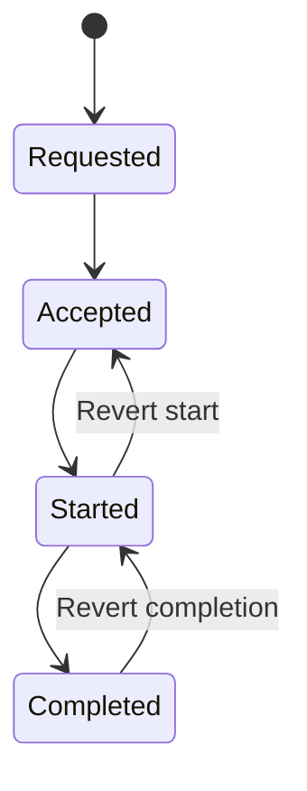
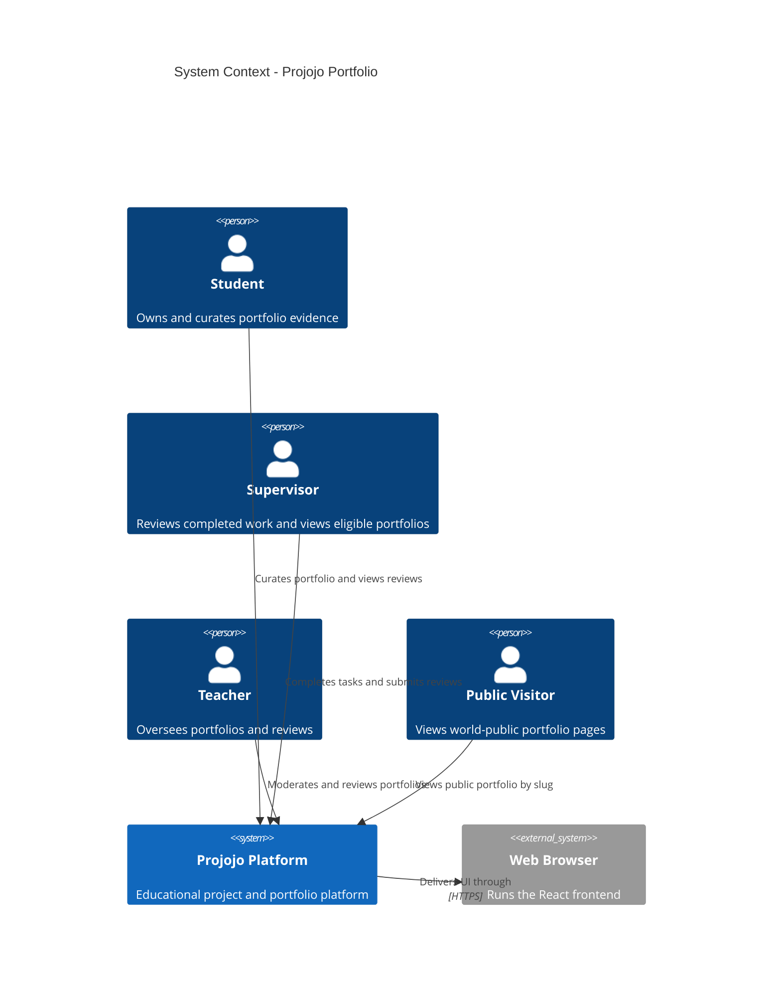
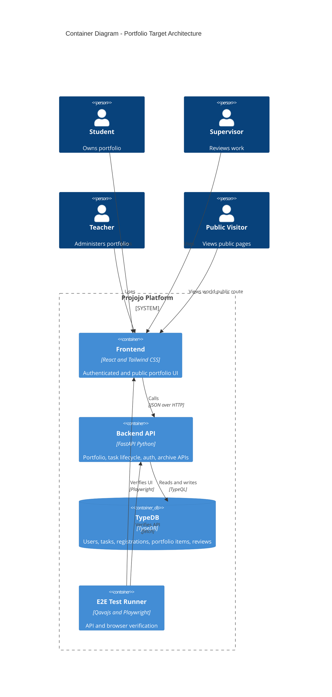
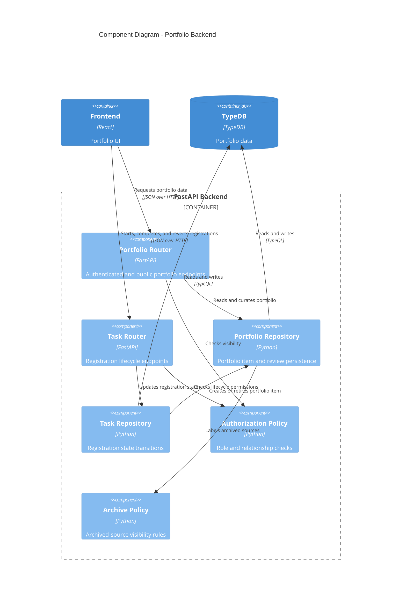
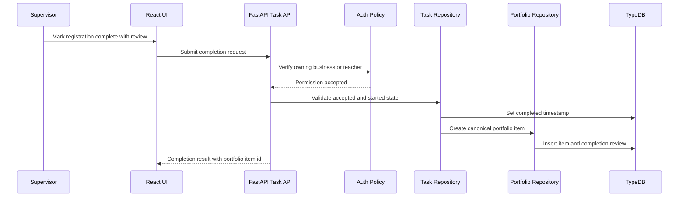
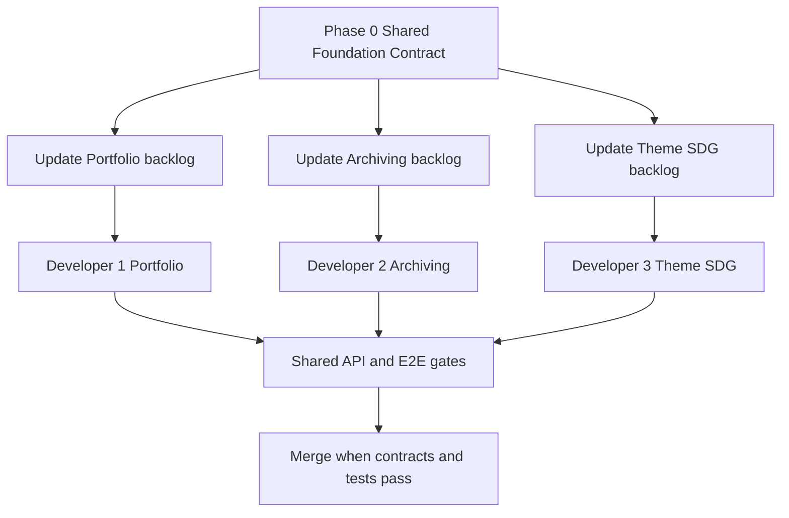

# Portfolio System Specification and Phased Implementation Plan

**Status**: Draft for review  
**Date**: 26 April 2026  
**Source audit**: `[PORTFOLIO_SYSTEM_AUDIT.md](docs/plans/PORTFOLIO_SYSTEM_AUDIT.md)`  
**Related specs**: `[ARCHIVING_SPECIFICATION.md](docs/plans/ARCHIVING_SPECIFICATION.md)`, `[THEME_SDG_IMPLEMENTATION_PLAN.md](docs/plans/THEME_SDG_IMPLEMENTATION_PLAN.md)`, `[TASK_SYSTEM_AUDIT.md](docs/plans/TASK_SYSTEM_AUDIT.md)`  
**Target branch context**: `[next-ui](docs/plans/PORTFOLIO_SYSTEM_AUDIT.md:4)` is not merged. Existing portfolio backend work is treated as stale and superseded.

---

## 1. Executive Summary

The current portfolio implementation is not a sound target for incremental repair. It has useful UI ideas, but the backend model is stale because it derives portfolio content from task registration timestamps and snapshot-on-hard-delete behavior. The target system replaces that with a first-class portfolio domain.

The new portfolio system must:

- remove stale snapshot-driven portfolio behavior in `[portfolio_repository.py](projojo_backend/domain/repositories/portfolio_repository.py:10)`
- remove or replace the current mixed active/completed endpoint in `[get_student_portfolio()](projojo_backend/routes/student_router.py:160)`
- create canonical portfolio items at completion time
- require review text for supervisor completion and allow optional rating
- support additional authenticated reviews by teachers and same-business supervisors
- distinguish world-public visibility from authenticated portfolio visibility
- support curation through summary, ordering, hide or show, authenticated-public retraction, and world-public selection
- coordinate with Archiving so hard-delete is removed and archived source records remain visible as archived context
- make automated API/E2E tests a gate for every phase using `[tests/e2e/](tests/e2e/)`

The implementation should preserve the existing neumorphic frontend visual design where it remains suitable, especially the portfolio list, timeline, card, and tab concepts in `[StudentPortfolio.jsx](projojo_frontend/src/components/StudentPortfolio.jsx:14)`, `[PortfolioList.jsx](projojo_frontend/src/components/PortfolioList.jsx:15)`, `[PortfolioRoadmap.jsx](projojo_frontend/src/components/PortfolioRoadmap.jsx:13)`, and `[PortfolioItem.jsx](projojo_frontend/src/components/PortfolioItem.jsx:14)`. Backend contracts and route surfaces should be redesigned rather than preserved.

---

## 2. Codebase Validation Summary

### 2.1 Audit Findings Confirmed

| Finding                                                   | Validation                                                                                                                                                                                                                                                          |
| --------------------------------------------------------- | ------------------------------------------------------------------------------------------------------------------------------------------------------------------------------------------------------------------------------------------------------------------- |
| Current endpoint allows supervisors too broadly           | `[get_student_portfolio()](projojo_backend/routes/student_router.py:160)` only blocks students from viewing other students and does not enforce supervisor relationship gating.                                                                                     |
| Current portfolio mixes active and completed work         | `[PortfolioRepository.get_student_portfolio()](projojo_backend/domain/repositories/portfolio_repository.py:307)` combines active, live completed, and snapshot items.                                                                                               |
| Active work is sourced from accepted registrations        | `[get_active_portfolio_items()](projojo_backend/domain/repositories/portfolio_repository.py:220)` returns accepted non-completed registrations.                                                                                                                     |
| Portfolio is derived from registrations, not domain-owned | `[get_live_portfolio_items()](projojo_backend/domain/repositories/portfolio_repository.py:133)` derives completed items from `[completedAt](projojo_backend/db/schema.tql:197)`.                                                                                    |
| Snapshot model is hard-delete-oriented                    | `[create_snapshot()](projojo_backend/domain/repositories/portfolio_repository.py:10)` stores JSON snapshot fields for deleted projects.                                                                                                                             |
| Snapshot delete endpoint is unsafe and obsolete           | `[delete_portfolio_item()](projojo_backend/routes/student_router.py:214)` does not verify student-item linkage before delete and will be superseded by soft-hide.                                                                                                   |
| Start and complete endpoints lack ownership checks        | `[mark_registration_started()](projojo_backend/routes/task_router.py:414)` and `[mark_registration_completed()](projojo_backend/routes/task_router.py:445)` use raw payload role checks rather than ownership enforcement.                                          |
| Timeline endpoint lacks authorization                     | `[get_registration_timeline()](projojo_backend/routes/task_router.py:477)` returns timeline without role or relationship checks.                                                                                                                                    |
| Registration transitions are not state-safe               | `[mark_registration_started()](projojo_backend/domain/repositories/task_repository.py:567)` and `[mark_registration_completed()](projojo_backend/domain/repositories/task_repository.py:590)` write timestamps without preventing duplicate or invalid transitions. |
| No public portfolio route exists                          | `[App.jsx](projojo_frontend/src/App.jsx:236)` has routes for `[/publiek](projojo_frontend/src/App.jsx:268)` but no world-public portfolio route.                                                                                                                    |
| Current UI copy assumes completed work                    | `[StudentPortfolio.jsx](projojo_frontend/src/components/StudentPortfolio.jsx:60)` and `[PortfolioList.jsx](projojo_frontend/src/components/PortfolioList.jsx:107)` use completed-work copy while backend includes active items.                                     |
| Tests can support API verification                        | `[infrastructure.steps.cjs](tests/e2e/steps/infrastructure.steps.cjs:104)` already has API request patterns, response status checks, and memory support.                                                                                                            |

### 2.2 Additional Constraints Discovered

- The current `[@auth()](projojo_backend/auth/permissions.py:17)` decorator supports supervisor ownership validation for resource IDs, including `[task_id](projojo_backend/auth/permissions.py:249)`, but portfolio relationship gating is not directly expressible as a simple owner-id check and needs explicit policy code.
- The Archiving backlog already expects removal of hard-delete and snapshot-only behavior in `[ARCH-task-003-legacy-feature-removal.md](docs/backlog/archiving/ARCH-task-003-legacy-feature-removal.md:1)`, which aligns with the new portfolio target.
- The Archiving specification already says hard-delete endpoints and hard-delete-only portfolio snapshotting should be removed in `[ARCHIVING_SPECIFICATION.md](docs/plans/ARCHIVING_SPECIFICATION.md:611)`.
- The current TypeDB schema contains only JSON snapshot portfolio fields in `[portfolioItem](projojo_backend/db/schema.tql:145)`, so the target model requires replacing or heavily expanding the schema.
- The frontend portfolio UI can likely be reused structurally, but filter semantics and archive/snapshot explanations in `[PortfolioList.jsx](projojo_frontend/src/components/PortfolioList.jsx:220)` must be rewritten because snapshots and hard-delete are no longer target concepts.

---

## 3. Target Product Rules

### 3.1 Scope

In scope:

- security and correctness fixes around registration lifecycle and portfolio access
- replacement portfolio backend API and schema
- first-class completed-work portfolio items
- review and rating workflow
- authenticated visibility model
- world-public vanity portfolio
- student summary and basic curation
- ordering, hide or show, authenticated-public retraction, world-public item and review selection
- automated tests for every phase
- Phase 0 shared contracts for Portfolio, Archiving, and Theme/SDG parallel work

Out of scope for this plan:

- endorsements and verified skills
- export or PDF portability
- evidence attachments
- tags
- notification system implementation
- hard-delete behavior for project, business, or task entities
- performance targets beyond correctness-oriented tests

Known debt intentionally deferred:

- notification copy currently over-promises in archive/delete-related UI, but notification implementation and copy cleanup are deferred by decision
- query fan-out performance should be documented as a future risk rather than gated now

### 3.2 Portfolio Definition

Portfolio means evidence of completed work only.

Active accepted work must live in dashboard or work-tracking contexts, not in the portfolio endpoint. The current active portfolio source in `[get_active_portfolio_items()](projojo_backend/domain/repositories/portfolio_repository.py:220)` must be removed from the portfolio domain.

### 3.3 First-Class Portfolio Item Lifecycle

When a registration reaches the completed state, the system creates a canonical `[portfolioItem](projojo_backend/db/schema.tql:145)`. That portfolio item becomes the source of truth for portfolio presentation.

The item must store stable copied display fields needed for portfolio display, even while source project, task, and business records still exist. This avoids semantic leakage from live task queries and keeps portfolio evidence stable if source records are later archived.

Required portfolio item state:

- item ID
- student owner
- source registration, task, project, and business identifiers
- copied source display fields for task, project, business, skills, and timeline
- created and completed timestamps
- retired state for revert handling
- hidden state for student or teacher soft-hide
- archived-source label information
- authenticated-public retraction flag
- world-visible flag
- display order

### 3.4 Registration State Machine

The registration lifecycle is strict and linear:

Rules:

- started requires accepted
- completed requires started
- transitions cannot be repeated
- students may view their own timeline but cannot mutate start or completion state
- supervisors of the task-owning business and teachers can start and complete registrations
- completing supervisors must submit review text and may submit an optional rating
- completing teachers may submit review text and optional rating
- completed-to-started revert retires the portfolio item and its reviews
- started-to-accepted revert removes started state
- re-completion creates a new portfolio item and requires a new completion review when the completing actor is a supervisor

### 3.5 Review and Rating Rules

Review creation:

- completing supervisor must submit review text
- completing supervisor may submit rating from 1 to 5
- completing teacher may submit review text and rating from 1 to 5
- after completion, teachers and supervisors associated with the same business may add additional reviews

Review editing:

- review author can edit their review
- any teacher can edit any review
- rating edits trigger authenticated-public visibility recalculation

Review visibility:

- student and teachers see all reviews on non-retired, non-hidden items
- relationship-gated supervisors see all reviews for items visible to them through authenticated-public rules
- world-public users see only reviews that the student explicitly selected as world-visible and only when the associated item and portfolio page are world-public
- every reviewer must see submission-time notice that the student may publish the review publicly later
- reviewers do not have a later opt-out after submitting under that notice

### 3.6 Visibility Model

The system must distinguish authenticated portfolio visibility from world-public visibility.

#### 3.6.1 Authenticated Private View

Student owner and teachers see all non-retired, non-hidden portfolio items and reviews.

#### 3.6.2 Supervisor Authenticated-Public View

Relationship-gated supervisors can see the entire portfolio context but only item records that pass authenticated-public rules.

Supervisor relationship gate:

- the student has a currently open application for a task with the supervisor's business, or
- the student has ever been accepted for a task by the supervisor's business

Authenticated-public item rule:

- item is not retired
- item is not hidden
- student has not retracted the item from authenticated-public visibility
- item has no ratings, or every rating on the item is 3 or higher

Dynamic rating behavior:

- a new or edited rating below 3 immediately removes authenticated-public visibility
- if all ratings later become 3 or higher again, authenticated-public visibility returns unless the student retracted it

#### 3.6.3 World-Public View

World-public means unauthenticated access through a vanity slug.

Rules:

- portfolio page is world-private by default
- default slug is generated
- student may change slug, and slug must remain unique across the system
- student can publish the portfolio page when at least one item is world-visible, or publish an empty page with summary only
- world-public item visibility is controlled by student selection and is not rating-gated
- world-public reviews require student selection and associated item world visibility
- public page shows selected item data and selected review data only

#### 3.6.4 Simplification Options for Later

If the full visibility model becomes too complex, two possible simplifications are explicitly allowed for later reconsideration:

1. Simplify authenticated visibility so relationship-gated supervisors see all non-hidden completed items regardless of ratings.
2. Simplify world-public visibility so selected items can be public but reviews are never world-public.

### 3.7 Curation Rules

Student curation includes:

- portfolio summary text
- generated but editable unique vanity slug
- world-public page toggle
- per-item hide or show
- per-item display ordering
- per-item authenticated-public retraction
- per-item world-visible selection
- per-review world-visible selection

Teacher curation powers:

- teachers may soft-hide portfolio items for moderation or administrative correction
- teachers may edit reviews
- teachers may see hidden/retired items in an administrative context if such context is added

### 3.8 Archive Interaction Rules

Hard-delete is removed from target specs.

Archived source behavior:

- portfolio items remain visible if their source project, task, or business is archived
- portfolio item displays an archived-source label
- navigation to archived source is disabled or restricted
- source archive does not hide or retire portfolio evidence
- active queries and task work flows should obey Archiving rules, but portfolio evidence remains visible

---

## 4. API Specification

The existing portfolio endpoint surface should be removed and replaced. Endpoint naming below is proposed, not a final implementation constraint.

### 4.1 Authenticated Portfolio APIs

| Method | Path                                                     | Auth                                                  | Purpose                                                                                |
| ------ | -------------------------------------------------------- | ----------------------------------------------------- | -------------------------------------------------------------------------------------- |
| GET    | `/portfolios/students/{student_id}`                      | Student owner, teacher, relationship-gated supervisor | Return authenticated portfolio view according to role visibility.                      |
| PATCH  | `/portfolios/me`                                         | Student                                               | Update summary, slug, and world-public page toggle.                                    |
| PATCH  | `/portfolios/me/items/{item_id}`                         | Student                                               | Update display order, hide state, authenticated-public retraction, world-visible flag. |
| PATCH  | `/portfolios/me/items/{item_id}/reviews/{review_id}`     | Student                                               | Set review world-visible flag.                                                         |
| PATCH  | `/portfolios/students/{student_id}/items/{item_id}/hide` | Teacher                                               | Administrative soft-hide.                                                              |

### 4.2 World-Public APIs

| Method | Path                | Auth | Purpose                                                        |
| ------ | ------------------- | ---- | -------------------------------------------------------------- |
| GET    | `/portfolio/{slug}` | None | Return world-public portfolio page if enabled and slug exists. |

The frontend route should mark `/portfolio/:slug` as public in `[App.jsx](projojo_frontend/src/App.jsx:214)` and add a dedicated public portfolio page.

### 4.3 Registration Lifecycle APIs

| Method | Path                                                            | Auth                                               | Purpose                                                           |
| ------ | --------------------------------------------------------------- | -------------------------------------------------- | ----------------------------------------------------------------- |
| PATCH  | `/tasks/{task_id}/registrations/{student_id}/start`             | Owning-business supervisor or teacher              | Move accepted registration to started.                            |
| PATCH  | `/tasks/{task_id}/registrations/{student_id}/complete`          | Owning-business supervisor or teacher              | Move started registration to completed and create portfolio item. |
| PATCH  | `/tasks/{task_id}/registrations/{student_id}/revert-completion` | Owning-business supervisor or teacher              | Retire portfolio item and move completed back to started.         |
| PATCH  | `/tasks/{task_id}/registrations/{student_id}/revert-start`      | Owning-business supervisor or teacher              | Move started back to accepted.                                    |
| GET    | `/tasks/{task_id}/registrations/{student_id}/timeline`          | Student owner, teacher, owning-business supervisor | Return registration timeline.                                     |

Completion request body:

| Field                        | Required                                      | Rule                                       |
| ---------------------------- | --------------------------------------------- | ------------------------------------------ |
| `reviewText`                 | Required for supervisor, optional for teacher | Non-empty for supervisor.                  |
| `rating`                     | No                                            | Integer 1 through 5 if present.            |
| `publicReviewNoticeAccepted` | Yes when review text is submitted             | Confirms reviewer saw world-public notice. |

### 4.4 Review APIs

| Method | Path                                 | Auth                                | Purpose                  |
| ------ | ------------------------------------ | ----------------------------------- | ------------------------ |
| POST   | `/portfolio-items/{item_id}/reviews` | Teacher or same-business supervisor | Add additional review.   |
| PATCH  | `/portfolio-reviews/{review_id}`     | Review author or teacher            | Edit review text/rating. |

---

## 5. Data Model Specification

The target schema should replace the stale snapshot-only `[portfolioItem](projojo_backend/db/schema.tql:145)` shape.

### 5.1 Entities and Relations

Proposed TypeDB concepts:

- `[portfolioItem](projojo_backend/db/schema.tql:145)` as canonical completed-work evidence
- `portfolioReview` as review entity
- `hasPortfolioItem` relation from student to portfolio item
- `portfolioItemSource` relation from portfolio item to registration, task, project, business where possible
- `hasPortfolioReview` relation from portfolio item to review
- `portfolioReviewAuthor` relation from review to teacher or supervisor

### 5.2 Required Attributes

Student additions:

- `portfolioSummary`
- `portfolioSlug`
- `isPortfolioWorldPublic`

Portfolio item additions:

- `id`
- `createdAt`
- `completedAt`
- `retiredAt`
- `hiddenAt`
- `hiddenBy`
- `displayOrder`
- `isAuthPublicRetracted`
- `isWorldVisible`
- copied business, project, task, skill, and timeline fields
- source IDs for registration, task, project, business
- source archived status fields or archived label metadata

Review additions:

- `id`
- `reviewText`
- `rating`
- `createdAt`
- `updatedAt`
- `isWorldVisible`
- `publicNoticeAcceptedAt`

### 5.3 Reset and Seed Strategy

Because there is no production data to preserve, schema changes may use Docker reset and reseed. The plan should update `[test_seed.tql](projojo_backend/db/test_seed.tql)` with deterministic fixtures covering:

- one student with completed portfolio items
- one supervisor/business with relationship access
- one unrelated supervisor/business without access
- one teacher
- one item with no ratings
- one item with all ratings 3 or higher
- one item with a rating below 3
- one hidden item
- one retracted authenticated-public item
- one world-public portfolio page with selected item and selected review
- one archived-source item

---

## 6. Architecture Decision Records

### ADR-001: Replace Stale Portfolio Backend with First-Class Portfolio Domain

**Status**: Accepted  
**Context**: The audit showed the current system derives portfolio output from registrations and snapshots in `[portfolio_repository.py](projojo_backend/domain/repositories/portfolio_repository.py:307)`. The user decided existing backend portfolio work is stale and superseded.  
**Decision**: Build a new portfolio API and schema centered on first-class `[portfolioItem](projojo_backend/db/schema.tql:145)` records created at completion time. Remove stale snapshot and mixed active/completed portfolio behavior.  
**Rationale**: This separates portfolio evidence from operational task state and avoids the semantic leakage criticized by the audit.  
**Consequences**: Completion, revert, archive, visibility, and reviews must keep portfolio item state consistent.

### ADR-002: Portfolio Contains Completed Work Only

**Status**: Accepted  
**Context**: Current backend includes active accepted work via `[get_active_portfolio_items()](projojo_backend/domain/repositories/portfolio_repository.py:220)`, while UI and product language describe completed work.  
**Decision**: Portfolio contains completed work only. Active tasks remain in dashboard/workflow surfaces.  
**Rationale**: Portfolio should be evidence of finished work, not a mixed work overview.  
**Consequences**: Active portfolio source and active portfolio counts are removed from the portfolio contract.

### ADR-003: Strict Registration State Machine with Revert

**Status**: Accepted  
**Context**: Current transition methods in `[task_repository.py](projojo_backend/domain/repositories/task_repository.py:567)` and `[task_repository.py](projojo_backend/domain/repositories/task_repository.py:590)` are not transition-safe.  
**Decision**: Enforce `requested → accepted → started → completed`, with authorized revert from completed to started and started to accepted.  
**Rationale**: Portfolio integrity depends on trustworthy completion state. Revert is needed for operational mistakes.  
**Consequences**: Completion revert retires existing portfolio item and reviews; re-completion creates a new item and new required supervisor review.

### ADR-004: Supervisor Completion Requires Review Text

**Status**: Accepted  
**Context**: Product goal is credible portfolio evidence, but completion alone is weak verification.  
**Decision**: Completing supervisor must leave review text and optional rating. Completing teacher may leave review text and optional rating. Additional teacher or same-business supervisor reviews are allowed after completion.  
**Rationale**: Separate review objects increase credibility without requiring multi-party approval.  
**Consequences**: Completion endpoint must accept review fields and enforce role-specific validation.

### ADR-005: Full Visibility Model with Authenticated and World-Public Distinction

**Status**: Accepted  
**Context**: The interview surfaced confusion between world-public and authenticated-public visibility.  
**Decision**: Implement separate visibility layers: student/teacher private authenticated view, rating-gated supervisor authenticated-public view, and student-selected world-public view.  
**Rationale**: This supports business discovery while allowing student control over broader public sharing.  
**Consequences**: Tests must cover rating changes, retraction, world-public item selection, world-public review selection, and supervisor relationship gates.

### ADR-006: Hard-Delete Is Removed from Portfolio and Archiving Specs

**Status**: Accepted  
**Context**: The audit treated snapshot preservation on hard-delete as strong existing behavior, but Archiving is moving to reversible archive-only flows.  
**Decision**: Remove hard-delete from the target specs and remove hard-delete-only portfolio snapshotting.  
**Rationale**: Reversible archive is safer and avoids orphaned data and snapshot consistency problems.  
**Consequences**: Portfolio items remain visible when source records are archived, labeled as archived source, with source navigation disabled or restricted.

### ADR-007: Contract-First Parallelization Across Portfolio, Archiving, and Theme/SDG

**Status**: Accepted  
**Context**: Archiving and Theme/SDG work are in progress and three developers are expected to work in parallel.  
**Decision**: Add Phase 0 shared foundation contracts before implementation and update Archiving and Theme/SDG backlog tasks before developers start.  
**Rationale**: Shared auth, lifecycle, schema, and test contracts reduce merge conflicts and contradictory rules.  
**Consequences**: Portfolio implementation is gated by Phase 0 contract approval and backlog updates.

### ADR-008: Automated Tests Are Gate Conditions for Every Phase

**Status**: Accepted  
**Context**: The user requires automated tests for every phase. Existing `[tests/e2e/](tests/e2e/)` infrastructure can do API and browser testing.  
**Decision**: Every phase must include automated API/E2E tests as completion gates.  
**Rationale**: Security, visibility, and lifecycle rules are too easy to regress manually.  
**Consequences**: Test seed and Qavajs steps must expand before or alongside feature implementation.

---

## 7. C4 Architecture Diagrams

### 7.1 System Context

### 7.2 Container Diagram

### 7.3 Backend Component Diagram

### 7.4 Dynamic Flow - Completion to Portfolio Item

### 7.5 Parallelization Flow

---

## 8. Phased Implementation Plan

### Phase 0 — Shared Foundation Contract

**Goal**: Make parallel development safe before three developers split across Portfolio, Archiving, and Theme/SDG.

Tasks:

- Define shared authorization contract for student, supervisor, teacher, and unauthenticated users.
- Define task registration lifecycle contract and revert semantics.
- Define archive-only contract and remove hard-delete from target stories.
- Define schema ownership boundaries between Portfolio, Archiving, and Theme/SDG.
- Define deterministic seed data contract for `[test_seed.tql](projojo_backend/db/test_seed.tql)`.
- Update Archiving backlog tasks, especially `[ARCH-task-003-legacy-feature-removal.md](docs/backlog/archiving/ARCH-task-003-legacy-feature-removal.md:1)`, to explicitly remove hard-delete-only portfolio snapshotting.
- Update Theme/SDG backlog tasks to avoid changing shared auth or schema contracts without coordination.
- Add cross-epic regression test requirements to relevant story definitions.

Dependencies:

- none

Risks:

- Skipping this phase makes parallel work likely to conflict in auth, schema, and archive behavior.

Success criteria:

- Shared contract is documented.
- Archiving and Theme/SDG backlogs reference the shared contract.
- Developers can identify which files and schema concepts they own.
- No implementation starts before this phase is accepted.

Automated test gate:

- Add a placeholder or contract-check suite that verifies the E2E runner loads and the seed reset path still works via `[task test:e2e](docs/TESTING_INFRASTRUCTURE.md:93)`.

### Phase 1 — Remove Stale Portfolio Backend and Establish New Schema

**Goal**: Replace stale snapshot/mixed portfolio backend with new first-class schema and empty read surface.

Tasks:

- Remove or decommission snapshot methods in `[portfolio_repository.py](projojo_backend/domain/repositories/portfolio_repository.py:10)`.
- Remove old student portfolio routes in `[student_router.py](projojo_backend/routes/student_router.py:160)` and `[student_router.py](projojo_backend/routes/student_router.py:214)`.
- Introduce new portfolio router or equivalent API surface.
- Replace snapshot-only `[portfolioItem](projojo_backend/db/schema.tql:145)` shape with canonical portfolio item schema.
- Add review schema concepts.
- Add student portfolio summary, slug, and world-public page fields.
- Update deterministic test seed to include portfolio users and relationship-gate fixtures.

Dependencies:

- Phase 0 accepted
- development reset allowed

Risks:

- Schema changes may conflict with Archiving schema additions if Phase 0 boundaries are incomplete.
- Removing old endpoints will temporarily break current frontend portfolio UI until later phases wire new APIs.

Success criteria:

- Old snapshot-based retrieval is gone or unreachable.
- New schema loads cleanly after reset.
- New portfolio endpoint exists and returns empty or seeded canonical portfolio data.
- Public slug uniqueness is enforced.

Automated test gate:

- API test proves old endpoint paths no longer return successful stale portfolio data.
- API test proves new authenticated portfolio endpoint enforces student owner, teacher, supervisor relationship, and unrelated supervisor denial.
- API test proves public slug route returns 404 or not-public response when page is not world-public.

### Phase 2 — Registration Lifecycle and Portfolio Item Creation

**Goal**: Make completed registrations create canonical portfolio items and enforce valid lifecycle transitions.

Tasks:

- Enforce ownership checks on start, complete, revert-completion, revert-start, and timeline endpoints.
- Implement strict transition validation in repository/service layer.
- Require prior started state before completion.
- Add review fields to completion request.
- Create portfolio item and initial review on successful completion.
- Retire portfolio item and reviews on completion revert.
- Ensure re-completion creates a new item and requires a new review.

Dependencies:

- Phase 1 schema and API baseline

Risks:

- TypeDB update semantics around repeated timestamp attributes must be handled explicitly by delete-then-insert or equivalent single-cardinality-safe patterns.
- Existing UI may not yet expose revert flows; API tests must cover behavior before UI catches up.

Success criteria:

- Unauthorized supervisor cannot start, complete, revert, or view timeline for another business's task.
- Student cannot mutate start or completion state.
- Supervisor completion without review text is rejected.
- Teacher completion without review text is accepted.
- Completion creates portfolio item.
- Revert retires item and reviews.
- Re-completion creates a new item.

Automated test gate:

- API scenarios for every allowed and denied transition.
- API scenarios for supervisor review-required and teacher review-optional rules.
- API scenario for revert and re-completion item identity behavior.

### Phase 3 — Authenticated Portfolio Read Model and Review Management

**Goal**: Deliver role-specific authenticated portfolio views and review editing.

Tasks:

- Implement authenticated read model for owner student, teacher, and relationship-gated supervisors.
- Implement authenticated-public rating gate for supervisors.
- Implement student authenticated-public retraction.
- Implement additional review creation by teachers and same-business supervisors.
- Implement review editing by author and teacher.
- Recalculate authenticated-public visibility after review rating changes.
- Add archived-source labels and disabled or restricted source navigation fields.

Dependencies:

- Phase 2 lifecycle and review creation
- Archiving contract for archived-source state

Risks:

- Visibility model is complex and needs clear API-level fields to prevent frontend inference bugs.
- Rating edit behavior can create surprising UI changes if not explained.

Success criteria:

- Student and teacher see all non-retired, non-hidden items.
- Relationship-gated supervisor sees no hidden, retired, retracted, or low-rated items.
- Unrelated supervisor is denied at portfolio level.
- Rating below 3 removes item from supervisor view.
- Editing rating back to 3 or above restores supervisor view unless student retracted it.
- Archived-source items remain visible with navigation disabled or restricted.

Automated test gate:

- API visibility matrix tests for student, teacher, related supervisor, unrelated supervisor, and unauthenticated user.
- API tests for rating change recalculation.
- API tests for archived-source label and navigation flag.

### Phase 4 — Student Curation and World-Public Portfolio

**Goal**: Enable controlled public sharing through vanity slug and student-selected items and reviews.

Tasks:

- Generate default unique portfolio slug for students.
- Implement slug update with uniqueness validation.
- Implement portfolio summary update.
- Implement world-public page toggle.
- Implement item world-visible selection.
- Implement review world-visible selection.
- Ensure world-public API returns only selected items and selected reviews.
- Ensure world-public API returns no data when portfolio page is not public.
- Require reviewer submission-time notice acceptance for reviews that may later be public.

Dependencies:

- Phase 3 authenticated read and review model

Risks:

- Publishing reviewer-authored text publicly is sensitive; the submission-time notice must be explicit and tested.
- World-public route must not leak authenticated-only items or reviews.

Success criteria:

- Portfolio page is private by default.
- Student can publish empty summary-only portfolio.
- Student can select public item and selected public reviews.
- Public visitor sees only selected world-public data.
- Reviews not selected by student do not appear publicly.
- Reviewer submission flow displays and records public-use notice acceptance.

Automated test gate:

- API tests for slug uniqueness and private-by-default behavior.
- API tests for summary-only public page.
- API tests for selected item and selected review visibility.
- Browser test for public vanity route rendering.

### Phase 5 — Frontend Integration and UX Preservation

**Goal**: Wire the new backend to the existing portfolio UI style while correcting semantics.

Tasks:

- Replace `[getStudentPortfolio()](projojo_frontend/src/services.js:873)` with new portfolio service functions.
- Update `[StudentPortfolio.jsx](projojo_frontend/src/components/StudentPortfolio.jsx:14)` for completed-only authenticated portfolio data.
- Update `[PortfolioList.jsx](projojo_frontend/src/components/PortfolioList.jsx:15)` filters to match target states: all, visible to supervisors, hidden, archived-source, world-visible.
- Update `[PortfolioItem.jsx](projojo_frontend/src/components/PortfolioItem.jsx:14)` to show reviews, ratings, curation controls, visibility badges, and archived-source labels.
- Update `[PortfolioRoadmap.jsx](projojo_frontend/src/components/PortfolioRoadmap.jsx:13)` to use started date where it says started and completed date for completion.
- Add public portfolio page and route in `[App.jsx](projojo_frontend/src/App.jsx:236)`.
- Preserve neumorphic styling and accessibility requirements.

Dependencies:

- Phase 4 public API

Risks:

- Current roadmap uses accepted date as work start in some calculations, so timeline semantics need careful correction.
- Adding many curation controls can clutter existing UI if not grouped.

Success criteria:

- Existing visual design language is retained where appropriate.
- Portfolio UI no longer displays active work as portfolio evidence.
- Owner student can edit summary, slug, page visibility, item visibility, review visibility, hide state, and order.
- Supervisor view does not show controls unavailable to supervisors.
- Public route renders without authenticated navbar/footer behavior.
- Keyboard and screen reader affordances are maintained.

Automated test gate:

- Browser tests for owner curation flows.
- Browser tests for supervisor filtered view.
- Browser tests for public vanity route.
- API tests remain green.

### Phase 6 — Cross-Epic Regression and Readiness

**Goal**: Verify Portfolio, Archiving, and Theme/SDG can proceed in parallel without breaking shared contracts.

Tasks:

- Run cross-epic scenarios against seeded test stack.
- Verify archive-only behavior and no hard-delete path.
- Verify portfolio items survive source archiving as visible archived-source items.
- Verify Theme/SDG changes do not break portfolio source display or project/task joins.
- Update documentation references that still describe snapshot-on-hard-delete as target behavior.

Dependencies:

- Portfolio frontend integrated
- Archiving implementation aligned with Phase 0 contract
- Theme/SDG implementation aligned with Phase 0 contract

Risks:

- Three parallel streams may still conflict in shared seed data and auth utilities.
- Deferred notification debt may still confuse users if old copy remains.

Success criteria:

- No hard-delete endpoint exists for project, business, or task entities.
- Portfolio source archiving does not remove portfolio evidence.
- Auth, lifecycle, visibility, and public portfolio tests pass together.
- Existing public discovery and Theme/SDG tests remain green.

Automated test gate:

- Full `[task test:e2e](docs/TESTING_INFRASTRUCTURE.md:93)` suite passes.
- Regression scenarios cover Portfolio plus Archiving interactions.
- Grep-style verification from Archiving cleanup remains valid for hard-delete removal.

---

## 9. Test Strategy

Use the existing Qavajs/Playwright infrastructure described in `[TESTING_INFRASTRUCTURE.md](docs/TESTING_INFRASTRUCTURE.md:1)`. Extend `[infrastructure.steps.cjs](tests/e2e/steps/infrastructure.steps.cjs:104)` or add dedicated portfolio step files for authenticated API calls, role switching, and response assertions.

Required feature files:

- `portfolio-auth.feature`
- `portfolio-lifecycle.feature`
- `portfolio-reviews.feature`
- `portfolio-visibility.feature`
- `portfolio-public.feature`
- `portfolio-archiving-integration.feature`

Required test categories:

- authorization denial cases
- valid lifecycle transitions
- invalid lifecycle transitions
- completion review requirements
- review editing permissions
- authenticated-public rating gate
- world-public page and slug behavior
- curation behavior
- archived-source behavior
- route removal for stale portfolio and hard-delete endpoints

---

## 10. Risk Register

| Risk                                  | Impact                                         | Mitigation                                                          |
| ------------------------------------- | ---------------------------------------------- | ------------------------------------------------------------------- |
| Visibility model complexity           | High chance of bugs or user confusion          | API returns explicit visibility fields and tests cover matrix.      |
| Parallel epic conflicts               | Shared schema and auth files conflict          | Phase 0 contract and backlog updates are mandatory.                 |
| TypeDB cardinality/update behavior    | Duplicate timestamps or ratings may occur      | Use explicit transition checks and delete-then-insert where needed. |
| Public review publication sensitivity | Reviewer text may be exposed unexpectedly      | Submission-time notice is mandatory and persisted.                  |
| Performance fan-out                   | Portfolio reads may slow as data grows         | Document as future risk; no current performance target.             |
| Frontend clutter                      | Curation controls can overwhelm UI             | Preserve existing visual language and group advanced controls.      |
| Stale docs                            | Old snapshot-on-delete docs mislead developers | Update affected docs during Phase 6.                                |

---

## 11. Open Questions for Implementation

These should not block the spec, but implementation must resolve them explicitly:

1. Exact TypeDB relation design for linking review author to either teacher or supervisor.
2. Whether retired reviews remain queryable through an admin-only endpoint or only hidden from normal read models.
3. Exact frontend placement of curation controls to preserve usability.
4. Whether slug generation happens at student creation or first portfolio access.
5. Exact archived-source navigation policy for teachers versus students and supervisors.
6. Whether review edit history is required, or whether only latest text/rating is stored.

---

## 12. Final Plan Checklist

- [ ] Phase 0 shared foundation contract accepted
- [ ] Archiving backlog updated
- [ ] Theme/SDG backlog updated
- [ ] Stale portfolio backend removed
- [ ] New schema implemented
- [ ] Registration lifecycle state machine implemented
- [ ] First-class portfolio item creation implemented
- [ ] Reviews implemented
- [ ] Authenticated visibility implemented
- [ ] World-public visibility implemented
- [ ] Student curation implemented
- [ ] Frontend integrated
- [ ] Cross-epic regression tests passing