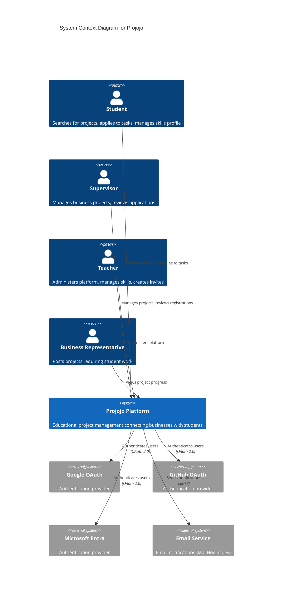

# Context

## System Overview

Projojo is an educational project management platform developed for HAN University of Applied Sciences (Hogeschool van Arnhem en Nijmegen). The system connects four key stakeholder groups in an educational project ecosystem:

- **Students** - Find and apply for projects matching their skills
- **Businesses** - Post projects with specific skill requirements
- **Supervisors** - Manage businesses and oversee project applications
- **Teachers** - Administer the platform and manage skills taxonomy

## System Context Diagram

## Users and Roles

### Students

Students are the primary users of the platform. They can:

- Create and manage their profile with skills and CV
- Browse available projects and businesses
- View project details and required skills
- Apply (register) for specific tasks within projects
- Track application status (pending, accepted, rejected)

### Supervisors

Supervisors are associated with specific businesses. They can:

- Create and manage projects for their business
- Create tasks within projects with skill requirements
- Review student applications for tasks
- Accept or reject registrations with feedback
- View business dashboard with pending registrations

### Teachers

Teachers have administrative privileges. They can:

- Manage the skills taxonomy (approve/rename pending skills)
- Create invite keys for new supervisors and teachers
- Archive and restore businesses
- View all users in the system

### Businesses

Businesses are organizational entities (not direct users) that:

- Host multiple projects
- Are managed by one or more supervisors
- Have associated metadata (name, description, location, image)

## External Systems

### OAuth Providers

Projojo uses OAuth 2.0 for authentication, supporting three providers:

| Provider | Purpose | Documentation |
|----------|---------|---------------|
| Google | Primary authentication for personal/educational accounts | [OAuth Setup](../../projojo_backend/auth/README.md#google-oauth-setup) |
| GitHub | Authentication for developers | [OAuth Setup](../../projojo_backend/auth/README.md#github-oauth-setup) |
| Microsoft Entra | Authentication for organizational accounts | [OAuth Setup](../../projojo_backend/auth/README.md#microsoft-oauth-setup) |

### Email Service

- **Development**: MailHog (local email testing)
- **Production**: TODO - External SMTP provider

## Demo Environment

- **Live Demo**: https://projojo.dp.demopreview.nl/
- **Repository**: https://github.com/HAN-AIM-CMD-WG/Projojo
