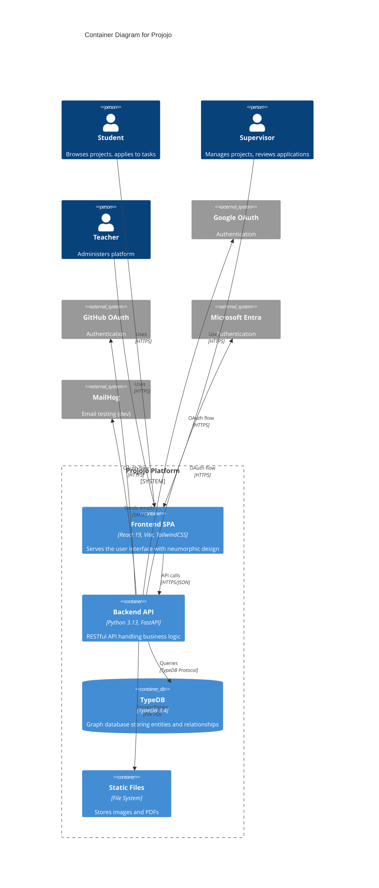
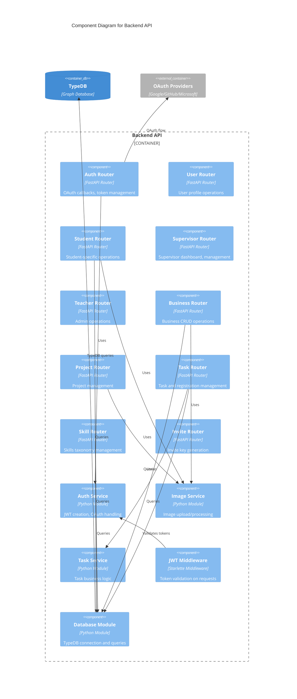
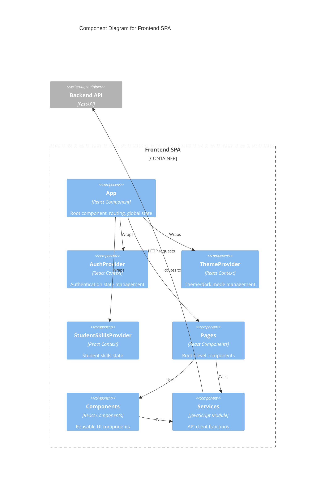

# Software Architecture

## Container Diagram

### Containers

| Container | Kind | Technology | Purpose |
|-----------|------|------------|---------|
| Frontend SPA | Web Application | React 19, Vite, TailwindCSS 4 | Single-page application serving the user interface |
| Backend API | REST API | Python 3.13, FastAPI, Pydantic | Business logic, authentication, API endpoints |
| TypeDB | Database | TypeDB 3.4 (Graph) | Stores entities, relationships, and graph queries |
| Static Files | File Storage | File System | Profile images, project images, CV PDFs |

## Component Diagram: Backend API

### Backend Components

| Component | Kind | Purpose | Key Dependencies |
|-----------|------|---------|------------------|
| Auth Router | FastAPI Router | OAuth callbacks, JWT token endpoints | Auth Service, OAuth providers |
| User Router | FastAPI Router | Get user by ID | Database Module |
| Student Router | FastAPI Router | Student profiles, skills, registrations | Database, Image Service |
| Supervisor Router | FastAPI Router | Dashboard, project management | Database Module |
| Teacher Router | FastAPI Router | Admin functions, user listing | Database Module |
| Business Router | FastAPI Router | Business CRUD, archiving | Database, Image Service |
| Project Router | FastAPI Router | Project CRUD with tasks | Database, Image Service |
| Task Router | FastAPI Router | Tasks, registrations, skills | Database, Task Service |
| Skill Router | FastAPI Router | Skill taxonomy management | Database Module |
| Invite Router | FastAPI Router | Invite key generation | Database Module |
| Auth Service | Service | JWT creation/validation, OAuth | Authlib, PyJWT |
| Image Service | Service | Image upload, resizing | File System |
| JWT Middleware | Middleware | Request authentication | Auth Service |
| Database Module | Data Access | TypeDB connection, queries | TypeDB Driver |

## Component Diagram: Frontend SPA

### Frontend Components

| Component | Kind | Purpose | Key Dependencies |
|-----------|------|---------|------------------|
| App | Root Component | Routing, layout, global error handling | React Router, Contexts |
| AuthProvider | Context | JWT storage, auth state, user info | services.js |
| ThemeProvider | Context | Dark/light mode, CSS variables | localStorage |
| StudentSkillsProvider | Context | Cached student skills | services.js |
| Pages | Route Components | Page-level UI (Dashboard, Profile, etc.) | Components, Services |
| Components | UI Components | Reusable UI (Navbar, Cards, Forms) | TailwindCSS, Lucide icons |
| Services | API Client | HTTP requests to backend | Fetch API |

## Key Architectural Decisions

### Graph Database (TypeDB)

**Decision**: Use TypeDB as the primary database.

**Rationale**: The domain model is highly relational with complex relationships between users, businesses, projects, tasks, and skills. A graph database naturally models these relationships and enables powerful graph queries.

**Trade-offs**:
- (+) Natural relationship modeling
- (+) Flexible schema evolution
- (+) Powerful query language (TypeQL)
- (-) Less common than SQL databases
- (-) Platform compatibility challenges (Windows)

### OAuth-Only Authentication

**Decision**: Use OAuth 2.0 exclusively (no username/password).

**Rationale**: Delegates credential management to trusted providers (Google, GitHub, Microsoft), reducing security burden and improving user experience.

**Trade-offs**:
- (+) No password storage required
- (+) Reduced attack surface
- (+) Familiar login flow for users
- (-) Requires OAuth provider setup
- (-) No offline/local-only operation

### Single-Page Application

**Decision**: React SPA with client-side routing.

**Rationale**: Modern, interactive user experience with fast navigation between views.

**Trade-offs**:
- (+) Fast, app-like experience
- (+) Rich interactivity
- (-) JavaScript required
- (-) SEO considerations (mitigated by educational context)

### Monorepo Structure

**Decision**: Frontend and backend in same repository with separate directories.

**Rationale**: Simplifies development coordination for small team, shared Docker Compose configuration.

**Trade-offs**:
- (+) Single repository to manage
- (+) Coordinated deployments
- (-) Larger clone size
- (-) Mixed language tooling
