# Data

## Database Technology

Projojo uses **TypeDB 3.4**, a strongly-typed graph database. TypeDB is chosen for its ability to naturally model complex relationships between entities.

### Why TypeDB?

- **Relationship-First**: The domain model has rich relationships (users manage businesses, projects contain tasks, students have skills, tasks require skills)
- **Strong Typing**: Schema enforces data integrity
- **Graph Queries**: TypeQL enables expressive graph traversal
- **Cardinality Constraints**: Schema defines relationship cardinalities

## Entity-Relationship Model

```mermaid
erDiagram
    USER {
        string id PK
        string email
        string fullName
        string imagePath
    }

    STUDENT {
        string description
        string cvPath
    }

    SUPERVISOR {
    }

    TEACHER {
    }

    BUSINESS {
        string id PK
        string name
        string description
        string imagePath
        string location
    }

    PROJECT {
        string id PK
        string name
        string description
        string imagePath
        datetime createdAt
    }

    TASK {
        string id PK
        string name
        string description
        int totalNeeded
        datetime createdAt
    }

    SKILL {
        string id PK
        string name
        boolean isPending
        datetime createdAt
    }

    OAUTH_PROVIDER {
        string name PK
    }

    INVITE_KEY {
        string key PK
        string inviteType
        boolean isUsed
        datetime createdAt
    }

    STUDENT ||--o{ HAS_SKILL : has
    STUDENT ||--o{ REGISTERS_FOR_TASK : registers
    SUPERVISOR ||--o{ MANAGES : manages
    SUPERVISOR ||--o{ CREATES : creates
    USER ||--o{ OAUTH_AUTHENTICATION : authenticates
    OAUTH_PROVIDER ||--o{ OAUTH_AUTHENTICATION : provides
    BUSINESS ||--o{ MANAGES : managed_by
    BUSINESS ||--o{ HAS_PROJECTS : has
    BUSINESS ||--o{ BUSINESS_INVITE : invited_via
    PROJECT ||--o{ HAS_PROJECTS : belongs_to
    PROJECT ||--o{ CONTAINS_TASK : contains
    PROJECT ||--o{ CREATES : created_by
    TASK ||--o{ CONTAINS_TASK : belongs_to
    TASK ||--o{ REQUIRES_SKILL : requires
    TASK ||--o{ REGISTERS_FOR_TASK : registered_by
    SKILL ||--o{ REQUIRES_SKILL : required_by
    SKILL ||--o{ HAS_SKILL : possessed_by
    INVITE_KEY ||--o{ BUSINESS_INVITE : for_business
```



## TypeDB Schema

The schema is defined in `projojo_backend/db/schema.tql`:

### Entities

```typeql
entity user @abstract,
    owns id @key,
    owns email @card(1),
    owns fullName @card(1),
    owns imagePath @card(1),
    plays oauthAuthentication:user @card(1..10);

entity supervisor sub user,
    plays manages:supervisor @card(1),
    plays creates:supervisor @card(0..);

entity student sub user,
    owns description @card(0..1),
    owns cvPath @card(0..1),
    plays hasSkill:student @card(0..),
    plays registersForTask:student @card(0..);

entity teacher sub user;

entity business,
    owns id @key,
    owns name @card(1),
    owns description @card(1),
    owns imagePath @card(1),
    owns location @card(1),
    plays manages:business @card(0..),
    plays hasProjects:business @card(0..),
    plays businessInvite:business @card(0..);

entity project,
    owns id @key,
    owns name @card(1),
    owns description @card(1),
    owns imagePath @card(1),
    owns createdAt @card(1),
    plays hasProjects:project @card(1),
    plays containsTask:project @card(0..),
    plays creates:project @card(0..);

entity task,
    owns id @key,
    owns name @card(1),
    owns description @card(1),
    owns totalNeeded @card(1),
    owns createdAt @card(1),
    plays containsTask:task @card(1),
    plays requiresSkill:task @card(0..),
    plays registersForTask:task @card(0..);

entity skill,
    owns id @key,
    owns name @card(1) @unique,
    owns isPending @card(1),
    owns createdAt @card(1),
    plays requiresSkill:skill @card(0..),
    plays hasSkill:skill @card(0..);

entity oauthProvider,
    owns name @key,
    plays oauthAuthentication:provider;

entity inviteKey,
    owns key @key,
    owns inviteType @card(1),
    owns isUsed @card(1),
    owns createdAt @card(1),
    plays businessInvite:key @card(0..1);
```

### Relations

```typeql
relation oauthAuthentication,
    relates provider,
    relates user,
    owns oauthSub @key;

relation creates,
    relates supervisor @card(1),
    relates project @card(0..),
    owns createdAt @card(1);

relation manages,
    relates supervisor @card(1),
    relates business @card(1),
    owns location @card(1..);

relation hasProjects,
    relates business @card(1),
    relates project @card(1..);

relation containsTask,
    relates project @card(1),
    relates task @card(1);

relation requiresSkill,
    relates task @card(1),
    relates skill @card(1);

relation hasSkill,
    relates student @card(1),
    relates skill @card(1),
    owns description @card(0..1);

relation registersForTask,
    relates student @card(1),
    relates task @card(1),
    owns description @card(1),
    owns isAccepted @card(0..1),
    owns response @card(0..1),
    owns createdAt @card(1);

relation businessInvite,
    relates business @card(1),
    relates key @card(1);
```

### Attributes

```typeql
attribute id value string;
attribute email value string;
attribute name value string;
attribute fullName value string;
attribute imagePath value string;
attribute cvPath value string;
attribute oauthSub value string;
attribute description value string;
attribute location value string;
attribute isPending value boolean;
attribute createdAt value datetime-tz;
attribute totalNeeded value integer;
attribute isAccepted value boolean;
attribute response value string;
attribute key value string;
attribute inviteType value string @values("business", "teacher");
attribute isUsed value boolean;
```

## Key Relationships

### User Hierarchy

`user` is abstract with three concrete subtypes:
- `student` - Can have skills and register for tasks
- `supervisor` - Can manage businesses and create projects
- `teacher` - Administrative access

### Project Hierarchy

```
business (1) ──hasProjects──> (many) project
project (1) ──containsTask──> (many) task
task (many) ──requiresSkill──> (many) skill
```

### Registration Flow

```
student (1) ──registersForTask──> (many) task
```

The relation includes:
- `description`: Motivation text
- `isAccepted`: null (pending), true (accepted), false (rejected)
- `response`: Supervisor's feedback message
- `createdAt`: Registration timestamp

## Data Storage

### Database Persistence

TypeDB data is persisted via Docker volume:

```yaml
volumes:
  typedb-data:
    # Mounted to /opt/typedb-all-linux-x86_64/server/data
```

### File Storage

Static files are stored on the filesystem:

| Type | Location | Access |
|------|----------|--------|
| Profile images | `static/images/` | `/image/{filename}` |
| Project images | `static/images/` | `/image/{filename}` |
| CV PDFs | `static/pdf/` | `/pdf/{filename}` |

## Seed Data

Development seed data is in `projojo_backend/db/seed.tql`. This includes:

- Sample OAuth providers (google, github, microsoft)
- Sample businesses with projects
- Sample tasks with skill requirements
- Sample skills (approved and pending)
- Sample users of each type

## Database Access Patterns

### Connection Management

```python
# db/initDatabase.py
@asynccontextmanager
async def lifespan(app: FastAPI):
    print("Initializing TypeDB connection...")
    Db = get_database()
    yield {}
    print("Closing TypeDB connection...")
    Db.close()
```

### Query Patterns

TypeQL queries are executed through the TypeDB driver:

```python
# Example query pattern
def get_projects():
    with driver.session(database_name) as session:
        with session.transaction() as tx:
            results = tx.query("""
                match $p isa project;
                fetch $p: id, name, description;
            """)
            return list(results)
```

## Data Migration

Currently no formal migration system. Schema changes require:

1. Update `schema.tql`
2. Rebuild database (drop and recreate)
3. Re-apply seed data if needed

TODO: Implement proper migration tooling for production.
