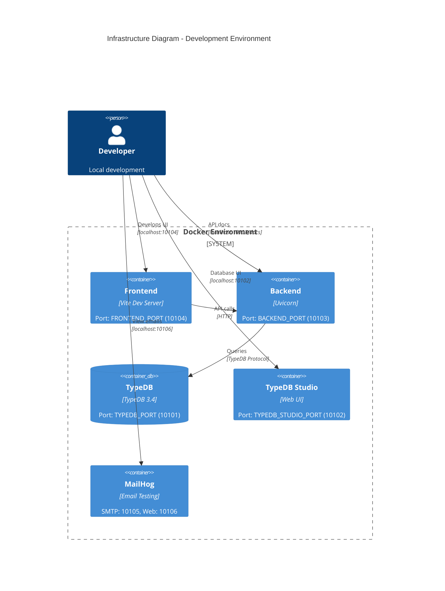

# Infrastructure

## Infrastructure Diagram



## Environment Overview

| Environment | Purpose | URL |
|-------------|---------|-----|
| Development | Local development with Docker | localhost ports |
| Preview | Staging/demo environment | https://projojo.dp.demopreview.nl/ |
| Production | TODO | TBD |

## Docker Configuration

### Service Architecture

```yaml
# docker-compose.yml (development)
services:
  typedb:        # Graph database
  backend:       # FastAPI application
  frontend:      # Vite dev server
  mailhog:       # Email testing
```

### Development vs Preview

| Aspect | Development | Preview |
|--------|-------------|---------|
| File | `docker-compose.yml` | `docker-compose.preview.yml` |
| Container names | Explicit (`projojo_backend`) | Auto-generated |
| Volumes | Code mounted for live reload | Built into image |
| Build target | `development` | (production) |
| Network | `projojo-network` | Isolated per project |

## Service Configuration

### TypeDB

```yaml
typedb:
  image: typedb/typedb:3.4.0
  platform: linux/amd64
  ports:
    - "${TYPEDB_PORT}:1729"        # TypeDB protocol
    - "${TYPEDB_STUDIO_PORT}:8000" # TypeDB Studio
  volumes:
    - typedb-data:/opt/typedb-all-linux-x86_64/server/data
```

### Backend

```yaml
backend:
  build:
    context: ./projojo_backend
    target: development  # Multi-stage build
  environment:
    - PYTHONUNBUFFERED=1
    - PYTHONDONTWRITEBYTECODE=1
    - PYTHONPATH=/app
  ports:
    - "${BACKEND_PORT}:${BACKEND_PORT}"
  volumes:
    - ./projojo_backend:/app         # Live reload
    - /app/__pycache__               # Exclude cache
    - /app/.venv                     # Exclude venv
  depends_on:
    - typedb
```

### Frontend

```yaml
frontend:
  build:
    context: ./projojo_frontend
    target: development
  environment:
    - VITE_BACKEND_HOST=${VITE_BACKEND_HOST}
    - VITE_BACKEND_PORT=${VITE_BACKEND_PORT}
    - VITE_APP_NAME=${VITE_APP_NAME}
    - VITE_APP_VERSION=${VITE_APP_VERSION}
  ports:
    - "${FRONTEND_PORT}:${FRONTEND_PORT}"
  volumes:
    - ./projojo_frontend:/app
    - /app/node_modules
```

### MailHog

```yaml
mailhog:
  image: mailhog/mailhog:latest
  platform: linux/amd64
  ports:
    - "${EMAIL_SMTP_PORT}:1025"    # SMTP
    - "${MAILHOG_WEB_PORT}:8025"   # Web UI
```

## Port Allocation

Default development ports (10100+ range to avoid conflicts):

| Service | Port | Purpose |
|---------|------|---------|
| TypeDB | 10101 | Database protocol |
| TypeDB Studio | 10102 | Database web UI |
| Backend | 10103 | API server |
| Frontend | 10104 | Dev server |
| MailHog SMTP | 10105 | Email SMTP |
| MailHog Web | 10106 | Email web UI |

## Environment Variables

Key environment variables (see `.env.example`):

### Ports

```bash
TYPEDB_PORT=10101
TYPEDB_STUDIO_PORT=10102
BACKEND_PORT=10103
FRONTEND_PORT=10104
EMAIL_SMTP_PORT=10105
MAILHOG_WEB_PORT=10106
```

### Application

```bash
VITE_BACKEND_HOST=           # Backend hostname (empty for localhost)
VITE_BACKEND_PORT=10103
VITE_APP_NAME=Projojo
VITE_APP_VERSION=0.1.0
```

### OAuth Credentials

```bash
GOOGLE_CLIENT_ID=
GOOGLE_CLIENT_SECRET=
GITHUB_CLIENT_ID=
GITHUB_CLIENT_SECRET=
MICROSOFT_CLIENT_ID=
MICROSOFT_CLIENT_SECRET=
```

### Security

```bash
SESSIONS_SECRET_KEY=         # Session encryption key
JWT_SECRET_KEY=              # JWT signing key
```

## Networking

### Docker Network

All services communicate via `projojo-network` bridge network:

```yaml
networks:
  projojo-network:
    driver: bridge
```

### Internal Communication

- Frontend -> Backend: Uses `VITE_BACKEND_HOST` and `VITE_BACKEND_PORT`
- Backend -> TypeDB: Uses Docker service name `typedb` on port 1729
- Backend -> MailHog: Uses Docker service name `mailhog` on port 1025

### External Access

- All services expose ports to localhost for development
- Traefik reverse proxy for production (ProxyHeadersMiddleware configured)

## Storage

### Database Volume

```yaml
volumes:
  typedb-data:
    # Persists database between container restarts
```

### Static Files

Static files stored within backend container:
- `projojo_backend/static/images/`
- `projojo_backend/static/pdf/`

In development, mounted via volume for live access.

## Platform Requirements

### Docker

- Docker Desktop (Windows/macOS) or Docker Engine (Linux)
- Docker Compose v2

### Platform-Specific

| Platform | Support |
|----------|---------|
| Linux x86_64 | Full support |
| macOS (Intel) | Full support |
| macOS (Apple Silicon) | Via Rosetta emulation |
| Windows | Docker required (WSL2 recommended) |

TypeDB image requires `platform: linux/amd64`.
