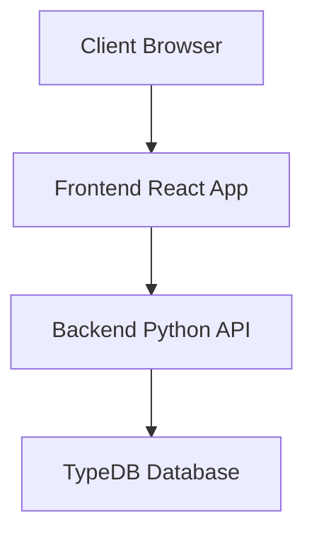

# System Patterns: Projojo

## System Architecture
- [Describe the high-level architecture of the system]
- [Outline the major components and their relationships]
- [Include any architectural diagrams or references]

## Key Technical Decisions
- [Document important technical decisions that shape the system]
- [Explain the rationale behind these decisions]
- [Note any alternatives that were considered and rejected]

## Design Patterns in Use
- [List the key design patterns employed in the codebase]
- [Describe how and where these patterns are applied]
- [Explain the benefits these patterns provide]

## Component Relationships
- [Detail how different components interact]
- [Describe the APIs or interfaces between components]
- [Explain any dependency management approaches]

## Data Flow
- [Describe how data flows through the system]
- [Document any data transformation or processing steps]
- [Note any caching or performance optimization strategies]

## Error Handling and Resilience
- [Explain the approach to error handling]
- [Describe any retry or circuit breaker patterns]
- [Document the logging and monitoring strategy]

## Security Patterns
- [Outline the security model and patterns]
- [Describe authentication and authorization approaches]
- [Document any data protection or privacy considerations]

---

*Note: This document captures the architectural decisions and patterns that define the system. It should be updated whenever significant architectural changes are made.*
