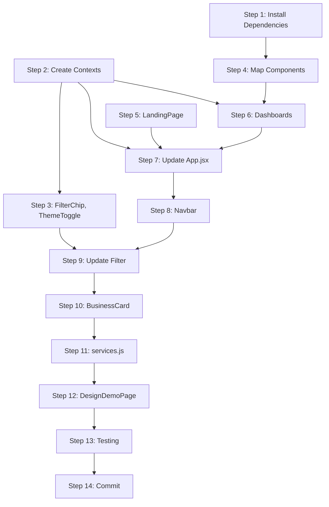

# Phase 2: UI Components Merge Plan

**Branch:** `updating-deployment-with-new-styling`  
**Source Branch:** `next-ui`  
**Created:** 2026-01-08

---

## Overview

Phase 2 focuses on merging UI components, new pages, React contexts, and routing changes from `next-ui` into the current branch. This is more complex than Phase 1 (styling) because it involves:

1. New npm dependencies (Leaflet for maps)
2. New React Context providers
3. New pages and components
4. Modified existing components
5. Routing structure changes
6. Missing notification system in `next-ui`

---

## Pre-Merge Analysis

### NEW Dependencies Required
| Package | Version | Purpose |
|---------|---------|---------|
| `leaflet` | ^1.9.4 | Map rendering library |
| `react-leaflet` | ^5.0.0 | React wrapper for Leaflet |
| `react-leaflet-cluster` | ^4.0.0 | Marker clustering for maps |

### NEW Files to Add
| File | Size | Description |
|------|------|-------------|
| `src/context/ThemeContext.jsx` | 7.7KB | Theme provider for dark/light mode |
| `src/context/StudentSkillsContext.jsx` | 3.1KB | Student skills state management |
| `src/pages/LandingPage.jsx` | 34KB | New public landing page |
| `src/pages/StudentDashboard.jsx` | 22KB | Student-specific dashboard |
| `src/pages/SupervisorDashboard.jsx` | 30KB | Supervisor-specific dashboard |
| `src/pages/DesignDemoPage.jsx` | 78KB | Design system demo (optional) |
| `src/components/LocationMap.jsx` | 7.6KB | Single location map component |
| `src/components/OverviewMap.jsx` | 15KB | Overview map with markers |
| `src/components/FilterChip.jsx` | 3.8KB | Filter chip component |
| `src/components/ThemeToggle.jsx` | 12KB | Theme toggle component |
| `src/DESIGN_SYSTEM.md` | 4.7KB | Design system documentation |

### MODIFIED Files (Require Careful Merging)
| File | Main Branch | next-ui | Risk Level |
|------|-------------|---------|------------|
| `App.jsx` | Has notification system | Missing notification system | HIGH |
| `Navbar.jsx` | Current styling | Neumorphic + new links | MEDIUM |
| `Filter.jsx` | ~current size | 29KB (significantly larger) | HIGH |
| `BusinessCard.jsx` | ~current size | 18KB (expanded) | MEDIUM |
| `services.js` | Has HttpError | Different API calls | HIGH |

### Routing Changes
| Route | Current (main) | New (next-ui) |
|-------|----------------|---------------|
| `/` | LoginPage | LandingPage |
| `/login` | (none) | LoginPage |
| `/home` | OverviewPage | HomePage (role-based) |
| `/ontdek` | (none) | OverviewPage |
| `/design-demo` | (none) | DesignDemoPage |

---

## Detailed Execution Steps

### Step 1: Install New NPM Dependencies

**Action:** Add Leaflet packages to package.json

**Files to modify:**
- `projojo_frontend/package.json`

**Code changes:**
```json
"dependencies": {
  // ... existing deps
  "leaflet": "^1.9.4",
  "react-leaflet": "^5.0.0",
  "react-leaflet-cluster": "^4.0.0"
}
```

**Risks:**
- Version conflicts with existing packages
- Leaflet CSS not loading (already added in Phase 1 via CDN)
- Bundle size increase (~150KB)

**Verification (Chrome DevTools MCP):**
```
1. Run: npm install
2. Check for errors in terminal
3. Verify package-lock.json updated
4. Start dev server: npm run dev
5. Check console for import errors
```

---

### Step 2: Create Context Directory and Files

**Action:** Add new React Context providers

**Files to create:**
- `src/context/ThemeContext.jsx`
- `src/context/StudentSkillsContext.jsx`

**Risks:**
- ThemeContext may conflict with existing Tailwind dark mode if present
- StudentSkillsContext depends on services.js API calls that may differ

**Verification (Chrome DevTools MCP):**
```javascript
// After Step 5 when contexts are wired in App.jsx
1. Navigate to any page
2. Take snapshot to verify page loads
3. Run script: () => {
  const root = document.querySelector('#root');
  return root ? 'App mounted' : 'App failed to mount';
}
4. Check console for context-related errors
```

---

### Step 3: Add New Components (Independent)

**Action:** Add new components that don't depend on other new components

**Files to create (in order):**
1. `src/components/FilterChip.jsx` - standalone
2. `src/components/ThemeToggle.jsx` - depends on ThemeContext

**Risks:**
- FilterChip uses CSS classes that may not exist yet
- ThemeToggle requires ThemeContext from Step 2

**Verification (Chrome DevTools MCP):**
```javascript
// Create temporary test route or import in existing page
1. Navigate to test page
2. Take screenshot
3. Check computed styles: () => {
  const filterChip = document.querySelector('.filter-chip, [class*="filter"]');
  return filterChip ? getComputedStyle(filterChip) : 'not found';
}
```

---

### Step 4: Add Map Components

**Action:** Add Leaflet-based map components

**Files to create (in order):**
1. `src/components/LocationMap.jsx`
2. `src/components/OverviewMap.jsx`

**Risks:**
- Leaflet CSS z-index conflicts (mitigated in Phase 1)
- Map not rendering if Leaflet not properly imported
- Leaflet icons not loading (requires special handling in Vite)
- SSR issues (Leaflet requires window object)

**Known Leaflet + Vite Issue:**
Default marker icons may not load due to Vite bundling. May need to add:
```javascript
import L from 'leaflet';
import markerIcon from 'leaflet/dist/images/marker-icon.png';
import markerIcon2x from 'leaflet/dist/images/marker-icon-2x.png';
import markerShadow from 'leaflet/dist/images/marker-shadow.png';

delete L.Icon.Default.prototype._getIconUrl;
L.Icon.Default.mergeOptions({
  iconRetinaUrl: markerIcon2x,
  iconUrl: markerIcon,
  shadowUrl: markerShadow,
});
```

**Verification (Chrome DevTools MCP):**
```javascript
1. Navigate to page with map (after Step 8)
2. Take screenshot to verify map renders
3. Check Leaflet loaded: () => {
  return typeof L !== 'undefined' ? 'Leaflet loaded' : 'Leaflet not found';
}
4. Check map tiles: evaluate_script: () => {
  const tiles = document.querySelectorAll('.leaflet-tile-loaded');
  return tiles.length > 0 ? `${tiles.length} tiles loaded` : 'No tiles';
}
```

---

### Step 5: Add New Pages (Part 1 - Simple Pages)

**Action:** Add LandingPage first as it's standalone

**Files to create:**
1. `src/pages/LandingPage.jsx`

**Risks:**
- LandingPage may use components not yet added
- May reference API endpoints not present on main branch
- Large file (34KB) - check for dependencies

**Verification (Chrome DevTools MCP):**
```javascript
// After adding route in Step 7
1. Navigate to /landing-test (temporary route)
2. Take snapshot: should see landing content
3. Take screenshot for visual verification
4. Check for console errors
```

---

### Step 6: Add New Pages (Part 2 - Dashboard Pages)

**Action:** Add role-based dashboard pages

**Files to create:**
1. `src/pages/StudentDashboard.jsx`
2. `src/pages/SupervisorDashboard.jsx`

**Dependencies these pages may have:**
- OverviewMap component
- Filter component (modified version)
- StudentSkillsContext
- Various API calls in services.js

**Risks:**
- Dashboard pages depend on OverviewMap (Step 4)
- May call API endpoints that don't exist yet (Phase 3)
- May use `archived` business field (Phase 3 backend change)
- StudentDashboard uses StudentSkillsContext

**Verification (Chrome DevTools MCP):**
```javascript
// After adding routes in Step 7
1. Navigate to /home (as student user)
2. Take snapshot: verify StudentDashboard elements
3. Check authData: () => {
  // Check localStorage or auth state
  return localStorage.getItem('authToken') ? 'Authenticated' : 'Not authenticated';
}
4. Check for API errors in console
```

---

### Step 7: Update App.jsx (Routing & Contexts)

**Action:** Modify App.jsx to add context providers and new routes

**Critical Differences:**
| Aspect | Main Branch | next-ui | Resolution |
|--------|-------------|---------|------------|
| Error handling | Has `notification.error()` | Missing | KEEP main branch error handling |
| Root container | `<div className="max-w-7xl...">` | `<div className="min-h-screen bg-[var(--neu-bg)]...">` | Use next-ui styling |
| Context providers | None | ThemeProvider + StudentSkillsProvider | ADD both |
| Skip link | None | Has accessibility skip link | ADD |

**Changes to make:**
1. Add imports for new contexts and pages
2. Add ThemeProvider and StudentSkillsProvider wrappers
3. Add HomePage component (role-based routing)
4. Update routes structure
5. **KEEP the existing notification error handling**
6. Add accessibility skip link

**Risks:**
- HIGH: If notification system is removed, unhandled errors will crash app
- Routing change from `/` to LandingPage may break bookmarks
- Context providers may cause re-render issues if not properly memoized

**Verification (Chrome DevTools MCP):**
```javascript
1. Navigate to / (should show LandingPage)
2. Take snapshot: verify "Projojo" or landing content
3. Navigate to /login
4. Take snapshot: verify login form present
5. Check error handling: () => {
  // Trigger an error and verify notification appears
  window.dispatchEvent(new CustomEvent('unhandledrejection', {
    detail: { reason: new Error('Test error') }
  }));
  return 'Error dispatched - check for notification';
}
6. Check contexts loaded: () => {
  return document.body.className; // Should have theme class
}
```

---

### Step 8: Update Modified Components (Navbar)

**Action:** Update Navbar.jsx with neumorphic styling

**Key changes in next-ui Navbar:**
- Neumorphic styling
- New navigation links (Ontdek, etc.)
- Mobile responsive menu
- User dropdown improvements
- Role-based menu items

**Risks:**
- Navigation links to non-existent routes
- Lost logout functionality if not careful
- Mobile menu may break
- User dropdown depends on auth state

**Verification (Chrome DevTools MCP):**
```javascript
1. Navigate to /home (authenticated page)
2. Take snapshot: verify navbar elements
3. Check nav links: () => {
  const links = document.querySelectorAll('nav a');
  return Array.from(links).map(l => ({href: l.href, text: l.textContent}));
}
4. Click mobile menu button (if viewport narrow)
5. Take screenshot at mobile viewport: resize_page(375, 667)
```

---

### Step 9: Update Modified Components (Filter)

**Action:** Update Filter.jsx with enhanced functionality

**The next-ui Filter.jsx is significantly larger (29KB) and includes:**
- More filter options
- Better UI with neumorphic styling
- FilterChip integration
- Saved filter presets
- Advanced search capabilities

**Risks:**
- May break existing filtering functionality
- Props interface may have changed
- Parent components may need updates
- May require API endpoints not present

**Strategy:** 
Consider replacing entire file rather than merging, then test thoroughly.

**Verification (Chrome DevTools MCP):**
```javascript
1. Navigate to /ontdek (or page with filter)
2. Take snapshot: verify filter UI elements
3. Interact with filter: click on filter dropdown
4. Take screenshot after filter interaction
5. Check filter state: () => {
  const filters = document.querySelectorAll('[class*="filter"]');
  return filters.length;
}
```

---

### Step 10: Update Modified Components (BusinessCard)

**Action:** Update BusinessCard.jsx with new styling and features

**Changes in next-ui BusinessCard:**
- Neumorphic styling
- Expanded project display
- Archive indicator (requires Phase 3 backend)
- Rating/review display

**Risks:**
- `business.archived` field doesn't exist yet (Phase 3)
- Image handling differences
- Click handlers may differ

**Temporary Fix:** Add optional chaining for `business.archived`:
```javascript
{business?.archived && <ArchivedBadge />}
```

**Verification (Chrome DevTools MCP):**
```javascript
1. Navigate to business page or list
2. Take snapshot: verify BusinessCard elements
3. Check styling: () => {
  const card = document.querySelector('[class*="business"], [class*="neu-card"]');
  return card ? getComputedStyle(card).boxShadow : 'no card found';
}
```

---

### Step 11: Update services.js (API Compatibility)

**Action:** Review and carefully merge services.js

**Key differences:**
- next-ui may have different API endpoint patterns
- HttpError class handling
- New API methods for skills, businesses
- Archived business endpoints (Phase 3)

**Strategy:**
1. Keep ALL existing methods from main
2. Add NEW methods from next-ui
3. Ensure HttpError is maintained
4. Mark Phase 3 methods with TODO comments

**Risks:**
- Breaking existing API calls
- Missing error handling
- Different response structures

**Verification (Chrome DevTools MCP):**
```javascript
1. Navigate to various pages
2. Open Network panel: list_network_requests
3. Check for failed API calls (4xx, 5xx)
4. Test specific endpoint: () => {
  return fetch('/api/v1/students/me').then(r => r.status);
}
```

---

### Step 12: Add DesignDemoPage (Optional)

**Action:** Add design demo page for testing

**This page is 78KB and serves as a comprehensive design system showcase. Optional but useful for verification.**

**Risks:**
- Very large file
- May use components not yet added
- Mainly for development, could exclude from production

**Verification (Chrome DevTools MCP):**
```javascript
1. Navigate to /design-demo
2. Take full-page screenshot
3. Scroll down and verify all sections render
4. Check for console errors
```

---

### Step 13: Final Integration Testing

**Action:** Comprehensive testing of all integrated components

**Test Scenarios:**

1. **Public Flow:**
   - Visit `/` → LandingPage loads
   - Click "Login" → `/login` loads
   - OAuth flow works (if backend running)

2. **Student Flow:**
   - Login as student
   - `/home` → StudentDashboard loads
   - Navigation works
   - Map renders (if data available)
   - Filters work

3. **Supervisor Flow:**
   - Login as supervisor  
   - `/home` → SupervisorDashboard loads
   - Business management accessible

4. **Error Handling:**
   - Induce an error (e.g., API failure)
   - Notification appears (not console error only)

**Verification (Chrome DevTools MCP):**
```javascript
// Run comprehensive checks
1. Visit each route in sequence
2. Take screenshot at each route
3. Collect console messages: list_console_messages
4. Check for any errors or warnings
5. Final network check: list_network_requests(resourceTypes: ['fetch', 'xhr'])
```

---

### Step 14: Commit and Push

**Action:** Stage changes and commit with descriptive message

**Commit message template:**
```
feat(ui): Add role-based dashboards and map components (Phase 2)

- Add ThemeContext and StudentSkillsContext providers
- Add LandingPage, StudentDashboard, SupervisorDashboard pages
- Add LocationMap, OverviewMap, FilterChip, ThemeToggle components
- Update routing: / → LandingPage, /login → LoginPage, /home → role-based
- Add /ontdek route for discovery/overview
- Update Navbar with neumorphic styling and new navigation
- Update Filter.jsx with enhanced filtering capabilities
- Update BusinessCard with new styling
- Add Leaflet dependencies for map functionality
- Preserve notification error handling from main branch

BREAKING CHANGE: Route / now shows LandingPage instead of LoginPage
```

---

## Risk Summary Matrix

| Step | Risk Level | Main Risk | Mitigation |
|------|------------|-----------|------------|
| 1 | LOW | Dependency conflicts | Fresh npm install |
| 2 | LOW | Context errors | Test in isolation |
| 3 | LOW | Missing CSS | Already added in Phase 1 |
| 4 | MEDIUM | Leaflet icons | Manual icon configuration |
| 5 | LOW | Missing deps | Add after components added |
| 6 | MEDIUM | API mismatches | Mark with TODOs |
| 7 | **HIGH** | Lost error handling | Keep notification system |
| 8 | MEDIUM | Broken navigation | Test each link |
| 9 | **HIGH** | Broken filtering | Test thoroughly |
| 10 | MEDIUM | Missing archived field | Optional chaining |
| 11 | **HIGH** | API breakage | Careful merging |
| 12 | LOW | Large file | Optional step |
| 13 | - | Testing | Required |
| 14 | LOW | - | Standard commit |

---

## Dependencies Between Steps



---

## Rollback Plan

If Phase 2 causes critical issues:

1. **Immediate:** `git checkout -- .` to discard all changes
2. **After commits:** `git revert HEAD~N` where N = number of commits
3. **Keep Phase 1:** Styling changes are independent and safe to keep

---

## Post-Phase 2 Considerations

After Phase 2 is complete, Phase 3 (Backend) will be needed to:
- Add `archived` attribute to Business entity in TypeDB schema
- Add archive/unarchive API endpoints
- Update seed data with archived businesses
- Address any API mismatches found during Phase 2 testing
