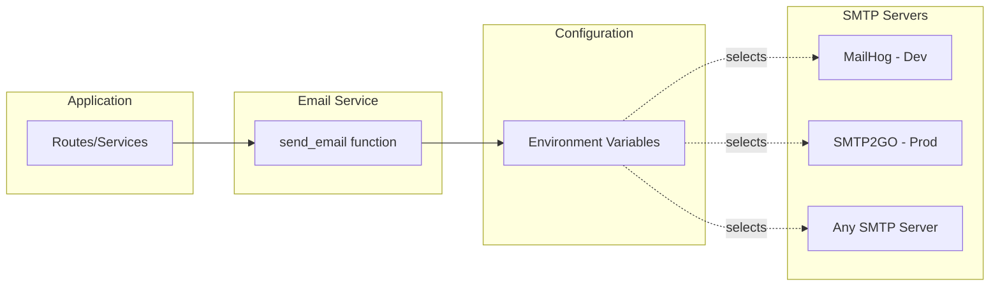
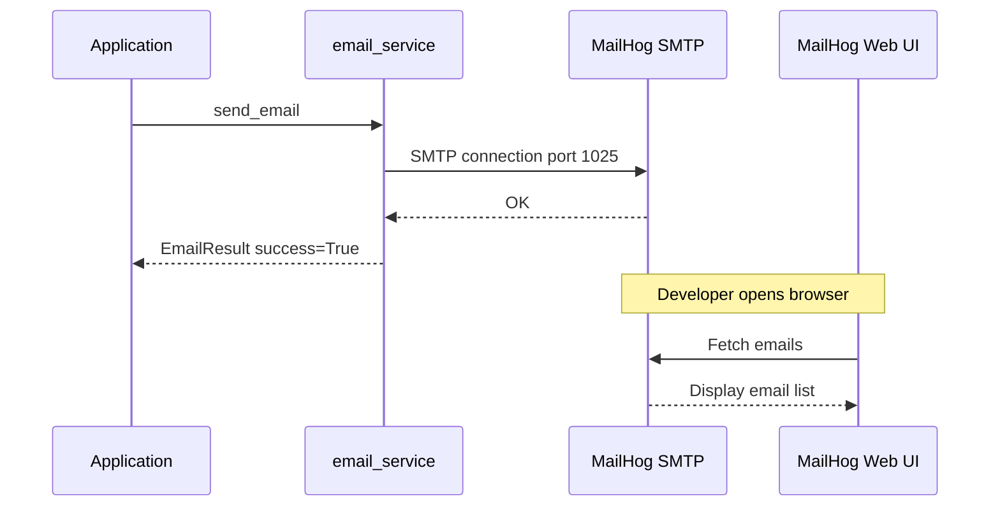

# Email Module Plan for Projojo Backend (Simplified)

## Overview

A **simple, configuration-driven** email module that exposes a single `send_email()` function. The SMTP server (SMTP2GO, MailHog, or any other) is determined purely by configuration—no code changes needed.

## Design Principles

1. **Minimal API**: Two functions: `send_email()` and `send_templated_email()`
2. **Configuration-based**: SMTP server details come from environment variables
3. **Pydantic models**: `EmailResult` and `EmailAttachment` for type safety
4. **Jinja2 templates**: Reusable email templates with inheritance
5. **Follows existing patterns**: Matches [`image_service.py`](projojo_backend/service/image_service.py) style
6. **MailHog for local dev**: Easy local testing via Docker

---

## Architecture Diagram



---

## File Structure

Minimal structure with template support:

```
projojo_backend/
├── service/
│   ├── __init__.py
│   ├── image_service.py      # existing
│   ├── task_service.py       # existing
│   ├── email_service.py      # NEW - email sending logic
│   └── ...
├── templates/
│   └── email/                # NEW - email templates
│       ├── base.html         # Base template with common layout
│       ├── invitation.html   # Project invitation template
│       └── notification.html # Generic notification template
```

---

## Implementation

### `email_service.py`

```python
# projojo_backend/service/email_service.py

import os
import smtplib
from email.mime.text import MIMEText
from email.mime.multipart import MIMEMultipart
from email.mime.base import MIMEBase
from email import encoders
from pathlib import Path
from typing import Optional, Any

from pydantic import BaseModel, EmailStr
from jinja2 import Environment, FileSystemLoader, select_autoescape


# ============================================================================
# Pydantic Models
# ============================================================================

class EmailAttachment(BaseModel):
    """Represents an email attachment."""
    filename: str
    content: bytes
    mime_type: str = "application/octet-stream"
    
    class Config:
        arbitrary_types_allowed = True


class EmailResult(BaseModel):
    """Result of an email send operation."""
    success: bool
    message_id: Optional[str] = None
    error: Optional[str] = None


# ============================================================================
# Template Engine Setup
# ============================================================================

# Template directory path (relative to backend root)
_TEMPLATE_DIR = Path(__file__).parent.parent / "templates" / "email"

# Jinja2 environment (lazy-loaded)
_jinja_env: Optional[Environment] = None


def _get_template_env() -> Environment:
    """Get or create the Jinja2 template environment."""
    global _jinja_env
    if _jinja_env is None:
        _jinja_env = Environment(
            loader=FileSystemLoader(_TEMPLATE_DIR),
            autoescape=select_autoescape(["html", "xml"]),
            trim_blocks=True,
            lstrip_blocks=True,
        )
    return _jinja_env


def _render_template(template_name: str, context: dict[str, Any]) -> str:
    """Render a Jinja2 template with the given context."""
    env = _get_template_env()
    template = env.get_template(template_name)
    return template.render(**context)


# ============================================================================
# Configuration
# ============================================================================

def _get_smtp_config() -> dict:
    """Load SMTP configuration from environment variables."""
    return {
        "host": os.getenv("EMAIL_SMTP_HOST", "localhost"),
        "port": int(os.getenv("EMAIL_SMTP_PORT", "1025")),
        "username": os.getenv("EMAIL_SMTP_USERNAME", ""),
        "password": os.getenv("EMAIL_SMTP_PASSWORD", ""),
        "use_tls": os.getenv("EMAIL_SMTP_USE_TLS", "false").lower() == "true",
        "default_sender": os.getenv("EMAIL_DEFAULT_SENDER", "noreply@projojo.nl"),
    }


# ============================================================================
# Email Sending Functions
# ============================================================================

def send_email(
    recipient: str | list[str],
    subject: str,
    body_text: Optional[str] = None,
    body_html: Optional[str] = None,
    sender: Optional[str] = None,
    cc: Optional[list[str]] = None,
    bcc: Optional[list[str]] = None,
    reply_to: Optional[str] = None,
    attachments: Optional[list[EmailAttachment]] = None,
) -> EmailResult:
    """
    Send an email via SMTP.
    
    The SMTP server is configured via environment variables:
    - EMAIL_SMTP_HOST: SMTP server hostname (default: localhost for MailHog)
    - EMAIL_SMTP_PORT: SMTP server port (default: 1025 for MailHog)
    - EMAIL_SMTP_USERNAME: SMTP username (optional, empty for MailHog)
    - EMAIL_SMTP_PASSWORD: SMTP password (optional, empty for MailHog)
    - EMAIL_SMTP_USE_TLS: Whether to use TLS (default: false)
    - EMAIL_DEFAULT_SENDER: Default sender email address
    
    Args:
        recipient: Email address or list of addresses to send to
        subject: Email subject line
        body_text: Plain text body (optional if body_html provided)
        body_html: HTML body (optional if body_text provided)
        sender: Sender email address (uses default if not provided)
        cc: List of CC recipients
        bcc: List of BCC recipients
        reply_to: Reply-to email address
        attachments: List of EmailAttachment objects
        
    Returns:
        EmailResult with success status and optional error message
    """
    config = _get_smtp_config()
    
    # Normalize recipient to list
    if isinstance(recipient, str):
        recipients = [recipient]
    else:
        recipients = list(recipient)
    
    # Use default sender if not provided
    from_addr = sender or config["default_sender"]
    
    # Build the email message
    msg = MIMEMultipart("alternative")
    msg["Subject"] = subject
    msg["From"] = from_addr
    msg["To"] = ", ".join(recipients)
    
    if cc:
        msg["Cc"] = ", ".join(cc)
        recipients.extend(cc)
    
    if bcc:
        recipients.extend(bcc)
    
    if reply_to:
        msg["Reply-To"] = reply_to
    
    # Add body parts
    if body_text:
        msg.attach(MIMEText(body_text, "plain", "utf-8"))
    
    if body_html:
        msg.attach(MIMEText(body_html, "html", "utf-8"))
    
    # Add attachments
    if attachments:
        for attachment in attachments:
            maintype, subtype = attachment.mime_type.split("/", 1)
            part = MIMEBase(maintype, subtype)
            part.set_payload(attachment.content)
            encoders.encode_base64(part)
            part.add_header(
                "Content-Disposition",
                f"attachment; filename={attachment.filename}"
            )
            msg.attach(part)
    
    # Send via SMTP
    try:
        if config["use_tls"]:
            server = smtplib.SMTP(config["host"], config["port"], timeout=30)
            server.ehlo()
            server.starttls()
            server.ehlo()
        else:
            server = smtplib.SMTP(config["host"], config["port"], timeout=30)
        
        if config["username"] and config["password"]:
            server.login(config["username"], config["password"])
        
        server.sendmail(from_addr, recipients, msg.as_string())
        server.quit()
        
        return EmailResult(success=True)
        
    except smtplib.SMTPException as e:
        return EmailResult(success=False, error=f"SMTP error: {str(e)}")
    except Exception as e:
        return EmailResult(success=False, error=f"Failed to send email: {str(e)}")


def send_templated_email(
    recipient: str | list[str],
    subject: str,
    template_name: str,
    context: dict[str, Any],
    text_template_name: Optional[str] = None,
    sender: Optional[str] = None,
    cc: Optional[list[str]] = None,
    bcc: Optional[list[str]] = None,
    reply_to: Optional[str] = None,
    attachments: Optional[list[EmailAttachment]] = None,
) -> EmailResult:
    """
    Send an email using a Jinja2 template.
    
    Templates are loaded from: projojo_backend/templates/email/
    
    Args:
        recipient: Email address or list of addresses
        subject: Email subject line
        template_name: Name of the HTML template file (e.g., "invitation.html")
        context: Dictionary of variables to pass to the template
        text_template_name: Optional plain text template (e.g., "invitation.txt")
        sender: Sender email address (uses default if not provided)
        cc: List of CC recipients
        bcc: List of BCC recipients
        reply_to: Reply-to email address
        attachments: List of EmailAttachment objects
        
    Returns:
        EmailResult with success status and optional error message
        
    Example:
        >>> result = send_templated_email(
        ...     recipient="user@example.com",
        ...     subject="You are invited!",
        ...     template_name="invitation.html",
        ...     context={
        ...         "user_name": "John",
        ...         "project_name": "Smart Farm",
        ...         "invite_link": "https://projojo.nl/invite/abc123"
        ...     }
        ... )
    """
    # Render HTML template
    body_html = _render_template(template_name, context)
    
    # Render text template if provided
    body_text = None
    if text_template_name:
        body_text = _render_template(text_template_name, context)
    
    return send_email(
        recipient=recipient,
        subject=subject,
        body_text=body_text,
        body_html=body_html,
        sender=sender,
        cc=cc,
        bcc=bcc,
        reply_to=reply_to,
        attachments=attachments,
    )
```

### Example Templates

#### `templates/email/base.html`

```html
<!DOCTYPE html>
<html>
<head>
    <meta charset="utf-8">
    <meta name="viewport" content="width=device-width, initial-scale=1.0">
    <title>Projojo</title>
    <style>
        body {
            font-family: -apple-system, BlinkMacSystemFont, 'Segoe UI', Roboto, Helvetica, Arial, sans-serif;
            line-height: 1.6;
            color: #333;
            max-width: 600px;
            margin: 0 auto;
            padding: 20px;
        }
        .header {
            text-align: center;
            padding: 20px 0;
            border-bottom: 2px solid #4F46E5;
        }
        .content {
            padding: 30px 0;
        }
        .button {
            display: inline-block;
            background-color: #4F46E5;
            color: white;
            padding: 12px 24px;
            text-decoration: none;
            border-radius: 6px;
            margin: 20px 0;
        }
        .footer {
            text-align: center;
            padding: 20px 0;
            color: #666;
            font-size: 12px;
            border-top: 1px solid #eee;
        }
    </style>
</head>
<body>
    <div class="header">
        <h1>Projojo</h1>
    </div>
    <div class="content">
        
    </div>
    <div class="footer">
        
        <p>© Projojo - Connecting students with projects</p>
        
    </div>
</body>
</html>
```

#### `templates/email/invitation.html`

```html


Project Invitation


<h2>Hello {{ user_name }}!</h2>

<p>You have been invited to join the project <strong>{{ project_name }}</strong>.</p>


<p>{{ message }}</p>


<p>
    <a href="{{ invite_link }}" class="button">Accept Invitation</a>
</p>

<p>Or copy this link: {{ invite_link }}</p>

<p>This invitation will expire in {{ expire_days|default(7) }} days.</p>

```

#### `templates/email/notification.html`

```html


{{ notification_title }}


<h2>{{ notification_title }}</h2>

<p>{{ notification_body }}</p>


<p>
    <a href="{{ action_url }}" class="button">{{ action_text|default('View Details') }}</a>
</p>


```

---

## Environment Variables

Add to [`.env.example`](projojo_backend/.env.example):

```bash
# ============================================================================
# Email Configuration (SMTP)
# ============================================================================
# Default configuration is for MailHog (local development)
# For production, configure SMTP2GO or your preferred SMTP provider

# SMTP server hostname
# - MailHog (local dev): localhost or mailhog (in Docker)
# - SMTP2GO (production): mail.smtp2go.com
EMAIL_SMTP_HOST=mailhog

# SMTP server port
# - MailHog: 1025
# - SMTP2GO: 2525 (or 587, 8025, 25)
EMAIL_SMTP_PORT=1025

# SMTP authentication (leave empty for MailHog)
EMAIL_SMTP_USERNAME=
EMAIL_SMTP_PASSWORD=

# Enable TLS (required for SMTP2GO, not needed for MailHog)
EMAIL_SMTP_USE_TLS=false

# Default sender email address
EMAIL_DEFAULT_SENDER=noreply@projojo.nl
```

---

## Docker Compose Update

Add MailHog service to [`docker-compose.yml`](docker-compose.yml):

```yaml
services:
  # ... existing services ...

  mailhog:
    container_name: projojo_mailhog
    image: mailhog/mailhog:latest
    restart: unless-stopped
    ports:
      - "1025:1025"   # SMTP server
      - "8025:8025"   # Web UI
    networks:
      - projojo-network
```

Update backend service to connect to MailHog:

```yaml
  backend:
    # ... existing config ...
    environment:
      # ... existing env vars ...
      - EMAIL_SMTP_HOST=mailhog
      - EMAIL_SMTP_PORT=1025
      - EMAIL_SMTP_USE_TLS=false
      - EMAIL_DEFAULT_SENDER=noreply@projojo.nl
```

---

## SMTP2GO Configuration

When deploying to production, set these environment variables:

```bash
EMAIL_SMTP_HOST=mail.smtp2go.com
EMAIL_SMTP_PORT=2525
EMAIL_SMTP_USERNAME=your_smtp_username
EMAIL_SMTP_PASSWORD=your_smtp_password
EMAIL_SMTP_USE_TLS=true
EMAIL_DEFAULT_SENDER=noreply@yourdomain.com
```

### Getting SMTP2GO Credentials

1. Sign up at [smtp2go.com](https://www.smtp2go.com)
2. Go to **Sending → SMTP Users**
3. Create a new SMTP user
4. Use the generated username/password in your environment variables

---

## Usage Examples

### Basic Usage

```python
from service.email_service import send_email

# Simple text email
result = send_email(
    recipient="user@example.com",
    subject="Welcome!",
    body_text="Welcome to Projojo!"
)

if not result.success:
    print(f"Failed: {result.error}")
```

### HTML Email

```python
result = send_email(
    recipient="user@example.com",
    subject="Project Update",
    body_text="You have a new project invitation.",  # Fallback for text clients
    body_html="""
        <html>
            <body>
                <h1>Project Invitation</h1>
                <p>You have been invited to join a project!</p>
                <a href="https://projojo.nl/accept">Accept Invitation</a>
            </body>
        </html>
    """
)
```

### Multiple Recipients

```python
result = send_email(
    recipient=["user1@example.com", "user2@example.com"],
    subject="Team Update",
    body_text="Important team announcement."
)
```

### With Attachment

```python
from service.email_service import send_email, EmailAttachment

pdf_content = open("report.pdf", "rb").read()

result = send_email(
    recipient="manager@example.com",
    subject="Monthly Report",
    body_text="Please find the monthly report attached.",
    attachments=[
        EmailAttachment(
            filename="report.pdf",
            content=pdf_content,
            mime_type="application/pdf"
        )
    ]
)
```

### Using Templates

```python
from service.email_service import send_templated_email

result = send_templated_email(
    recipient="user@example.com",
    subject="You have been invited!",
    template_name="invitation.html",
    context={
        "user_name": "John Doe",
        "project_name": "Smart Farm Analytics",
        "invite_link": "https://projojo.nl/invite/abc123",
        "expire_days": 7
    }
)

if result.success:
    print("Invitation sent!")
```

### In a Route Handler

```python
# projojo_backend/routes/invite_router.py

from fastapi import APIRouter
from service.email_service import send_email

router = APIRouter(prefix="/invite", tags=["invites"])

@router.post("/send")
async def send_invitation(email: str, project_name: str):
    result = send_email(
        recipient=email,
        subject=f"Invitation to join {project_name}",
        body_text=f"You have been invited to join the project: {project_name}",
        body_html=f"<h1>Project Invitation</h1><p>Join <strong>{project_name}</strong></p>"
    )
    
    if result.success:
        return {"status": "sent"}
    else:
        return {"status": "failed", "error": result.error}
```

---

## Local Testing with MailHog

1. Start the Docker environment:
   ```bash
   docker-compose up -d
   ```

2. Send a test email (from your app or Python REPL)

3. View emails in MailHog web UI:
   - Open http://localhost:8025 in your browser
   - All sent emails will appear here



---

## Dependencies

Add to [`pyproject.toml`](projojo_backend/pyproject.toml):

```toml
dependencies = [
    # ... existing dependencies ...
    "jinja2>=3.1.0",  # Email template rendering
]
```

---

## Implementation Checklist

- [ ] Create `projojo_backend/service/email_service.py`
- [ ] Create `projojo_backend/templates/email/` directory
- [ ] Create `projojo_backend/templates/email/base.html`
- [ ] Create `projojo_backend/templates/email/invitation.html`
- [ ] Create `projojo_backend/templates/email/notification.html`
- [ ] Add `jinja2` to `pyproject.toml`
- [ ] Add MailHog service to `docker-compose.yml`
- [ ] Add email environment variables to `.env.example`
- [ ] Update backend service environment in `docker-compose.yml`
- [ ] Export functions from `service/__init__.py`
- [ ] Add basic test in `tests/test_email_service.py`

---

## Summary

| Aspect | Choice |
|--------|--------|
| **API Surface** | Two functions: `send_email()` + `send_templated_email()` |
| **Models** | Pydantic: `EmailResult`, `EmailAttachment` |
| **Templates** | Jinja2 with base template inheritance |
| **Configuration** | Environment variables only |
| **Local Testing** | MailHog via Docker |
| **Production** | SMTP2GO (or any SMTP server) |
| **Dependencies** | `jinja2` + Python stdlib `smtplib` |
| **Files to Create** | 1 service file + 3 templates |
| **Pattern Match** | Same style as `image_service.py` |
