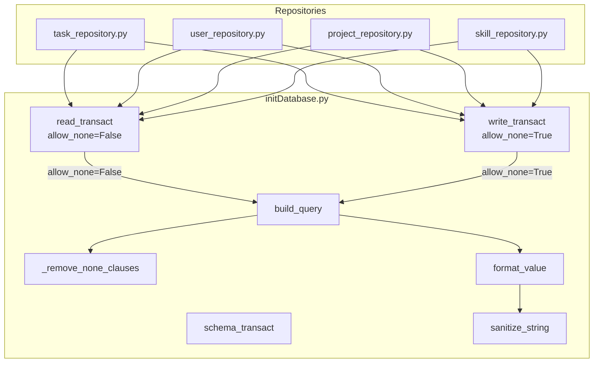

# TypeQL Parameterized Query Plan

## Overview

This document outlines the design for adding parameterized query support directly to the existing `Db` class methods (`read_transact`, `write_transact`, `schema_transact`) in `projojo_backend/db/initDatabase.py`.

## File Location

```
projojo_backend/db/
├── __init__.py
├── initDatabase.py    # MODIFIED: Add params support and sanitization functions
├── schema.tql
└── seed.tql
```

**All code will be contained in `initDatabase.py`** - no separate module needed.

## Module Design

### 1. Placeholder Syntax

Use tilde-prefix placeholders: `~param_name`

**Why tilde?** The `~` character is completely unused in TypeQL grammar, making it safe from any syntax conflicts. Other symbols like `:` are already used for type annotations and role players.

**Example:**
```python
template = """
    match
        $task isa task, has id ~task_id;
    fetch { 'name': $task.name };
"""
```

### 2. Type Detection and Formatting Rules

| Python Type | TypeQL Output | Example Input | Example Output |
|-------------|---------------|---------------|----------------|
| `str` | Quoted, escaped | `"O'Brien"` | `"O\'Brien"` |
| `UUID` | Quoted string | `UUID('abc-123')` | `"abc-123"` |
| `int` | Raw number | `42` | `42` |
| `float` | Raw number | `3.14` | `3.14` |
| `bool` | Lowercase | `True` | `true` |
| `datetime` | ISO format | `datetime(2024,1,1)` | `2024-01-01T00:00:00` |
| `date` | ISO format | `date(2024,1,1)` | `2024-01-01` |
| `None` | **Context-dependent** | See below | See below |
| `list` | TypeQL list | `[1, 2, 3]` | `[1, 2, 3]` |

### 2.1 Handling Optional/Absent Attributes

**Important:** TypeQL has no `null` or `None` literal. An absent attribute means the entity simply doesn't have a `has` clause for that attribute.

#### Context-Dependent `None` Handling

| Method | `None` Behavior | Rationale |
|--------|-----------------|-----------|
| `write_transact()` | Removes clause | Optional attribute not being set |
| `read_transact()` | Raises `ValueError` | Matching on None is meaningless |

#### Write Queries: `None` Removes the Clause

In INSERT/PUT/UPDATE queries, `None` naturally means "don't include this optional attribute":

```python
# Simple and Pythonic - just pass None for optional fields
Db.write_transact(
    """
    insert
        $task isa task,
        has id ~task_id,
        has name ~task_name,
        has description ~description;
    """,
    params={
        'task_id': task.id,
        'task_name': task.name,
        'description': task.description  # Can be None
    }
)
```

**Result when `description` is `None`:**
```typeql
insert
    $task isa task,
    has id "abc",
    has name "My Task";
```

#### Read Queries: `None` Raises Error

In MATCH queries, you can't meaningfully match on None:

```python
# This raises ValueError - use negation pattern instead
Db.read_transact(
    "match $user isa user, has email ~email;",
    params={'email': None}  # ValueError!
)
```

#### Querying for Absent Attributes

To match entities that **don't have** an attribute, use negation patterns:
```typeql
match
    $user isa user, has id ~user_id;
    not { $user has phone $p; };  # User has no phone
```

To match entities **regardless** of whether they have an attribute, use `try`:
```typeql
match
    $user isa user, has id ~user_id;
    try { $user has phone $phone; };  # Phone is optional
fetch { "phone": $phone };  # Returns () if no phone
```

### 3. Code to Add to initDatabase.py

```python
# projojo_backend/db/initDatabase.py

from typedb.driver import TypeDB, TransactionType, Credentials, DriverOptions
from typing import Any
from datetime import datetime, date
from uuid import UUID
import os
import re
import time
from dotenv import load_dotenv

# Load environment variables from .env file
load_dotenv()


# =============================================================================
# Sanitization and Query Building Functions
# =============================================================================

def sanitize_string(value: str) -> str:
    """
    Sanitize a string value for safe interpolation into TypeQL queries.
    
    Escapes:
    - Backslashes (\ -> \\) - MUST be first to avoid double-escaping
    - Double quotes (" -> \")
    
    Args:
        value: The string to sanitize
        
    Returns:
        Sanitized string safe for TypeQL interpolation
    """
    return value.replace('\\', '\\\\').replace('"', '\\"')


def format_value(value: Any) -> str:
    """
    Format a Python value for TypeQL query interpolation.
    
    Automatically detects the type and applies appropriate formatting:
    - str: Quoted and escaped
    - UUID: Converted to quoted string
    - int/float: Raw number
    - bool: Lowercase true/false
    - datetime/date: ISO format (unquoted for TypeQL datetime literals)
    - list: TypeQL list format
    
    Args:
        value: The Python value to format
        
    Returns:
        TypeQL-formatted string representation
        
    Note:
        None values should be filtered out before calling this function.
        This function raises ValueError if it receives None.
    """
    if value is None:
        raise ValueError(
            "format_value received None - this is a bug. "
            "None values should be filtered before formatting."
        )
    
    if isinstance(value, bool):  # Must check before int (bool is subclass of int)
        return 'true' if value else 'false'
    
    if isinstance(value, UUID):
        return f'"{str(value)}"'
    
    if isinstance(value, int):
        return str(value)
    
    if isinstance(value, float):
        return str(value)
    
    if isinstance(value, datetime):
        return value.strftime('%Y-%m-%dT%H:%M:%S')
    
    if isinstance(value, date):
        return value.strftime('%Y-%m-%d')
    
    if isinstance(value, (list, tuple)):
        formatted_items = [format_value(item) for item in value]
        return f"[{', '.join(formatted_items)}]"
    
    # Default: treat as string
    return f'"{sanitize_string(str(value))}"'


def _remove_none_clauses(template: str, none_params: list[str]) -> str:
    """
    Remove lines/clauses containing None placeholders from the template.
    
    Handles TypeQL syntax by:
    1. Removing the entire line containing ~param_name
    2. Cleaning up dangling commas
    3. Preserving valid TypeQL structure
    
    Args:
        template: Query template
        none_params: List of parameter names with None values
        
    Returns:
        Template with None clauses removed
    """
    result = template
    
    for param in none_params:
        # Remove entire line containing the placeholder
        # This regex matches a line (with leading whitespace) containing ~param_name
        # and handles both comma-terminated and semicolon-terminated lines
        pattern = rf'^\s*.*~{re.escape(param)}(?![a-zA-Z0-9_]).*$\n?'
        result = re.sub(pattern, '', result, flags=re.MULTILINE)
    
    # Clean up dangling commas before semicolons or closing braces
    # e.g., "has name "x",\n    ;" -> "has name "x";"
    result = re.sub(r',\s*;', ';', result)
    result = re.sub(r',\s*\)', ')', result)
    result = re.sub(r',\s*}', '}', result)
    
    return result


def build_query(template: str, params: dict[str, Any], allow_none: bool = False) -> str:
    """
    Build a TypeQL query from a template and parameters.
    
    Replaces ~param_name placeholders with properly formatted and sanitized values.
    
    Validates:
    1. All placeholders in template have corresponding keys in params
    2. All placeholders in template are unique (no duplicates)
    3. All keys in params are used as placeholders in template
    
    Args:
        template: Query template with ~param_name placeholders
        params: Dictionary of parameter names to values
        allow_none: If True, None values remove the containing clause (for writes).
                    If False, None values raise ValueError (for reads).
        
    Returns:
        Complete TypeQL query string with interpolated values
        
    Raises:
        KeyError: If a placeholder in the template has no matching parameter
        ValueError: If None is passed and allow_none is False,
                    if duplicate placeholders exist,
                    or if params contains keys not used in template
    """
    # Step 1: Extract all placeholders from template
    all_placeholders = re.findall(r'~([a-zA-Z_][a-zA-Z0-9_]*)', template)
    unique_placeholders = set(all_placeholders)
    param_keys = set(params.keys())
    
    # Step 2: Validate no duplicate placeholders
    if len(all_placeholders) != len(unique_placeholders):
        # Find the duplicates
        seen = set()
        duplicates = set()
        for p in all_placeholders:
            if p in seen:
                duplicates.add(p)
            seen.add(p)
        raise ValueError(
            f"Duplicate placeholders in template: {sorted(duplicates)}. "
            "Each placeholder must appear exactly once."
        )
    
    # Step 3: Validate all params are used in template
    unused_params = param_keys - unique_placeholders
    if unused_params:
        raise ValueError(
            f"Unused parameters: {sorted(unused_params)}. "
            "All params must correspond to placeholders in the template."
        )
    
    # Step 4: Validate all placeholders have params (after accounting for None handling)
    # Note: This is checked later after None handling, as None params remove placeholders
    
    # Step 5: Handle None values based on allow_none flag
    none_params = [k for k, v in params.items() if v is None]
    
    if none_params and not allow_none:
        raise ValueError(
            f"Cannot use None in read queries. Parameters with None: {none_params}. "
            "TypeQL has no null literal. Use negation patterns to match absent attributes: "
            "not {{ $x has attr $v; }};"
        )
    
    # For write queries, None values remove the clause
    regular_params = {k: v for k, v in params.items() if v is not None}
    
    # Step 6: Remove clauses for None params (only when allow_none=True)
    result = _remove_none_clauses(template, none_params) if none_params else template
    
    # Step 7: Substitute regular params
    for key, value in regular_params.items():
        formatted_value = format_value(value)
        # Use word boundary to avoid partial replacements (e.g., ~id vs ~id_name)
        result = re.sub(rf'~{re.escape(key)}(?![a-zA-Z0-9_])', formatted_value, result)
    
    # Step 8: Check for any remaining unsubstituted placeholders
    remaining = re.findall(r'~([a-zA-Z_][a-zA-Z0-9_]*)', result)
    if remaining:
        raise KeyError(f"Missing parameters: {remaining}")
    
    return result


# =============================================================================
# Db Class with Parameterized Query Support
# =============================================================================

class Db:
    address = os.getenv("TYPEDB_SERVER_ADDR", "127.0.0.1:1729")
    name = os.getenv("TYPEDB_NAME", "projojo_db")
    username = os.getenv("TYPEDB_USERNAME", "admin")
    password = os.getenv("TYPEDB_PASSWORD", "password")
    reset = True if str.lower(os.getenv("RESET_DB", "no")) == "yes" else False
    base_path = os.path.dirname(os.path.abspath(__file__))
    schema_path = os.path.join(base_path, "schema.tql")
    seed_path = os.path.join(base_path, "seed.tql")

    # Initialize as None - will be connected lazily with retry logic
    driver = None
    db = None
    _connection_established = False

    @classmethod
    def connect_with_retry(cls, max_retries=10, initial_delay=1):
        """Connect to TypeDB with retry logic and exponential backoff"""
        if cls._connection_established and cls.driver is not None:
            return  # Already connected

        delay = initial_delay
        for attempt in range(max_retries):
            try:
                print(f"Attempting to connect to TypeDB at {cls.address} (attempt {attempt + 1}/{max_retries})...")
                cls.driver = TypeDB.driver(cls.address, Credentials(cls.username, cls.password), DriverOptions(False, None))
                cls.db = cls.driver.databases.get(cls.name) if cls.driver.databases.contains(cls.name) else None
                cls._connection_established = True
                print("Successfully connected to TypeDB!")
                return
            except Exception as e:
                print(f"Connection failed: {e}")
                if attempt < max_retries - 1:
                    print(f"Retrying in {delay} seconds...")
                    time.sleep(delay)
                    delay = min(delay * 1.5, 30)  # Exponential backoff with max 30 seconds
                else:
                    print(f"Failed to connect to TypeDB after {max_retries} attempts")
                    raise Exception(f"Failed to connect to TypeDB after {max_retries} attempts. Last error: {e}")

    @classmethod
    def ensure_connection(cls):
        """Ensure we have a valid connection, reconnect if necessary"""
        if not cls._connection_established or cls.driver is None:
            cls.connect_with_retry()

    @staticmethod
    def schema_transact(query: str):
        """
        Execute a schema transaction.
        
        Note: Schema queries do not support parameterization as they typically
        contain static schema definitions loaded from .tql files.
        
        Args:
            query: TypeQL schema query string
        """
        Db.ensure_connection()
        with Db.driver.transaction(Db.name, TransactionType.SCHEMA) as tx:
            tx.query(query).resolve()
            tx.commit()

    @staticmethod
    def read_transact(query: str, params: dict[str, Any] = None, sort_fields: bool = True):
        """
        Execute a read transaction.
        
        Args:
            query: TypeQL query string or template with ~param placeholders
            params: Optional dictionary of parameters to safely interpolate.
                    None values will raise ValueError (use negation patterns instead).
            sort_fields: Whether to sort result dictionary keys
            
        Returns:
            List of query results
            
        Raises:
            ValueError: If any parameter value is None
        """
        Db.ensure_connection()
        if params:
            query = build_query(query, params, allow_none=False)
        with Db.driver.transaction(Db.name, TransactionType.READ) as tx:
            results = list(tx.query(query).resolve())

            # Sort dictionaries by key for consistent output order if requested
            if sort_fields:
                results = [dict(sorted(item.items())) for item in results]

            return results

    @staticmethod
    def write_transact(query: str, params: dict[str, Any] = None):
        """
        Execute a write transaction.
        
        Args:
            query: TypeQL query string or template with ~param placeholders
            params: Optional dictionary of parameters to safely interpolate.
                    None values will remove the containing clause (for optional attributes).
        """
        Db.ensure_connection()
        if params:
            query = build_query(query, params, allow_none=True)
        with Db.driver.transaction(Db.name, TransactionType.WRITE) as tx:
            tx.query(query).resolve()
            tx.commit()

    @staticmethod
    def close():
        if Db.driver is not None:
            Db.driver.close()
        Db.driver = None
        Db.db = None
        Db._connection_established = False

    @staticmethod
    def reopen():
        Db.close()
        Db.connect_with_retry()
        create_database_if_needed()


# Rest of the file (get_database, create_database_if_needed, main) unchanged...
```

### 4. Usage Examples

#### Before (Current Vulnerable Pattern)
```python
# task_repository.py - VULNERABLE
def get_by_id(self, id: str) -> Task | None:
    escaped_id = id.replace('"', '\\"')  # Incomplete escaping!
    query = f"""
        match
            $task isa task, has id "{escaped_id}";
        fetch { 'id': $task.id };
    """
    results = Db.read_transact(query)
```

#### After (Safe Pattern)
```python
# task_repository.py - SAFE
def get_by_id(self, id: str) -> Task | None:
    results = Db.read_transact(
        """
        match
            $task isa task, has id ~task_id;
        fetch { 'id': $task.id };
        """,
        params={'task_id': id}
    )
```

#### Write Example with UUID
```python
# task_repository.py - SAFE INSERT with UUID
from uuid import UUID, uuid4

def create(self, task: Task) -> Task:
    task_uuid = uuid4()  # Generate new UUID
    
    Db.write_transact(
        """
        match
            $project isa project, has id ~project_id;
        insert
            $task isa task,
            has id ~task_id,
            has name ~task_name,
            has totalNeeded ~total_needed,
            has createdAt ~created_at;
            $projectTask isa containsTask (project: $project, task: $task);
        """,
        params={
            'project_id': task.project_id,  # str or UUID
            'task_id': task_uuid,            # UUID object
            'task_name': task.name,          # str
            'total_needed': task.total_needed,  # int
            'created_at': datetime.now()     # datetime
        }
    )
```

### 5. Important Notes

#### Placeholder Syntax
- Use `~name` (tilde prefix) for parameters
- Parameter names must start with a letter and contain only alphanumeric characters and underscores
- The `~` symbol is completely unused in TypeQL, avoiding any syntax conflicts

#### String Values Are Auto-Quoted
When a parameter is a string or UUID, it is automatically wrapped in quotes:
- `{'name': 'Alice'}` → `has name "Alice"`
- `{'id': UUID('abc-123')}` → `has id "abc-123"`
- Don't add quotes in the template: `has name ~name` ✓
- Not: `has name "~name"` ✗

#### UUID Handling
UUID objects are automatically converted to their string representation and quoted:
```python
from uuid import UUID, uuid4

# Both work:
params={'id': 'abc-123-def'}           # String UUID
params={'id': UUID('abc-123-def')}     # UUID object
params={'id': uuid4()}                 # Generated UUID

# All produce: has id "abc-123-def"
```

### 6. Migration Strategy

#### Phase 1: Update initDatabase.py
1. Add the sanitization functions (`sanitize_string`, `format_value`, `build_query`) to `initDatabase.py`
2. Add `from uuid import UUID` import
3. Update `schema_transact`, `read_transact`, `write_transact` with optional `params` argument
4. Write unit tests for sanitization functions

#### Phase 2: Update Repositories (One at a Time)
Priority order based on user input exposure:
1. `user_repository.py` - OAuth data from external providers
2. `task_repository.py` - Task names, descriptions from users
3. `skill_repository.py` - Skill names from users
4. `project_repository.py` - Project names, descriptions
5. `business_repository.py` - Business data
6. `invite_repository.py` - Invite keys
7. `base.py` - Generic repository methods

#### Phase 3: Remove Old Escaping
After migration, remove all `.replace('"', '\\"')` calls that are now redundant.

## API Summary

After implementation, the `Db` class methods will have these signatures:

```python
Db.read_transact(query: str, params: dict = None, sort_fields: bool = True) -> list
Db.write_transact(query: str, params: dict = None) -> None
Db.schema_transact(query: str) -> None  # No params - schema queries are static
```

**Backward Compatible**: Existing code without `params` continues to work unchanged.

## Security Considerations

### What This Protects Against
- **String termination injection**: Backslashes and quotes are properly escaped
- **Comment injection**: `#` characters are safe inside properly quoted strings
- **Type confusion**: Integer parameters can't accidentally become strings
- **UUID injection**: UUID objects are safely converted to quoted strings

### What This Does NOT Protect Against
- **Identifier injection**: This design only parameterizes values, not identifiers. Type names and variable names must be static in templates. If an invalid identifier is somehow used, TypeDB's parser will reject the query.
- **Schema modification**: This is a query-level protection, not schema-level access control

## Testing Plan

```python
# test_initDatabase.py

import pytest
from db.initDatabase import sanitize_string, format_value, build_query
from uuid import UUID
from datetime import datetime, date


class TestSanitizeString:
    def test_escapes_backslash(self):
        assert sanitize_string('test\\path') == 'test\\\\path'

    def test_escapes_quotes(self):
        assert sanitize_string('say "hello"') == 'say \\"hello\\"'

    def test_escapes_both(self):
        assert sanitize_string('end\\') == 'end\\\\'

    def test_injection_attempt_backslash_quote(self):
        # This would break out of string if not properly escaped
        assert sanitize_string('x\\"') == 'x\\\\\\"'


class TestFormatValue:
    def test_string(self):
        assert format_value('hello') == '"hello"'

    def test_uuid(self):
        uuid = UUID('12345678-1234-5678-1234-567812345678')
        assert format_value(uuid) == '"12345678-1234-5678-1234-567812345678"'

    def test_int(self):
        assert format_value(42) == '42'

    def test_float(self):
        assert format_value(3.14) == '3.14'

    def test_bool_true(self):
        assert format_value(True) == 'true'

    def test_bool_false(self):
        assert format_value(False) == 'false'

    def test_datetime(self):
        dt = datetime(2024, 1, 15, 10, 30, 0)
        assert format_value(dt) == '2024-01-15T10:30:00'

    def test_date(self):
        d = date(2024, 1, 15)
        assert format_value(d) == '2024-01-15'

    def test_list(self):
        assert format_value([1, 2, 3]) == '[1, 2, 3]'

    def test_list_of_strings(self):
        assert format_value(['a', 'b']) == '["a", "b"]'

    def test_none_raises_error(self):
        with pytest.raises(ValueError, match="format_value received None"):
            format_value(None)


class TestBuildQueryValidation:
    """Tests for build_query parameter validation"""
    
    def test_duplicate_placeholder_raises(self):
        template = 'match $x isa task, has id ~id, has name ~id;'  # ~id used twice
        with pytest.raises(ValueError, match="Duplicate placeholders"):
            build_query(template, {'id': 'abc'}, allow_none=False)

    def test_unused_param_raises(self):
        template = 'match $x isa task, has id ~id;'
        with pytest.raises(ValueError, match="Unused parameters"):
            build_query(template, {'id': 'abc', 'extra': 'value'}, allow_none=False)

    def test_missing_param_raises(self):
        template = 'match $x isa task, has id ~id, has name ~name;'
        with pytest.raises(KeyError, match="Missing parameters"):
            build_query(template, {'id': 'abc'}, allow_none=False)  # missing 'name'

    def test_empty_params_with_placeholders_raises(self):
        template = 'match $x isa task, has id ~id;'
        with pytest.raises(ValueError, match="Unused parameters|Missing parameters"):
            build_query(template, {}, allow_none=False)


class TestBuildQueryReadMode:
    """Tests for build_query with allow_none=False (read transactions)"""
    
    def test_substitutes_params(self):
        template = 'match $x isa task, has id ~id;'
        result = build_query(template, {'id': 'abc'}, allow_none=False)
        assert result == 'match $x isa task, has id "abc";'

    def test_with_uuid(self):
        template = 'match $x isa task, has id ~task_id;'
        uuid = UUID('12345678-1234-5678-1234-567812345678')
        result = build_query(template, {'task_id': uuid}, allow_none=False)
        assert result == 'match $x isa task, has id "12345678-1234-5678-1234-567812345678";'

    def test_multiple_params(self):
        template = 'match $x isa task, has id ~id, has name ~name;'
        result = build_query(template, {'id': 'abc', 'name': 'Test Task'}, allow_none=False)
        assert result == 'match $x isa task, has id "abc", has name "Test Task";'

    def test_none_param_raises_in_read_mode(self):
        template = 'match $x isa task, has id ~id;'
        with pytest.raises(ValueError, match="Cannot use None in read queries"):
            build_query(template, {'id': None}, allow_none=False)


class TestBuildQueryWriteMode:
    """Tests for build_query with allow_none=True (write transactions)"""
    
    def test_none_removes_single_clause(self):
        template = '''insert
            $task isa task,
            has id ~id,
            has description ~desc;'''
        result = build_query(template, {'id': 'abc', 'desc': None}, allow_none=True)
        assert 'description' not in result
        assert 'has id "abc"' in result

    def test_none_cleans_trailing_comma(self):
        template = '''insert
            $task isa task,
            has name ~name,
            has desc ~desc;'''
        result = build_query(template, {'name': 'Test', 'desc': None}, allow_none=True)
        # Should not have ",;" or dangling comma
        assert ',;' not in result
        assert ', ;' not in result

    def test_none_multiple_optional_attrs(self):
        template = '''insert
            $x isa entity,
            has required ~req,
            has opt1 ~opt1,
            has opt2 ~opt2;'''
        result = build_query(template, {
            'req': 'value',
            'opt1': None,
            'opt2': None
        }, allow_none=True)
        assert 'opt1' not in result
        assert 'opt2' not in result
        assert 'has required "value"' in result

    def test_pythonic_optional_pattern(self):
        # Realistic usage pattern - just pass fields directly, including None
        class Task:
            id = 'task-123'
            name = 'My Task'
            description = None  # Optional field not set
        
        task = Task()
        template = '''insert
            $task isa task,
            has id ~id,
            has name ~name,
            has description ~description;'''
        result = build_query(template, {
            'id': task.id,
            'name': task.name,
            'description': task.description  # Can be None
        }, allow_none=True)
        assert 'description' not in result
        assert 'has id "task-123"' in result
        assert 'has name "My Task"' in result

    def test_with_value_present(self):
        # When value is present, it should be included
        template = '''insert
            $task isa task,
            has id ~id,
            has description ~description;'''
        result = build_query(template, {
            'id': 'task-123',
            'description': "A real description"
        }, allow_none=True)
        assert 'has description "A real description"' in result
```

## Architecture Diagram



## Key Changes Summary

### Optional Attributes Handling

**Problem**: TypeQL has no `null` literal. Pydantic uses `None` for absent attributes, but you can't insert `None` into TypeDB.

**Solution**: Context-dependent `None` handling

| Method | `None` Behavior | Rationale |
|--------|-----------------|-----------|
| `write_transact()` | Removes clause | Optional attribute not being set |
| `read_transact()` | Raises `ValueError` | Matching on None is meaningless |

```python
# Write transactions: None removes the clause (Pythonic!)
Db.write_transact(
    """insert $task isa task,
        has id ~id,
        has description ~description;""",
    params={
        'id': task.id,
        'description': task.description  # Can be None - clause removed
    }
)

# Read transactions: None raises error
Db.read_transact(
    "match $x isa task, has id ~id;",
    params={'id': None}  # ValueError! Use negation pattern instead
)
```

### TypeQL Patterns for Querying Optional Values

| Use Case | Pattern |
|----------|---------|
| Match entities **without** attribute | `not { $x has attr $v; };` |
| Match entities **with or without** | `try { $x has attr $v; };` |
| Result for missing attr in fetch | `()` (empty tuple) |

## Approval

Ready to proceed with implementation in Code mode?